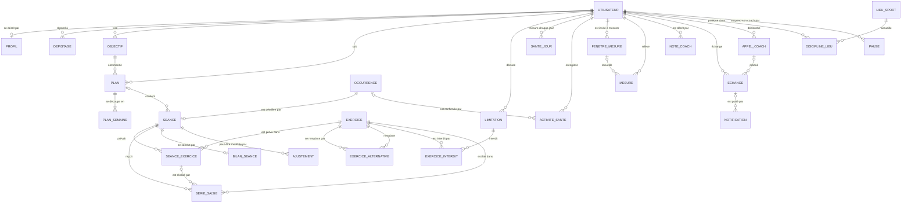

# Module coach sportif

Cahier des charges

Auteur : Thomas Mathis

Ce document décrit le module coach tel qu'il doit être construit. Il complète le cahier des charges du système de planification personnelle, qu'il cite sans le recopier : quand une règle porte un préfixe déjà connu (`SPT`, `NOT`, `JRN`, `EXE`, `ABS`, `UTI`), elle se lit là-bas. Les règles sportives elles-mêmes sont dans le dossier du coach, cité par numéro de chapitre.

Chaque règle porte un code, que le code source citera en commentaire. Quand le module tournera, ce document sera fusionné dans le premier.

Ce document sert de base à l'écriture du code, y compris par un outil de génération. Une règle écrite ici est une obligation. Ce qui n'est pas écrit se décide en suivant les choix de la section 1.2 et les conventions du système existant : règles dans la base, API mince, SQL sans ORM, un fichier par fonction.

## Sommaire

1. Rappel du sujet et choix effectués
2. Outils et architecture
3. Règles de gestion
4. Acteurs du système
5. Diagramme des données
6. Dictionnaire de données
7. Contraintes d'intégrité
8. Description des opérations
9. Interfaces exposées
10. Ce que le module change dans le système existant
11. Risques et points à vérifier
12. Ce qui est volontairement exclu

Annexe A : règles `SPT` remplacées ou retirées
Annexe B : valeurs par défaut à calibrer

---

## 1. Rappel du sujet et choix effectués

### 1.1 Rappel du sujet

Le système de planification sait déjà quand placer une séance de sport : il connaît l'emploi du temps, les heures d'ouverture, le trajet, et il refuse ce qui ne tient pas. Il ne sait pas ce qu'il y a dans la séance. Une séance y est un lieu, une heure et une durée.

Le module coach apporte le contenu. À partir d'objectifs fixés par l'utilisateur, d'un dossier de règles sportives et des données réelles (séances saisies, Apple Watch, emploi du temps), un modèle de langage construit un plan sur quatre semaines, propose chaque séance avec ses exercices, suit ce qui est fait, et ajuste. Il parle à l'utilisateur à des moments précis : une synthèse chaque soir, une réponse immédiate à un signalement, un chat pour les questions.

Le coach conseille et l'utilisateur décide. Une séance n'entre au planning qu'une fois validée, et le coach ne touche plus à ce qui est validé.

La première version sert un seul compte, celui de Thomas. Elle couvre la musculation, la course à pied et les machines cardio de la salle.

### 1.2 Choix effectués

- **Le coach est un module du système existant, pas un système à part.** Il vit dans le même dépôt, la même base et le même processus. Il réutilise le planning, le placement, les notifications, le journal et les comptes.
- **Le coach décide du contenu, la base décide du placement.** Le modèle choisit le type de séance, les exercices, les charges, la durée et le jour. PostgreSQL vérifie que le créneau tient et ajoute le trajet et le battement, comme pour une séance posée à la main.
- **Le modèle n'écrit jamais dans une table.** Il dispose d'une liste fermée d'outils, et chaque outil d'écriture est une fonction SQL. C'est le parti pris du projet appliqué à un client de plus : si le modèle se trompe, la base refuse et lui rend le motif.
- **Trois règles de sécurité sont tenues par la base**, parce qu'elles sont vérifiables sans jugement : pas d'exercice interdit par une limitation, une seule charge pour les deux côtés, pas deux séances dures collées. Tout ce qui demande du jugement reste dans le dossier.
- **Une réponse du coach a une forme fixe.** Un message, et la liste typée de ce qu'il a fait. Cette liste vient de la base, jamais du modèle : un bouton n'existe que si ce qu'il déclenche existe.
- **La saisie d'une séance marche sans réseau.** Chaque saisie porte une clé créée par l'appareil, ce qui rend tout envoi répétable.
- **Le modèle est appelé à des moments précis, pas en permanence.** Pendant la séance, tout se fait avec des boutons. Sept situations déclenchent un appel (COA-2). Chaque appel est enregistré avec ce qu'il a consommé (COA-21).
- **Une séance du coach est proposée, puis validée.** L'utilisateur valide la semaine en une fois. Une séance validée est épinglée, et le coach ne peut plus ni la modifier ni la retirer seul : il dépose un ajustement, que l'utilisateur accepte ou refuse. Sans réponse, seul un allègement s'applique.
- **Le dossier du coach est versionné dans le dépôt**, en Markdown, un fichier par chapitre. Changer une règle sportive change le comportement du coach : c'est du code.
- **Le dossier ne contient rien de personnel.** Il décrit des méthodes, valables pour n'importe qui. Ce qui concerne une personne, sa limitation, ses exercices interdits, son historique, vit en base : dans sa limitation et dans son carnet. Le dépôt est public, une donnée de santé n'a rien à y faire, et le coach d'un autre compte ne doit pas recevoir le cas du premier.
- **Six chapitres partent à chaque appel** : rôle, sécurité, limitations permanentes, décision, communication, posture. Les autres se lisent à la demande, par un outil. Envoyer tout le dossier à chaque appel coûterait environ cinq fois plus cher.
- **La mémoire du coach est en base.** Un carnet de notes courtes, et tous les échanges. Le carnet et les dix derniers échanges sont rendus au modèle à chaque appel.
- **Il n'y a pas de filtre de mots dans le code pour les signaux graves.** Le chapitre de sécurité part à chaque appel et le modèle l'applique seul. C'est un choix assumé, dont la section 11 dit la contrepartie.
- **Il n'y a pas de plafond de dépense dans le système.** Le suivi se fait sur la console du fournisseur.
- **L'utilisateur peut faire autre chose que le plan.** Une séance libre, avec un ami ou selon l'envie, n'est ni refusée ni comptée comme manquée. Le coach l'analyse, donne son avis et refait la suite de la semaine autour.
- **Le coach s'active par compte.** Un compte sans coach pose ses séances à la main, comme le permet déjà SPT-17.
- **Le coach remplace les réservations « à déterminer ».** Le minimum hebdomadaire, les habitudes et l'alerte du lundi sont retirés (annexe A).
- **Le plan est détaillé une semaine à la fois.** Le coach écrit les exercices de la semaine à valider. Les trois autres semaines sont des esquisses : un jour, un lieu, un type, une durée, une intensité. Il les détaille une à une, le dimanche.
- **Une feuille de route relie les plans entre eux.** Un plan dure quatre semaines, un objectif souvent trois mois. Le coach écrit sur l'objectif principal le chemin jusqu'à l'échéance, et le relit à chaque appel.
- **Une discipline se pratique dans un ou plusieurs lieux.** L'utilisateur les choisit et les range. Le coach prend le lieu de chaque séance parmi eux.
- **Un outil écrit et valide aussitôt.** Un appel n'est pas tout ou rien : ce qu'un outil a écrit reste. Un nouvel essai reprend là où l'appel s'est arrêté, il ne recommence pas.
- **Le soir, une séance est faite ou pas faite.** À 23 h, toute séance du jour restée sans nouvelle se juge sur ce qui a été fait, qu'elle ait été validée ou seulement proposée.
- **Le coach peut être mis en pause.** Maladie, vacances, examens : il ne propose plus rien, et la synthèse ne passe plus qu'un soir sur trois.
- **Une course objectif est une séance comme les autres.** Elle n'a ni type ni règle à part : le coach la met au plan à sa date et adapte ce qui l'entoure.
- **Les données de santé arrivent par une application Swift de test**, qui lit l'application Santé et permet de saisir les séances. Elle consomme l'API décrite ici et fait l'objet d'un projet séparé.

Ce module lève une exclusion du premier cahier des charges, qui écartait « tout apprentissage automatique ou prédiction de préférences ». Elle reste vraie pour le planning domestique.

---

## 2. Outils et architecture

### 2.1 Outils ajoutés

Tout ce que le système utilise déjà est repris. S'y ajoutent :

| Outil | Rôle | Pourquoi celui-là |
|---|---|---|
| API d'Anthropic, SDK Python `anthropic` | Appels au modèle, avec outils | Un seul fournisseur, des outils déclarés en JSON, un cache pour la partie fixe de la consigne |
| Claude Sonnet 5.5 | Modèle de départ | Tient un long jeu de règles simultanées pour un coût de quelques dollars par mois. Le nom du modèle est un réglage, pas du code |
| Dossier du coach en Markdown | Savoir sportif | Lisible, versionné, découpé par chapitre |
| HealthKit, par l'application Swift de test | Données de l'Apple Watch | Seule voie d'accès aux données de santé d'un iPhone |

Sont volontairement écartés : les bases vectorielles et la recherche sémantique, les cadres d'agents, un deuxième fournisseur de secours. Le dossier a un sommaire de quarante-neuf chapitres : le modèle choisit le chapitre à lire, il n'y a rien à chercher par similarité.

### 2.2 Schéma d'ensemble

```
   ENTRÉES                          LE SYSTÈME                        SORTIES
   ───────                          ──────────                        ───────

   Application Swift ──┐       ┌───────────────────────┐
   (Santé, saisies)    │       │      API FastAPI      │────────►  Bot Telegram
                       ├──────►│  endpoints            │           (synthèse, réponses,
   Bot Telegram ───────┤       │  ordonnanceur         │            semaine à valider)
   (texte, boutons)    │       │  module coach ◄───────┼──┐
                       │       └──────────┬────────────┘  │
   Ordonnanceur ───────┘                  │ SQL           │ outils
   (23 h, dimanche)              ┌────────▼────────────┐  │
                                 │     PostgreSQL      │  │        ┌──────────────┐
                                 │  planning existant  │  └───────►│   Modèle     │
                                 │  objectifs, plan    │           │  (Anthropic) │
                                 │  séances, saisies   │◄──────────│              │
   Dossier du coach ────────────►│  santé, carnet      │  fonctions└──────────────┘
   (Markdown, dépôt)             │  règles de sécurité │  appelées
                                 └─────────────────────┘
```

Le module coach est du Python dans le processus de l'API. Il assemble la consigne, appelle le modèle, exécute les outils que le modèle demande, et recommence jusqu'à la réponse. Il ne contient aucune règle métier : chaque outil appelle une fonction SQL ou lit une vue.

### 2.3 Comment fonctionne l'agent

**Le principe.** Un modèle de langage ne retient rien d'un appel à l'autre et ne peut rien faire seul : il reçoit du texte et rend du texte. Le coach est donc fait de quatre choses, dont une seule est le modèle.

| Élément | Ce que c'est | Où il vit |
|---|---|---|
| La consigne | Le texte envoyé au début de chaque appel : qui est le coach, ses règles, ce qu'il sait de l'utilisateur | Assemblée par le module, à partir du dossier et de la base |
| Les outils | La liste fermée des actions que le modèle peut demander | Déclarés par le module, exécutés par la base |
| La boucle | Le va-et-vient entre le module et le modèle, jusqu'à la réponse | Module coach |
| Le modèle | Lit la consigne, demande des outils, rédige | Chez le fournisseur |

Le modèle ne touche jamais la base. Il demande un outil, par exemple « propose cette séance jeudi », et c'est le module qui appelle la fonction de la base, puis lui rend le résultat. Le module ne décide de rien : il transmet.

**Ce que contient la consigne, dans cet ordre**

| Rang | Contenu | Change quand |
|---|---|---|
| 1 | Les six chapitres de base du dossier et son sommaire (COA-3) | Le dossier est modifié |
| 2 | Le contexte de l'utilisateur : profil, limitations, objectifs, trame du plan, rôle de la semaine, carnet | Un de ces éléments change |
| 3 | Les dix derniers échanges | À chaque appel |
| 4 | Le message du moment : ce qui déclenche l'appel, et le texte de l'utilisateur s'il y en a un | À chaque appel |

L'ordre va du plus stable au plus changeant. Le fournisseur facture moins cher une partie de consigne déjà vue : la partie fixe doit donc venir en premier et rester identique d'un appel à l'autre, au caractère près.

**Un appel, pas à pas**

1. Un déclencheur arrive : l'ordonnanceur, une action de l'utilisateur, une fonction de la base.
2. Le module vérifie qu'aucun autre appel n'est en cours pour ce compte, enregistre l'appel, et ouvre une opération au journal avec l'acteur « coach » (COA-21, COA-22, JRN-4).
3. Il assemble la consigne.
4. Il l'envoie au modèle, avec la liste des outils permis pour ce moment (COA-5).
5. Tant que le modèle demande un outil, le module l'exécute et lui rend le résultat. Un refus de la base est un résultat comme un autre : le modèle lit le motif et corrige. Chaque outil d'écriture valide sa propre transaction (COA-23).
6. Quand le modèle rend un texte, la boucle s'arrête.
7. Le module construit la réponse : le texte du modèle, et la liste de ce que l'opération a écrit en base (COA-17, COA-18).
8. Il enregistre la réponse dans les échanges, crée la notification que le bot transmet (NOT-2), et la rend à l'appelant.
9. L'appel est clos, avec son nombre de tours, ses tokens et sa durée. L'opération est close. Tout ce que le coach a changé porte son numéro.

**Exemple : une synthèse du soir.** Mardi, 23 h. Une séance de haut du corps a été faite, une course est validée pour mercredi, et la nuit précédente a été courte.

| Tour | Qui parle | Ce qui se passe |
|---|---|---|
| 1 | Module vers modèle | La consigne, puis le message du moment : « synthèse du mardi » |
| 2 | Modèle | Demande `lire_semaine` et `lire_sante` |
| 3 | Module | Rend la semaine (séance du jour faite, effort 8) et la santé (5 h 40 de sommeil, dernier envoi à 22 h 10) |
| 4 | Modèle | Demande `lire_forme` |
| 5 | Module | Rend le score et la charge sur 7 et 28 jours |
| 6 | Modèle | Demande `proposer_ajustement` : alléger la course de mercredi, motif « nuit courte après une séance dure » |
| 7 | Module | La base vérifie et accepte. L'ajustement est en attente |
| 8 | Modèle | Rend son texte : la séance du jour, la nuit courte, l'ajustement proposé, ce qui attend demain |
| 9 | Module | Construit la réponse : le message, plus un élément « ajustement » avec ses deux actions, accepter et refuser |

L'utilisateur reçoit le message et les deux boutons, dans l'application comme sur Telegram. Le modèle n'a écrit que le texte : le bouton existe parce que la base contient un ajustement en attente, pas parce que le modèle l'a annoncé.

**Deux façons d'être appelé**

| Façon | Déclencheur | Qui attend |
|---|---|---|
| À la demande | Un bilan, un signalement, une question, un objectif, l'annonce d'une séance libre | L'application attend la réponse (COA-16) |
| Planifiée | La synthèse du soir, la révision du dimanche, la construction du plan | Personne. La réponse part en notification et se lit ensuite dans les échanges |

### 2.4 Ce qui tourne tout seul

Les heures sont celles de Paris. Le fuseau est passé explicitement à chaque déclencheur.

| Quand | Tâche planifiée | Ce qu'elle fait |
|---|---|---|
| 23h00 | Clôture du jour | Sans le modèle : juge faite ou pas faite chaque séance du jour restée ouverte (PLN-9) |
| 23h00 | Synthèse du soir | Lit la journée, répond à l'utilisateur, décide du sort d'une séance pas faite (COA-9, PLN-10). En pause, un soir sur trois (PAU-3) |
| Dimanche, 23h00 | Révision de la semaine | Dans le même appel que la synthèse : revoit les semaines suivantes, détaille et propose la semaine à valider, relit le carnet (PLN-8, PLN-23, CAR-5). Suspendue en pause |
| 23h05, 23h20, 23h50 | Nouveaux essais | Si l'appel de 23 h a échoué. L'essai reprend là où l'appel s'est arrêté (COA-11, COA-24) |
| 6h55 | Rattrapage de la synthèse | Si les trois essais ont échoué, un dernier passage avant le bilan du matin (COA-11) |
| 0h05 | Report d'office, déjà en place | Clôt aussi les fenêtres de mesure expirées et lève une pause arrivée à son terme (MES-3, PAU-6) |

Deux tâches du système existant disparaissent : l'alerte de sport du lundi à 7h20 (SPT-27) et le constat des séances à déterminer toutes les trente minutes (SPT-25).

### 2.5 Développement et mise en production

Le module se développe sur une branche `coach` du dépôt existant, sur un Docker local avec une copie de la base de production. Un deuxième bot Telegram sert au développement : deux instances sur le même jeton se disputent les messages. La relève des courriels et les envois planifiés sont coupés en local.

Le serveur ne déploie que `main`. La fusion se fait quand le coach passe les scénarios de test du chapitre 10.5 du dossier. Le coach s'active ensuite pour un compte par `coach_actif`, ce qui laisse un retour en arrière d'une ligne.

---

## 3. Règles de gestion

Mêmes conventions que le premier cahier des charges. Un code est stable et n'est jamais réattribué. Trois types : **D** pour une règle sur les données, garantie par le schéma ou par un réglage ; **T** pour un traitement, réalisé par une fonction, un trigger ou le module coach ; **M** pour une procédure manuelle, à la charge de l'utilisateur.

Une règle de type T dont le texte commence par « Le coach » est tenue par le modèle, guidé par le dossier. Elle est vérifiée par les scénarios de test, pas par une contrainte. Les autres règles T sont tenues par la base.

### 3.1 Objectifs : `OBJ`

| Code | Type | Règle |
|---|---|---|
| OBJ-1 | D | Un objectif appartient à un utilisateur. Il a un type : un pilier (force, physique, endurance), une course à une date, une performance à atteindre, une mesure du corps à faire évoluer |
| OBJ-2 | D | Un utilisateur a au plus un objectif principal actif. C'est lui qui commande le plan |
| OBJ-3 | D | Le nombre d'objectifs secondaires n'est pas limité : un tour de bras à gagner est un petit objectif qui tient à côté d'un grand. Ils portent un rang d'affichage |
| OBJ-4 | D | Une course exige une date et une distance. Une performance et une mesure exigent une cible chiffrée et son unité. Un pilier n'exige rien |
| OBJ-5 | T | À la création ou à la modification d'un objectif, le coach rend un avis : réaliste, ambitieux ou irréaliste, avec l'ajustement qu'il propose. L'avis ne bloque rien : l'utilisateur garde son objectif s'il le veut |
| OBJ-6 | T | Le coach alerte quand les objectifs sont trop nombreux ou se contredisent, et dit lequel il mettrait en pause. Il ne met jamais un objectif en pause lui-même |
| OBJ-7 | M | L'utilisateur ajoute, modifie, met en pause, reprend, abandonne et reclasse ses objectifs, et désigne le principal |
| OBJ-8 | T | Sans objectif principal actif, aucun plan n'est construit : le coach demande d'en définir un. Les séances déjà validées restent en place |
| OBJ-9 | D | Un objectif clos, atteint ou abandonné, ne se rouvre pas. On en crée un autre : l'historique doit rester lisible |
| OBJ-10 | T | Un objectif dont l'échéance est passée est signalé dans la synthèse. C'est l'utilisateur qui le clôt, atteint ou non |
| OBJ-11 | D | L'objectif principal porte une feuille de route : le texte que le coach écrit pour aller d'aujourd'hui à l'échéance, par grandes phases. Elle dépasse le plan de quatre semaines et lui survit : c'est elle qui relie un plan au suivant |
| OBJ-12 | T | Le coach écrit la feuille de route à la construction du premier plan et la révise à chaque nouveau plan. Elle lui est rendue à chaque appel, avec la trame |
| OBJ-13 | T | Le jour d'une course objectif est une séance comme les autres : le coach la propose à sa date, et elle se valide avec sa semaine. Le placement et la règle des séances dures la voient donc sans rien de particulier. Ce qui l'entoure, l'affûtage avant et la récupération après, relève du coach (chapitres 5.6 et 5.7 du dossier) |

### 3.2 Plan et séances du coach : `PLN`

| Code | Type | Règle |
|---|---|---|
| PLN-1 | D | Un plan couvre quatre semaines, du lundi au dimanche. Un utilisateur n'a qu'un plan en cours. Le plan porte une trame, le texte de ses grandes lignes, et un rôle pour chaque semaine : calibrage, charge, allégée, test, affûtage, reprise |
| PLN-2 | T | Un plan naît d'un objectif principal. Il est reconstruit quand il arrive à son terme ou quand le principal change |
| PLN-3 | D | Une séance du coach est une occurrence de sport qui porte en plus son contenu : discipline, type, intensité, durée, séance clé ou secondaire, groupes sollicités, consigne, et la liste de ses exercices |
| PLN-4 | D | Une séance du coach est proposée ou validée. Proposée, elle occupe son créneau, pour que le ménage ne s'y mette pas, mais n'est pas épinglée. Validée, elle est épinglée |
| PLN-5 | T | Le coach propose une séance par une seule fonction. Il donne le lieu, pris parmi ceux de la discipline (LIE-2), le jour et une plage d'heures, pas une heure seule : la base choisit dans la plage le début qui tient, selon la préférence du lieu (SPT-8, SPT-12). La plage sert au coach à tenir ses temps de repos, qui se comptent en heures. La base vérifie le placement avec les règles strictes d'une proposition (SPT-21), puis les règles de sécurité (SEC), et ajoute le trajet et le battement (SPT-4, SPT-10). Un refus rend son motif |
| PLN-6 | M | L'utilisateur valide une semaine en une fois : toutes ses séances proposées deviennent validées. Il peut les ajuster avant |
| PLN-7 | T | Le coach ne modifie ni ne retire seul une séance validée. La fonction le refuse. Il dépose un ajustement, que l'utilisateur accepte ou refuse (PLN-18) |
| PLN-8 | T | Le dimanche à 23 h, le coach révise les semaines non validées selon l'emploi du temps et la forme, détaille la semaine à venir (PLN-23) et la propose à la validation |
| PLN-9 | T | À 23 h, toute séance du jour restée ouverte se juge sur ce qui a été fait, qu'elle soit validée ou seulement proposée. Si une séance de la même discipline a été saisie ou enregistrée par la montre ce jour-là, elle est comptée comme faite. Sinon elle est close comme pas faite : ne pas valider n'excuse pas de ne rien faire, et ne rien dire ne garde pas une séance ouverte. Le coach décide de la suite (PLN-10). Une séance qui n'est pas finie à 23 h attend le soir suivant |
| PLN-10 | T | Une séance pas faite, qu'elle ait été validée ou seulement proposée, est close et n'est pas replacée d'office. À la synthèse, le coach décide : une séance clé est proposée à nouveau s'il reste un jour qui tient, une séance secondaire est abandonnée. La nouvelle proposition se valide seule, d'un bouton |
| PLN-11 | M | L'utilisateur déplace, modifie ou supprime toute séance, proposée ou validée, par les moyens existants (SPT-21, SPT-24, SPT-26). Une séance déplacée garde son contenu |
| PLN-12 | T | Quand un déplacement fait par l'utilisateur enfreint une règle de sécurité, la base avertit et laisse faire. L'avertissement est rendu tout de suite, et le coach réajuste la suite à la synthèse |
| PLN-13 | D | La durée d'une séance du coach lui est propre, de 15 à 240 minutes. Celle du lieu ne sert plus que de valeur par défaut à une séance posée à la main |
| PLN-14 | M | L'utilisateur peut fixer un maximum de séances par semaine. La base refuse une proposition qui le dépasse. Sans réglage, le coach décide seul |
| PLN-15 | T | Une absence déclarée retire les séances proposées qu'elle couvre et signale les séances validées. C'est à l'utilisateur de dire s'il s'entraîne là où il va |
| PLN-16 | T | Le coach reçoit la charge de chaque journée, calculée par la base : légère, moyenne, lourde. Ce qu'il en fait relève du dossier (chapitre 7.3) : la base ne refuse pas une séance au motif d'une journée lourde |
| PLN-17 | M | Une séance du coach se propose à l'autre personne comme n'importe quelle séance (SPT-31, SPT-32). L'invité reçoit le créneau, pas le contenu |
| PLN-18 | T | Pour changer une séance validée, le coach dépose un ajustement : alléger, modifier le contenu, déplacer ou retirer, avec son motif. L'utilisateur accepte ou refuse d'un bouton. Une séance n'a qu'un ajustement en attente à la fois |
| PLN-19 | T | Un ajustement accepté passe par les mêmes vérifications qu'une proposition (PLN-5). Resté sans réponse quand la séance commence, il s'applique s'il allège ou retire la séance, et devient caduc s'il la modifie ou la déplace : le silence ne peut qu'alléger. Refusé, il ne change rien |
| PLN-20 | T | La première semaine du premier plan est une semaine de calibrage. Ses séances de musculation ne portent pas de charge : l'utilisateur choisit celle où il lui reste deux ou trois répétitions en réserve, et la saisit. Ce qu'il saisit devient la référence du coach |
| PLN-21 | T | Par la suite, le coach ne fixe pas de charge sur un exercice que l'utilisateur n'a jamais saisi. La première fois se fait toujours au ressenti |
| PLN-22 | D | Une séance du coach est une esquisse ou une séance détaillée. L'esquisse porte tout sauf les exercices : jour, lieu, discipline, type, intensité, durée, groupes sollicités. Elle occupe son créneau et compte pour la règle des séances dures (SEC-3) |
| PLN-23 | T | Le coach détaille la première semaine qui n'est pas validée, et seulement elle. Les autres semaines du plan restent en esquisses, qu'il détaille une à une à la révision du dimanche. Détailler plus loin obligerait à tout réécrire : les charges dépendent de ce qui sera saisi d'ici là (PLN-21) |
| PLN-24 | T | Une semaine ne se valide que si toutes ses séances du coach sont détaillées. La base refuse la validation tant qu'il reste une esquisse |

### 3.3 Séances libres : `LIB`

Une séance libre est une séance que le coach n'a pas écrite : on suit le programme d'un ami, ou son envie du jour. Le coach ne l'interdit pas. Il la lit, dit ce qu'il en pense, et refait la suite autour.

| Code | Type | Règle |
|---|---|---|
| LIB-1 | D | Une séance libre a pour auteur l'utilisateur. Elle se fait en musculation, en course ou sur les machines cardio. Son contenu est ce que l'utilisateur a réellement fait, pas ce qui était prévu |
| LIB-2 | M | L'utilisateur y saisit les exercices du catalogue qu'il veut, dans l'ordre qu'il veut. Pour une course, la séance enregistrée par la montre suffit |
| LIB-3 | M | L'utilisateur peut annoncer une séance libre d'avance : le jour, la discipline, et ce qu'il compte faire s'il le sait. Elle se pose au planning comme une séance posée à la main (SPT-17) |
| LIB-4 | T | Une annonce déclenche un appel immédiat au coach, comme un signalement : il dit ce qu'il conseille d'éviter ce jour-là et ajuste la suite sans attendre |
| LIB-5 | T | Sans annonce, une séance libre se reconnaît d'elle-même : une saisie hors de toute séance prévue, ou une séance de la montre qu'aucune séance prévue n'explique (SAN-4). Le coach la découvre à la synthèse |
| LIB-6 | T | Une séance libre faite le jour d'une séance du coach de la même discipline la remplace : la séance prévue est close avec le motif « remplacée par une séance libre », et non comme pas faite. D'une autre discipline, elle s'ajoute : les deux se font le même jour (SPT-37) |
| LIB-7 | M | Depuis une séance prévue, un bouton « faire autre chose » la transforme en séance libre : même créneau, contenu vide à remplir |
| LIB-8 | T | À la synthèse, le coach compare la séance libre à ce que le plan demandait : groupes travaillés, volume, intensité, charge. Il rend un avis parmi trois : conforme, « c'est à peu près ce qu'on devait faire » ; acceptable, « d'accord pour cette fois » ; à éviter, « d'accord, mais évite la prochaine fois », avec la raison |
| LIB-9 | T | Le coach ne refuse pas une séance libre et ne la compte jamais comme une séance manquée. Même l'avis « à éviter » porte sur la prochaine fois, pas sur celle-ci |
| LIB-10 | T | Après une séance libre, le coach refait la suite de la semaine : il compense ce qui a manqué, ou il allège si l'utilisateur en a fait plus. Les séances proposées se modifient directement, les séances validées par un ajustement (PLN-18) |
| LIB-11 | D | Une séance libre laisse le choix des exercices, pas celui d'enfreindre une limitation : un exercice interdit y est refusé à la saisie (SEC-1). La règle des séances dures s'y applique en mode souple : elle avertit sans empêcher (SEC-4) |
| LIB-12 | D | L'intensité d'une séance libre se déduit de la note d'effort : 7 ou plus en fait une séance dure. Sans note, elle se déduit de la séance de la montre, par la fréquence cardiaque. Sans note ni montre, la séance est tenue pour dure, par prudence. Ses groupes sont ceux des exercices saisis. C'est ce que SEC-3 compare pour les séances qui suivent |
| LIB-13 | T | Quand les séances libres reviennent au même moment, tous les jeudis avec le même ami par exemple, le coach le note au carnet et construit le plan autour |
| LIB-14 | D | Pour un compte qui a le coach, une séance posée à la main sans contenu est une séance libre annoncée. Le coach n'y met rien : il la contourne dans son plan et l'analyse une fois faite |

### 3.4 Catalogue d'exercices et limitations : `EXO`

| Code | Type | Règle |
|---|---|---|
| EXO-1 | D | Un exercice du catalogue a un code stable, une discipline, un groupe musculaire principal, des groupes secondaires, un matériel, et dit s'il se fait un côté à la fois. Il déclare ce qu'on y mesure : charge et répétitions, durée, ou distance |
| EXO-2 | D | Un exercice déclare ses alternatives, dans un ordre de préférence. C'est ce qu'on fait quand la machine est prise |
| EXO-3 | D | Un exercice ne se supprime pas, il se désactive : les saisies passées s'y réfèrent |
| EXO-4 | M | L'administrateur tient le catalogue. Il est rempli une première fois d'après les chapitres 4.4, 4.5 et 6.3 du dossier, pour le matériel de la salle fréquentée |
| EXO-5 | T | Le coach ne compose une séance qu'avec des exercices actifs du catalogue. La fonction refuse un code inconnu. Quand il lui manque un exercice, le coach le dit dans son message au lieu d'en inventer un |
| EXO-6 | D | Une limitation permanente appartient à un utilisateur : une zone du corps, un côté, une description. Elle porte la liste des exercices qu'elle interdit, chacun avec son motif |
| EXO-7 | T | Les alternatives présentées pendant une séance excluent les exercices interdits à cet utilisateur |
| EXO-8 | M | L'utilisateur déclare ses limitations et les exercices qu'elles interdisent. Le coach peut proposer d'en ajouter un, il ne l'ajoute pas lui-même |
| EXO-9 | D | Une limitation et ses exercices interdits sont les données d'un compte. Elles s'enregistrent par l'API, jamais par une migration ni dans le dossier : le dépôt est public |

### 3.5 Règles de sécurité tenues par la base : `SEC`

Ces règles ne remplacent pas le dossier. Elles rattrapent une erreur du modèle sur trois points où l'erreur se vérifie sans jugement.

| Code | Type | Règle |
|---|---|---|
| SEC-1 | T | Un exercice interdit par une limitation active de l'utilisateur est refusé partout : dans une séance proposée par le coach, dans un ajustement, et à la saisie, séance libre comprise. C'est la seule règle de sécurité sans mode souple |
| SEC-2 | D | Un exercice porte une seule charge, un seul nombre de séries et un seul nombre de répétitions, qui valent pour les deux côtés. Il n'existe pas de charge gauche et de charge droite, ni dans ce qui est prévu ni dans ce qui est saisi. Une différence entre les deux bras est impossible à écrire |
| SEC-3 | T | Deux séances dures qui sollicitent un même groupe sont séparées d'au moins 48 heures, de début à début. La course et les machines cardio forment un groupe à elles. Le délai est un réglage du compte |
| SEC-4 | T | La règle des séances dures (SEC-3) a deux forces, comme `obstacle_seance()` : stricte pour une proposition ou un ajustement du coach, qui est refusé ; souple pour un geste de l'utilisateur, déplacement ou séance libre, qui est averti (PLN-12, LIB-11) |
| SEC-5 | T | Un refus de sécurité est rendu au coach avec son motif et noté au journal. Un coach qui se heurte souvent à la même règle signale un dossier à corriger |

### 3.6 Saisie et bilan d'une séance : `SAI`

| Code | Type | Règle |
|---|---|---|
| SAI-1 | M | Pendant la séance, l'utilisateur saisit chaque série : la charge et les répétitions, ou la durée, ou la distance, selon ce que l'exercice mesure |
| SAI-2 | D | Une série saisie se rattache à un exercice du catalogue, et à la ligne prévue quand il y en a une. Un exercice fait à la place d'un autre garde le lien avec celui qu'il remplace |
| SAI-3 | M | Changer de machine ne demande aucun appel au modèle : les alternatives sont dans le catalogue, et la ligne prévue garde ses séries et ses répétitions |
| SAI-4 | M | En fin de séance, l'utilisateur donne une note d'effort de 1 à 10, la durée réelle, et un commentaire libre s'il en a un |
| SAI-5 | T | Enregistrer le bilan valide la séance comme faite. Une séance faite sans aucune série saisie reste une séance faite : la saisie est un service, pas une condition |
| SAI-6 | M | Une séance qui n'était pas prévue se saisit quand même, comme séance libre (LIB-1 à LIB-13). Elle compte dans la charge |
| SAI-7 | M | Le bouton « Bilan » sur une séance déclenche un appel immédiat au coach, sans attendre 23 h |
| SAI-8 | T | Une série se corrige ou se supprime jusqu'à la synthèse du soir. Ensuite elle est figée : le coach a raisonné dessus |
| SAI-9 | D | Chaque série, chaque bilan et chaque séance libre porte une clé créée par l'appareil au moment de la saisie. Renvoyer la même clé ne crée rien de plus : c'est ce qui permet de renvoyer sans risque après une coupure |
| SAI-10 | M | La saisie se fait sans réseau. L'application charge d'avance la séance du jour, ses exercices et leurs alternatives permises, garde les saisies sur l'appareil et les envoie quand le réseau revient |
| SAI-11 | T | Un envoi groupé est accepté dans n'importe quel ordre. Chaque saisie garde l'heure où elle a été faite, pas celle où elle arrive |
| SAI-12 | T | Une saisie qui arrive après la synthèse du soir est acceptée : elle s'ajoute, elle ne modifie rien de figé. Le coach la lit à la synthèse suivante et le dit |
| SAI-13 | D | Une séance faite sans bilan n'a pas de note d'effort, donc pas de charge. C'est une donnée absente, pas un zéro (SAN-5) : elle n'entre pas dans les sommes, et le coach lit combien de séances de la période sont dans ce cas |
| SAI-14 | M | Le bouton « faite » du bot demande la note d'effort, de 1 à 10, d'un seul geste. Un bilan se donne aussi après coup : il s'ajoute à une séance déjà close (SAI-12) |

### 3.7 Données de santé : `SAN`

| Code | Type | Règle |
|---|---|---|
| SAN-1 | D | Chaque jour porte au plus une ligne par utilisateur : pas, fréquence cardiaque de repos, variabilité cardiaque, durée de sommeil |
| SAN-2 | D | Chaque séance enregistrée par la montre est gardée avec tout son détail : type, début et fin, durée, distance, dénivelé, énergie, fréquence cardiaque moyenne et maximale, allure, cadence. Ce que le schéma ne nomme pas est gardé tel quel : temps par kilomètre, temps par zone, intervalles. Rien de ce que la montre donne n'est jeté |
| SAN-3 | D | Une séance de la montre porte la clé que lui donne l'application Santé, unique par utilisateur. La renvoyer la met à jour sans la dupliquer |
| SAN-4 | T | Une séance de la montre se rattache à la séance prévue du même jour et de la même discipline, proposée ou validée, et la fait compter comme faite à 23 h (PLN-9). Faute de séance prévue, elle devient une séance libre |
| SAN-5 | D | Une donnée absente n'est pas un zéro. Un jour sans envoi n'a pas de ligne, et le coach lit « pas de données », pas « aucun pas » |
| SAN-6 | T | La synthèse raisonne sur ce qui est arrivé. La date du dernier envoi lui est donnée, pour qu'elle dise quand ses données sont vieilles |
| SAN-7 | D | Les données de santé ne sortent du serveur que dans le contenu d'un appel au modèle, et seulement ce que rend l'outil demandé. Elles ne figurent ni dans le flux iCalendar, ni dans ce que l'autre personne peut lire |

### 3.8 Mesures et tests : `MES`

| Code | Type | Règle |
|---|---|---|
| MES-1 | T | Le coach ouvre une fenêtre de mesure : un type, une période de deux ou trois jours, une consigne. Il décide du rythme selon l'objectif |
| MES-2 | M | L'utilisateur saisit sa mesure pendant la fenêtre, ou dit qu'il ne peut pas. Dans ce cas la fenêtre est reportée et le coach en rouvre une plus tard |
| MES-3 | T | Une fenêtre qui se ferme sans mesure est close comme expirée. Le coach le relève dans la synthèse. Il n'y a pas de relance à part |
| MES-4 | M | Une mesure se saisit aussi hors de toute fenêtre |
| MES-5 | D | Un utilisateur n'a qu'une fenêtre ouverte à la fois pour un même type de mesure |
| MES-6 | T | Un test de course ou de force est une séance du plan, de type test. Son résultat est enregistré comme une mesure |

### 3.9 Carnet et échanges : `CAR`

| Code | Type | Règle |
|---|---|---|
| CAR-1 | D | Une note du carnet est courte, datée et classée : préférence, ce qui marche ou non, historique du corps, engagement, contexte. Elle dit si elle vient de l'utilisateur ou d'une déduction du coach |
| CAR-2 | T | Le coach ne fonde pas une décision sur une déduction non confirmée. Il la fait confirmer par l'utilisateur, et la note le garde |
| CAR-3 | T | Le carnet ne passe jamais devant le dossier, ni devant une règle de sécurité |
| CAR-4 | D | Le carnet compte au plus soixante notes actives. Au-delà, la fonction refuse et le coach doit en fusionner ou en retirer |
| CAR-5 | T | Le dimanche, pendant la révision, le coach relit le carnet, fusionne les doublons et retire ce qui est périmé |
| CAR-6 | D | Tous les échanges sont gardés : synthèses, réponses, questions, signalements. Chacun porte son moment, son numéro d'opération, le modèle utilisé et la version du dossier |
| CAR-7 | T | Les dix derniers échanges sont rendus au modèle à chaque appel. Les autres restent en base et ne coûtent rien |
| CAR-8 | D | Le carnet et les échanges sont privés : seul leur propriétaire les lit. Ils n'entrent pas dans ce que le journal montre à l'autre personne |
| CAR-9 | T | Quand l'utilisateur demande au coach d'oublier quelque chose, le coach retire la note. Le carnet n'a pas d'écran dans cette version |

### 3.10 Le coach : `COA`

| Code | Type | Règle |
|---|---|---|
| COA-1 | D | Le coach s'active par compte. Un compte sans coach n'a ni plan ni synthèse, et pose ses séances à la main |
| COA-2 | T | Sept situations déclenchent un appel : un objectif créé ou modifié, un plan à construire, la révision du dimanche, la synthèse du soir, un bilan demandé, un signalement ou l'annonce d'une séance libre, une question dans le chat |
| COA-3 | T | Chaque appel reçoit les chapitres 1.1, 1.2, 2.4, 10.1, 10.2 et 10.3 du dossier, son sommaire, le contexte de l'utilisateur et les dix derniers échanges |
| COA-4 | T | Le coach n'agit que par une liste fermée d'outils. Un outil d'écriture appelle une fonction SQL et rien d'autre |
| COA-5 | D | Chaque moment a ses outils permis. Dans le chat, le coach lit, note et oublie : il ne propose aucune séance. S'il lit un signalement dans le texte, il le requalifie (COA-25) |
| COA-6 | T | Un appel est une opération du journal, sous l'acteur « coach ». Tout ce qu'il change partage son numéro, et `/pourquoi` le rend en phrases |
| COA-7 | T | Un appel est borné à douze tours d'outils, trente pour la construction du plan et la révision du dimanche. Au-delà, il est arrêté, rien de plus n'est écrit, et l'échec est annoncé |
| COA-8 | D | Le dossier vit dans le dépôt, un fichier par chapitre. Il ne nomme personne et ne décrit aucun cas personnel. Le nom du modèle est un réglage. Les deux sont notés dans chaque échange, pour savoir avec quoi une réponse a été produite |
| COA-9 | T | La synthèse du soir couvre la journée entière : séances faites, pas faites ou non validées, données de santé, mesures attendues, déplacements faits par l'utilisateur, objectifs échus. Elle se termine par ce qui attend demain |
| COA-10 | T | Un signalement, de santé ou de contretemps, déclenche un appel immédiat. Il n'attend jamais 23 h |
| COA-11 | T | Un appel planifié qui échoue est réessayé trois fois, à 5, 20 et 50 minutes. Après le dernier échec, un message le dit, et la synthèse est rattrapée à 6h55 |
| COA-12 | T | Un signalement ou un bilan qui ne peut pas être traité, faute de réponse du modèle, reçoit tout de suite un message fixe : le coach est injoignable, le texte est gardé et sera traité dès que possible |
| COA-13 | D | Aucun mot du texte de l'utilisateur n'est filtré par le code. Le chapitre 1.2 part à chaque appel et le modèle l'applique seul |
| COA-14 | M | Avant tout changement de modèle, de consigne ou d'un chapitre de base, les scénarios du chapitre 10.5 du dossier sont rejoués, ceux de sécurité en premier |
| COA-15 | D | Le contenu d'un appel est tout ce qui sort du serveur. Il ne contient ni clé, ni jeton, ni rien de l'autre personne que ses créneaux pris |
| COA-16 | T | Un appel à la demande est synchrone : l'API ne répond qu'une fois le coach terminé. Elle se donne 90 secondes. L'échange est enregistré avant d'être rendu : une réponse perdue en route, parce que le réseau a coupé, se relit dans les échanges et arrive aussi par le bot |
| COA-17 | D | Toute réponse du coach a la même forme : un message, et une liste d'éléments. Chaque élément a un type pris dans une liste fermée, l'identifiant de ce qu'il désigne, et les actions que l'utilisateur peut faire dessus |
| COA-18 | T | Les éléments ne viennent pas du modèle. Le module les construit à partir de ce que l'opération a réellement écrit en base. Le modèle ne fournit que le texte du message |
| COA-19 | D | L'application et le bot lisent la même réponse. Chacun affiche le message, puis un bloc par élément avec ses boutons. Un type inconnu de celui qui lit est ignoré, jamais une erreur : on peut ajouter un type sans casser un client |
| COA-20 | D | Un refus de l'API a lui aussi une forme fixe : un code stable, un message lisible, et le motif rendu par la base quand il y en a un. L'application affiche le motif tel quel |
| COA-21 | D | Chaque appel est enregistré : son moment, ce qui l'a déclenché, son état (en cours, terminé, échoué), son nombre de tours, les tokens lus et écrits, sa durée, le modèle. C'est le suivi du coût, sans plafond : une requête dit ce qu'a coûté la semaine |
| COA-22 | T | Un compte n'a qu'un appel en cours à la fois. Un deuxième attend la fin du premier, dans la limite de son délai : un bilan envoyé à 22h59 et la synthèse de 23 h ne se marchent pas dessus |
| COA-23 | T | Chaque outil d'écriture valide sa propre transaction. Ce qu'un outil a écrit reste, même si l'appel échoue ensuite. Aucune connexion à la base n'est tenue pendant que le modèle réfléchit |
| COA-24 | T | Un nouvel essai ne repart pas de zéro. Il garde le numéro d'opération de l'appel échoué, et le message du moment dit au modèle ce qui est déjà écrit : il termine, il ne recommence pas |
| COA-25 | T | Dans le chat, le coach dispose d'un outil pour requalifier un texte en signalement : une douleur, une fatigue, un contretemps, ou la réponse à une question qu'il a lui-même posée dans une synthèse. Le module relance alors l'appel avec le moment signalement et ses outils, dans la même opération. L'utilisateur ne reçoit qu'une réponse |
| COA-26 | D | La clé de l'appareil d'une demande est gardée avec l'appel. La même clé renvoyée rend l'échange déjà produit, ou fait attendre l'appel encore en cours, sans rappeler le modèle |

### 3.11 Séances de sport : `SPT`, règles ajoutées

Les règles `SPT` du premier cahier des charges restent, sauf celles de l'annexe A. S'y ajoutent :

| Code | Type | Règle |
|---|---|---|
| SPT-33 | T | L'organisation du sport porte sur quatre semaines, du lundi au dimanche : la semaine en cours et les trois suivantes. Elle ne réserve plus rien d'elle-même |
| SPT-34 | D | Une séance porte sa propre durée. Faute de durée propre, celle du lieu s'applique (SPT-9) |
| SPT-35 | D | Une séance de sport a trois origines possibles : posée à la main, proposée par le coach, acceptée sur invitation |
| SPT-36 | T | Une séance déclarée pas faite est close. La semaine ne se recomplète plus d'elle-même (PLN-10) |
| SPT-37 | T | Un jour porte au plus deux séances, de disciplines différentes : une course le matin et de la musculation le soir. La règle vaut pour le coach, pour une séance posée à la main et pour une séance libre. La base tient la limite ; l'écart entre les deux séances relève du coach (chapitre 7.1 du dossier) |

### 3.12 Notifications et journal : règles ajoutées

| Code | Type | Règle |
|---|---|---|
| NOT-11 | D | Un type de notification « coach » porte les synthèses et les réponses. Il suit NOT-2 : écrit avant d'être envoyé |
| NOT-12 | T | Le bilan du matin dit quand une semaine attend d'être validée |
| NOT-13 | D | Dans le flux iCalendar, une séance proposée s'affiche avec la mention « à valider ». Le contenu de la séance n'y figure pas |
| JRN-10 | D | Les tables du coach sont suivies au journal. Les objectifs, le plan, les séances, leurs exercices et les séries saisies se lisent à deux, comme le reste du journal (JRN-6). Les lieux d'une discipline aussi. Le profil, le dépistage, la santé, les mesures, le bilan d'une séance, les limitations, la pause, le carnet, les échanges et les appels font des événements que seul leur propriétaire lit |

### 3.13 Profil et dépistage : `PRO`

| Code | Type | Règle |
|---|---|---|
| PRO-1 | D | Un compte qui a le coach a un profil : date de naissance, sexe, taille, niveau en musculation et en course, moment préféré pour s'entraîner, jours sans sport, accord ou non pour parler de compléments alimentaires, régime alimentaire. Le poids n'y est pas : c'est une mesure |
| PRO-2 | M | Le profil se remplit par un formulaire à champs fixes, au démarrage, et se modifie ensuite quand on veut. Le coach ne le recueille pas en discutant |
| PRO-3 | D | Le dépistage est un questionnaire de sept questions fermées, celles du chapitre 1.2 du dossier. Il est daté, et on garde les anciennes réponses |
| PRO-4 | T | Aucun plan n'est construit tant que le profil et le dépistage ne sont pas remplis. La base refuse, et le coach dit ce qui manque |
| PRO-5 | T | Une seule réponse positive au dépistage bloque le plan. Le coach demande un avis médical avant de commencer. Le plan se débloque quand l'utilisateur déclare avoir eu cet avis, avec sa date |
| PRO-6 | T | Le dépistage se refait au bout de douze mois. Le coach le rappelle à la révision du dimanche. Passé ce délai, les séances en place restent, mais aucun nouveau plan n'est construit |
| PRO-7 | D | Le coach ne s'active pas pour une personne de moins de 18 ans. La base le refuse d'après la date de naissance |
| PRO-8 | D | Le profil et le dépistage sont privés : seul leur propriétaire les lit (JRN-10) |
| PRO-9 | T | Toutes les huit semaines, à la révision, le coach propose de revoir le profil : niveau, disponibilités, préférences |

### 3.14 Lieux d'une discipline : `LIE`

Le placement d'une séance dépend de son lieu : le trajet, les heures d'ouverture, le battement. Le coach raisonne en disciplines. Il faut donc dire où chacune se pratique.

| Code | Type | Règle |
|---|---|---|
| LIE-1 | D | Une discipline se pratique dans un ou plusieurs lieux, propres à chaque compte et rangés par ordre de préférence : la musculation à la salle ; la course dehors, ou sur le tapis de la salle |
| LIE-2 | T | Le coach choisit le lieu de chaque séance parmi ceux de sa discipline. La base refuse un lieu qui n'en fait pas partie. Sans lieu donné, le premier du rang s'applique |
| LIE-3 | T | Les lieux de chaque discipline sont rendus au coach avec le contexte, chacun avec son trajet. Les heures d'ouverture se lisent avec le planning. Le choix entre deux lieux relève du dossier (chapitre 5.3 pour le terrain de course) |
| LIE-4 | M | L'utilisateur choisit ses lieux et leur ordre, discipline par discipline, au démarrage, et les change quand il veut. Les lieux possibles lui sont proposés : ce sont ceux que le système connaît déjà |
| LIE-5 | M | L'utilisateur change le lieu d'une séance, proposée ou validée, comme il en change l'heure (PLN-11). Les lieux de la discipline lui sont proposés en boutons |
| LIE-6 | T | Aucun plan n'est construit pour une discipline sans lieu. Le coach dit laquelle, au lieu de l'écarter en silence |

### 3.15 Pause : `PAU`

Une maladie, des vacances, une semaine d'examens. Le coach n'a rien à proposer, et une synthèse par soir pour dire qu'il ne s'est rien passé ne sert à personne.

| Code | Type | Règle |
|---|---|---|
| PAU-1 | M | L'utilisateur met son coach en pause, avec un motif libre et une date de fin s'il la connaît. Il la lève quand il veut |
| PAU-2 | T | Pendant la pause, le coach ne propose aucune séance et ne dépose aucun ajustement : la base le refuse. Les séances proposées de la période sont retirées. Les séances validées sont signalées, et c'est l'utilisateur qui les garde ou les supprime |
| PAU-3 | T | Pendant la pause, la synthèse n'a lieu qu'un soir sur trois, compté depuis le premier jour de la pause. La révision du dimanche est suspendue |
| PAU-4 | T | Un signalement, une question, un bilan et une séance libre restent possibles : la pause espace le coach, elle ne le coupe pas. Une séance libre faite en pause compte dans la charge |
| PAU-5 | T | Les soirs sans synthèse, la clôture des séances du jour (PLN-9) et le figeage des séries (SAI-8) se font quand même, sans appel au modèle |
| PAU-6 | T | À la fin de la pause, le coach est appelé tout de suite, avec le moment révision : il relit ce qui s'est passé, détaille une semaine de reprise et la propose. Une pause arrivée à sa date de fin se lève d'elle-même à 0h05 |
| PAU-7 | D | Une pause n'est pas une absence. Une absence dit où l'on est (ABS), une pause dit qu'on ne suit pas le plan. L'une ne déclenche pas l'autre |
| PAU-8 | D | La pause ne clôt pas le plan : ses semaines continuent de courir. Au retour, le coach le reprend, ou en construit un autre s'il n'a plus de sens |

---

## 4. Acteurs du système

| Acteur | Type | Rôle |
|---|---|---|
| Thomas, utilisateur du coach | Principal | Fixe ses objectifs, valide ses semaines, déplace ses séances, saisit ses séries et ses mesures, signale, pose ses questions. Comme administrateur, il tient le catalogue d'exercices et le dossier |
| Lorette, utilisatrice sans coach | Principal | Pose ses séances à la main. Reçoit une invitation quand Thomas lui propose une séance |
| Coach | Principal | Module de l'API. Assemble la consigne, appelle le modèle, exécute les outils, enregistre l'échange et la notification |
| Modèle de langage | Secondaire | Reçoit la consigne et le contexte, demande des outils, rend un texte. Ne voit que ce qu'on lui envoie et n'écrit que par les outils |
| Système | Secondaire | Vérifie le placement et la sécurité, calcule les charges et le score de forme, tient les états, le journal et les notifications |
| Ordonnanceur | Principal | Déclenche la synthèse du soir, la révision du dimanche, les nouveaux essais et le rattrapage |
| Application Swift de test | Secondaire | Envoie les données de l'application Santé et les saisies de séance. Affiche la séance du jour et ses alternatives |
| Application Santé d'Apple | Secondaire | Fournit les données de l'Apple Watch à l'application Swift |
| Telegram | Secondaire | Transporte les messages du coach et renvoie les textes et les boutons de l'utilisateur |

---

## 5. Diagramme des données

Le module ajoute 23 tables. `UTILISATEUR`, `OCCURRENCE` et `LIEU_SPORT` existent déjà : elles sont le point d'attache. `SEANCE` prolonge une occurrence de sport sans la remplacer, ce qui laisse le placement, la validation et l'invitation fonctionner comme avant.



---

## 6. Dictionnaire de données

Les tables sont rangées par domaine. Dans chaque table, les colonnes suivent l'ordre du schéma.

### 6.1 Comptes : colonnes ajoutées

#### Table : Utilisateur

| Attribut | Type | NULL ? | Contrainte domaine | Unicité | Défaut | PK | FK |
|---|---|---|---|---|---|---|---|
| coach_actif | BOOLEAN | non | | | FALSE | | |
| repos_dur_heures | SMALLINT | non | > 0 | | 48 | | |
| seances_max_semaine | SMALLINT | oui | entre 1 et 14 | | | | |
| besoin_sommeil_minutes | SMALLINT | non | > 0 | | 480 | | |

`minimum_sport` est retirée avec les réservations (annexe A). `seances_max_semaine` vide laisse le coach décider (PLN-14) ; quatorze est le plafond, puisqu'un jour porte au plus deux séances (SPT-37). `besoin_sommeil_minutes` sert au score de forme.

### 6.2 Profil et dépistage

#### Table : Profil

| Attribut | Type | NULL ? | Contrainte domaine | Unicité | Défaut | PK | FK |
|---|---|---|---|---|---|---|---|
| id_utilisateur | INTEGER | non | | oui | | oui | Utilisateur |
| date_naissance | DATE | non | 18 ans révolus | | | | |
| sexe | VARCHAR(8) | non | 'homme', 'femme' | | | | |
| taille_cm | SMALLINT | non | entre 100 et 250 | | | | |
| niveau_musculation | VARCHAR(14) | non | 'debutant', 'intermediaire', 'avance' | | | | |
| niveau_course | VARCHAR(14) | non | 'debutant', 'intermediaire', 'avance' | | | | |
| moment_prefere | VARCHAR(12) | non | 'matin', 'soir', 'indifferent' | | 'indifferent' | | |
| jours_sans_sport | SMALLINT[] | non | valeurs de 1 à 7, lundi = 1 | | '{}' | | |
| accord_complements | BOOLEAN | non | | | FALSE | | |
| regime | TEXT | oui | | | | | |
| date_maj | DATE | non | | | CURRENT_DATE | | |

Les niveaux suivent les repères du chapitre 2.1 du dossier. `accord_complements` à faux interdit au coach d'aborder les compléments, même si on lui pose la question de la prise de muscle (chapitre 9.5). `jours_sans_sport` est une préférence rendue au coach, pas une contrainte tenue par la base : l'utilisateur peut toujours y poser une séance.

#### Table : Depistage

| Attribut | Type | NULL ? | Contrainte domaine | Unicité | Défaut | PK | FK |
|---|---|---|---|---|---|---|---|
| id_depistage | SERIAL | non | | oui | | oui | |
| id_utilisateur | INTEGER | non | | | | | Utilisateur |
| date_reponse | DATE | non | jamais dans le futur | | CURRENT_DATE | | |
| coeur | BOOLEAN | non | | | | | |
| vertiges | BOOLEAN | non | | | | | |
| maladie_chronique | BOOLEAN | non | | | | | |
| traitement | BOOLEAN | non | | | | | |
| os_articulations | BOOLEAN | non | | | | | |
| grossesse | BOOLEAN | non | | | | | |
| sedentaire_age | BOOLEAN | non | | | | | |
| positif | BOOLEAN | non | vrai si une réponse au moins est vraie, colonne calculée | | | | |
| avis_medical_le | DATE | oui | seulement si positif, jamais dans le futur | | | | |

Une ligne par passage du questionnaire : le dernier fait foi, les précédents restent. Les sept colonnes reprennent dans l'ordre les sept questions du chapitre 1.2 du dossier, dont le texte exact est affiché à l'utilisateur. Une limitation permanente n'est pas une réponse positive : elle se déclare à part (EXO-6).

### 6.3 Objectifs

#### Table : Objectif

| Attribut | Type | NULL ? | Contrainte domaine | Unicité | Défaut | PK | FK |
|---|---|---|---|---|---|---|---|
| id_objectif | SERIAL | non | | oui | | oui | |
| id_utilisateur | INTEGER | non | | | | | Utilisateur |
| type | VARCHAR(12) | non | 'pilier', 'course', 'performance', 'mesure' | | | | |
| libelle | VARCHAR(120) | non | | | | | |
| pilier | VARCHAR(10) | oui | 'force', 'physique', 'endurance' ; obligatoire si type = 'pilier' | | | | |
| distance_m | INTEGER | oui | > 0 ; obligatoire si type = 'course' | | | | |
| cible_valeur | NUMERIC(8,2) | oui | obligatoire si type = 'performance' ou 'mesure' | | | | |
| cible_unite | VARCHAR(12) | oui | renseignée si et seulement si cible_valeur | | | | |
| id_exercice | INTEGER | oui | | | | | Exercice |
| type_mesure | VARCHAR(20) | oui | obligatoire si type = 'mesure' | | | | |
| echeance | DATE | oui | obligatoire si type = 'course' | | | | |
| principal | BOOLEAN | non | | un seul actif par utilisateur | FALSE | | |
| rang | SMALLINT | non | > 0 | | 1 | | |
| statut | VARCHAR(12) | non | 'actif', 'en_pause', 'atteint', 'abandonne' | | 'actif' | | |
| avis | VARCHAR(12) | oui | 'realiste', 'ambitieux', 'irrealiste' | | | | |
| avis_detail | TEXT | oui | | | | | |
| feuille_de_route | TEXT | oui | seulement si principal | | | | |
| date_creation | DATE | non | | | CURRENT_DATE | | |
| date_cloture | DATE | oui | obligatoire si statut = 'atteint' ou 'abandonne' | | | | |

`avis` vide veut dire que le coach ne s'est pas encore prononcé, pas que l'objectif est réaliste (OBJ-5). Pour une course, `cible_valeur` est facultative : c'est le temps visé, en secondes. `id_exercice` désigne l'exercice d'une performance de force.

La `feuille_de_route` est au long terme ce que la `trame` est au mois : les phases jusqu'à l'échéance, écrites par le coach pour lui-même (OBJ-11). Elle reste sur l'objectif quand le plan change. Un objectif qui cesse d'être le principal garde la sienne, pour le jour où il le redevient.

### 6.4 Plan et séances

#### Table : Plan

| Attribut | Type | NULL ? | Contrainte domaine | Unicité | Défaut | PK | FK |
|---|---|---|---|---|---|---|---|
| id_plan | SERIAL | non | | oui | | oui | |
| id_utilisateur | INTEGER | non | | | | | Utilisateur |
| id_objectif | INTEGER | non | | | | | Objectif |
| periode | DATERANGE | non | 28 jours, commence un lundi ; sans chevauchement pour un même utilisateur | | | | |
| trame | TEXT | non | | | | | |
| statut | VARCHAR(10) | non | 'en_cours', 'clos' | un seul en cours par utilisateur | 'en_cours' | | |
| date_creation | TIMESTAMPTZ | non | | | now() | | |

La `trame` est le texte que le coach écrit pour lui-même : ce que le mois doit produire, et pourquoi. Elle lui est rendue à chaque appel. Sans elle, il referait le plan à chaque synthèse au lieu de le suivre.

#### Table : PlanSemaine

| Attribut | Type | NULL ? | Contrainte domaine | Unicité | Défaut | PK | FK |
|---|---|---|---|---|---|---|---|
| id_plan | INTEGER | non | | avec lundi | | oui | Plan (suppression en cascade) |
| lundi | DATE | non | un lundi, dans la période du plan | avec id_plan | | oui | |
| role | VARCHAR(10) | non | 'calibrage', 'charge', 'allegee', 'test', 'affutage', 'reprise' | | | | |
| intention | TEXT | oui | | | | | |
| validee_le | TIMESTAMPTZ | oui | | | | | |

#### Table : Seance

| Attribut | Type | NULL ? | Contrainte domaine | Unicité | Défaut | PK | FK |
|---|---|---|---|---|---|---|---|
| id_occurrence | INTEGER | non | | oui | | oui | Occurrence (suppression en cascade) |
| id_plan | INTEGER | oui | | | | | Plan (mise à nul) |
| auteur | VARCHAR(12) | non | 'coach', 'utilisateur' | | | | |
| etat | VARCHAR(10) | non | 'proposee', 'validee' | | 'proposee' | | |
| libre | BOOLEAN | non | vrai seulement si auteur = 'utilisateur' | | FALSE | | |
| annoncee | BOOLEAN | non | vrai seulement si libre | | FALSE | | |
| discipline | VARCHAR(12) | non | 'musculation', 'course', 'cardio' | | | | |
| type_seance | VARCHAR(40) | non | | | | | |
| intensite | VARCHAR(8) | oui | 'legere', 'moderee', 'dure' ; obligatoire si auteur = 'coach' | | | | |
| cle | BOOLEAN | non | | | FALSE | | |
| est_test | BOOLEAN | non | | | FALSE | | |
| duree_minutes | SMALLINT | non | entre 15 et 240 | | | | |
| groupes | TEXT[] | non | non vide si auteur = 'coach' | | '{}' | | |
| consigne | TEXT | oui | | | | | |
| id_occurrence_remplacee | INTEGER | oui | | | | | Occurrence (mise à nul) |
| cle_client | UUID | oui | renseignée pour une séance libre créée depuis l'appareil | oui | | | |
| avis_libre | VARCHAR(12) | oui | 'conforme', 'acceptable', 'a_eviter' ; seulement si libre | | | | |
| avis_detail | TEXT | oui | | | | | |

Une occurrence de sport sans ligne dans `Seance` est la séance posée à la main d'un compte sans coach (SPT-17). Pour un compte qui a le coach, poser une séance à la main crée une séance libre annoncée (LIB-14). Une séance libre a pour auteur l'utilisateur et naît validée, qu'elle soit annoncée d'avance ou reconnue après coup (LIB-3, LIB-5). Son intensité et ses groupes sont vides tant qu'elle n'est pas saisie, puis se déduisent de ce qui a été fait (LIB-12). `avis_libre` vide veut dire que le coach ne l'a pas encore lue.

Une séance du coach sans aucune ligne dans `SeanceExercice` est une esquisse (PLN-22). Il n'y a pas de colonne pour le dire : c'est l'absence d'exercices qui le dit. Le lieu de la séance est celui de son occurrence (`id_lieu`), pris dans `DisciplineLieu` (LIE-2).

`groupes` est ce que SEC-3 compare. Pour une esquisse, le coach les donne. Dès que la séance a des exercices, ce sont pour la musculation les groupes principaux des exercices, recopiés par trigger. Pour la course et les machines cardio, c'est toujours `{cardio}`. `id_occurrence_remplacee` relie une séance à celle dont elle prend la place : une séance proposée à nouveau après une séance pas faite (PLN-10), ou une séance libre faite à la place d'une séance du coach (LIB-6).

#### Table : SeanceExercice

| Attribut | Type | NULL ? | Contrainte domaine | Unicité | Défaut | PK | FK |
|---|---|---|---|---|---|---|---|
| id_seance_exercice | SERIAL | non | | oui | | oui | |
| id_occurrence | INTEGER | non | | avec rang | | | Seance (suppression en cascade) |
| rang | SMALLINT | non | > 0 | avec id_occurrence | | | |
| id_exercice | INTEGER | non | | | | | Exercice |
| series | SMALLINT | non | > 0 | | 1 | | |
| repetitions_min | SMALLINT | oui | > 0 | | | | |
| repetitions_max | SMALLINT | oui | >= repetitions_min | | | | |
| charge_kg | NUMERIC(5,1) | oui | >= 0 | | | | |
| duree_secondes | INTEGER | oui | > 0 | | | | |
| distance_m | INTEGER | oui | > 0 | | | | |
| repos_secondes | SMALLINT | oui | >= 0 | | | | |
| marge_repetitions | SMALLINT | oui | entre 0 et 5 | | | | |
| cible | VARCHAR(60) | oui | | | | | |
| consigne | TEXT | oui | | | | | |

Une ligne par exercice prévu, ou par bloc d'une séance de course : échauffement, répétitions, retour au calme. `cible` porte l'allure ou la zone visée. `marge_repetitions` est le nombre de répétitions à garder en réserve.

Il n'y a qu'une colonne `charge_kg`, qu'une colonne `series` et qu'une fourchette de répétitions. Pour un exercice qui se fait un côté à la fois, elles valent pour les deux côtés (SEC-2).

#### Table : Ajustement

| Attribut | Type | NULL ? | Contrainte domaine | Unicité | Défaut | PK | FK |
|---|---|---|---|---|---|---|---|
| id_ajustement | SERIAL | non | | oui | | oui | |
| id_occurrence | INTEGER | non | | un seul de statut propose par séance | | | Seance (suppression en cascade) |
| nature | VARCHAR(10) | non | 'alleger', 'modifier', 'deplacer', 'retirer' | | | | |
| contenu | JSONB | oui | obligatoire sauf si nature = 'retirer' | | | | |
| motif | TEXT | non | non vide | | | | |
| statut | VARCHAR(10) | non | 'propose', 'accepte', 'refuse', 'caduc' | | 'propose' | | |
| date_creation | TIMESTAMPTZ | non | | | now() | | |
| date_reponse | TIMESTAMPTZ | oui | obligatoire si statut = 'accepte' ou 'refuse' | | | | |

Un allègement ne peut que réduire : moins de séries, moins de charge, moins de durée, une intensité plus basse. La fonction le vérifie, sans quoi le mot « alléger » suffirait à faire passer n'importe quoi en silence (PLN-19).

`contenu` porte la version que le coach voudrait mettre à la place : les exercices, la durée, ou le jour et la plage d'heures. C'est le même principe que la table des conflits du planning : on garde côte à côte ce qui est en place et ce qui est proposé, et quelqu'un tranche.

#### Table : DisciplineLieu

| Attribut | Type | NULL ? | Contrainte domaine | Unicité | Défaut | PK | FK |
|---|---|---|---|---|---|---|---|
| id_utilisateur | INTEGER | non | | avec discipline et id_lieu | | oui | Utilisateur (suppression en cascade) |
| discipline | VARCHAR(12) | non | 'musculation', 'course', 'cardio' | avec id_utilisateur et id_lieu | | oui | |
| id_lieu | INTEGER | non | | avec id_utilisateur et discipline | | oui | LieuSport |
| rang | SMALLINT | non | > 0 | avec id_utilisateur et discipline | 1 | | |

Où chacun pratique chaque discipline, par ordre de préférence (LIE-1). Un même lieu sert à plusieurs disciplines : la salle accueille la musculation, les machines cardio et la course sur tapis. Le trajet, le battement et les heures d'ouverture restent ceux du lieu, dans `LieuSport`.

#### Table : Pause

| Attribut | Type | NULL ? | Contrainte domaine | Unicité | Défaut | PK | FK |
|---|---|---|---|---|---|---|---|
| id_pause | SERIAL | non | | oui | | oui | |
| id_utilisateur | INTEGER | non | | | | | Utilisateur |
| periode | DATERANGE | non | non vide ; sans chevauchement pour un même utilisateur | | | | |
| motif | TEXT | oui | | | | | |
| date_creation | TIMESTAMPTZ | non | | | now() | | |

Une `periode` sans borne haute est une pause dont on ne connaît pas la fin. Lever une pause ferme sa période à la date du jour au lieu de l'effacer : ce qui s'est passé pendant qu'elle courait garde son explication. Le `motif` est rendu au coach à la reprise.

### 6.5 Catalogue et limitations

#### Table : Exercice

| Attribut | Type | NULL ? | Contrainte domaine | Unicité | Défaut | PK | FK |
|---|---|---|---|---|---|---|---|
| id_exercice | SERIAL | non | | oui | | oui | |
| code | VARCHAR(40) | non | | oui | | | |
| libelle | VARCHAR(100) | non | | | | | |
| discipline | VARCHAR(12) | non | 'musculation', 'course', 'cardio' | | | | |
| groupe_principal | VARCHAR(20) | non | parmi les groupes du catalogue | | | | |
| groupes_secondaires | TEXT[] | non | | | '{}' | | |
| materiel | VARCHAR(16) | non | 'machine', 'poulie', 'halteres', 'barre', 'poids_du_corps', 'cardio', 'aucun' | | | | |
| unilateral | BOOLEAN | non | | | FALSE | | |
| mesure | VARCHAR(12) | non | 'charge_reps', 'duree', 'distance' | | | | |
| consigne | TEXT | oui | | | | | |
| actif | BOOLEAN | non | | | TRUE | | |

Les groupes du catalogue : pectoraux, dos, épaules, biceps, triceps, avant-bras, abdominaux, lombaires, fessiers, quadriceps, ischios, adducteurs, mollets, cardio. Les trapèzes sont rangés avec le dos.

#### Table : ExerciceAlternative

| Attribut | Type | NULL ? | Contrainte domaine | Unicité | Défaut | PK | FK |
|---|---|---|---|---|---|---|---|
| id_exercice | INTEGER | non | | avec id_alternative | | oui | Exercice (suppression en cascade) |
| id_alternative | INTEGER | non | différent de id_exercice | avec id_exercice | | oui | Exercice (suppression en cascade) |
| rang | SMALLINT | non | > 0 | | 1 | | |

#### Table : Limitation

| Attribut | Type | NULL ? | Contrainte domaine | Unicité | Défaut | PK | FK |
|---|---|---|---|---|---|---|---|
| id_limitation | SERIAL | non | | oui | | oui | |
| id_utilisateur | INTEGER | non | | | | | Utilisateur |
| libelle | VARCHAR(100) | non | | | | | |
| zone | VARCHAR(30) | non | | | | | |
| cote | VARCHAR(8) | non | 'gauche', 'droite', 'deux' | | | | |
| description | TEXT | non | | | | | |
| active | BOOLEAN | non | | | TRUE | | |
| date_creation | DATE | non | | | CURRENT_DATE | | |

La `description` est rendue au coach avec le contexte. Elle dit ce que la base ne sait pas vérifier : l'amplitude possible, la prise à utiliser, ce qu'il faut surveiller.

#### Table : ExerciceInterdit

| Attribut | Type | NULL ? | Contrainte domaine | Unicité | Défaut | PK | FK |
|---|---|---|---|---|---|---|---|
| id_limitation | INTEGER | non | | avec id_exercice | | oui | Limitation (suppression en cascade) |
| id_exercice | INTEGER | non | | avec id_limitation | | oui | Exercice |
| motif | TEXT | non | | | | | |

### 6.6 Saisie

#### Table : SerieSaisie

| Attribut | Type | NULL ? | Contrainte domaine | Unicité | Défaut | PK | FK |
|---|---|---|---|---|---|---|---|
| id_serie | BIGINT | non | | oui | identité | oui | |
| id_occurrence | INTEGER | non | | avec id_exercice et numero | | | Seance (suppression en cascade) |
| id_exercice | INTEGER | non | | avec id_occurrence et numero | | | Exercice |
| id_seance_exercice | INTEGER | oui | | | | | SeanceExercice (mise à nul) |
| numero | SMALLINT | non | > 0 | avec id_occurrence et id_exercice | | | |
| charge_kg | NUMERIC(5,1) | oui | >= 0 | | | | |
| repetitions | SMALLINT | oui | >= 0 | | | | |
| duree_secondes | INTEGER | oui | > 0 | | | | |
| distance_m | INTEGER | oui | > 0 | | | | |
| marge_repetitions | SMALLINT | oui | entre 0 et 5 | | | | |
| saisie_le | TIMESTAMPTZ | non | heure de la saisie sur l'appareil, jamais dans le futur | | now() | | |
| cle_client | UUID | non | | oui | | | |
| figee | BOOLEAN | non | | | FALSE | | |

`cle_client` est la clé créée par l'appareil (SAI-9). `id_seance_exercice` renseigné avec un `id_exercice` différent de celui de la ligne prévue dit qu'un exercice en a remplacé un autre (SAI-2). Vide, il dit que l'exercice a été ajouté. `figee` passe à vrai à la synthèse du soir (SAI-8).

#### Table : BilanSeance

| Attribut | Type | NULL ? | Contrainte domaine | Unicité | Défaut | PK | FK |
|---|---|---|---|---|---|---|---|
| id_occurrence | INTEGER | non | | oui | | oui | Seance (suppression en cascade) |
| effort | SMALLINT | non | entre 1 et 10 | | | | |
| duree_minutes | SMALLINT | non | > 0 | | | | |
| commentaire | TEXT | oui | | | | | |
| date_bilan | TIMESTAMPTZ | non | | | now() | | |
| cle_client | UUID | oui | | oui | | | |

L'effort multiplié par la durée donne la charge de la séance (chapitre 8.1 du dossier). C'est la seule mesure qui s'additionne d'une discipline à l'autre.

### 6.7 Santé

#### Table : SanteJour

| Attribut | Type | NULL ? | Contrainte domaine | Unicité | Défaut | PK | FK |
|---|---|---|---|---|---|---|---|
| id_utilisateur | INTEGER | non | | avec jour | | oui | Utilisateur |
| jour | DATE | non | jamais dans le futur | avec id_utilisateur | | oui | |
| pas | INTEGER | oui | >= 0 | | | | |
| fc_repos | SMALLINT | oui | entre 25 et 150 | | | | |
| vfc_ms | NUMERIC(5,1) | oui | > 0 | | | | |
| sommeil_minutes | SMALLINT | oui | entre 0 et 1440 | | | | |
| recue_le | TIMESTAMPTZ | non | | | now() | | |

Chaque colonne vide est une donnée que la montre n'a pas fournie ce jour-là, pas un zéro (SAN-5).

#### Table : ActiviteSante

| Attribut | Type | NULL ? | Contrainte domaine | Unicité | Défaut | PK | FK |
|---|---|---|---|---|---|---|---|
| id_activite | BIGINT | non | | oui | identité | oui | |
| id_utilisateur | INTEGER | non | | avec cle_externe | | | Utilisateur |
| cle_externe | VARCHAR(64) | non | | avec id_utilisateur | | | |
| type | VARCHAR(40) | non | | | | | |
| discipline | VARCHAR(12) | non | 'musculation', 'course', 'cardio', 'autre' | | | | |
| periode | TSTZRANGE | non | non vide, bornée, jamais dans le futur | | | | |
| duree_secondes | INTEGER | non | > 0 | | | | |
| distance_m | INTEGER | oui | >= 0 | | | | |
| denivele_m | INTEGER | oui | >= 0 | | | | |
| energie_kcal | INTEGER | oui | >= 0 | | | | |
| fc_moyenne | SMALLINT | oui | entre 25 et 250 | | | | |
| fc_max | SMALLINT | oui | >= fc_moyenne | | | | |
| allure_s_km | SMALLINT | oui | > 0 | | | | |
| cadence | SMALLINT | oui | > 0 | | | | |
| details | JSONB | non | | | '{}' | | |
| id_occurrence | INTEGER | oui | | | | | Occurrence (mise à nul) |
| recue_le | TIMESTAMPTZ | non | | | now() | | |

`type` garde le nom que lui donne l'application Santé. `discipline` en est déduite par une correspondance tenue dans la configuration du module, pas dans le code. `details` garde tout ce que les colonnes ne nomment pas : temps par kilomètre, temps par zone de fréquence cardiaque, intervalles (SAN-2).

### 6.8 Mesures

#### Table : FenetreMesure

| Attribut | Type | NULL ? | Contrainte domaine | Unicité | Défaut | PK | FK |
|---|---|---|---|---|---|---|---|
| id_fenetre | SERIAL | non | | oui | | oui | |
| id_utilisateur | INTEGER | non | | | | | Utilisateur |
| type_mesure | VARCHAR(20) | non | parmi les types de mesure | une seule ouverte par utilisateur et par type | | | |
| periode | DATERANGE | non | non vide, sept jours au plus | | | | |
| statut | VARCHAR(10) | non | 'ouverte', 'faite', 'reportee', 'expiree' | | 'ouverte' | | |
| consigne | TEXT | oui | | | | | |
| id_occurrence | INTEGER | oui | | | | | Occurrence (mise à nul) |
| date_creation | TIMESTAMPTZ | non | | | now() | | |

Les types de mesure : poids, tour de taille, tour de bras, tour d'avant-bras, tour de cuisse, tour de poitrine, test de course, test de force.

#### Table : Mesure

| Attribut | Type | NULL ? | Contrainte domaine | Unicité | Défaut | PK | FK |
|---|---|---|---|---|---|---|---|
| id_mesure | SERIAL | non | | oui | | oui | |
| id_utilisateur | INTEGER | non | | | | | Utilisateur |
| type_mesure | VARCHAR(20) | non | parmi les types de mesure | | | | |
| valeur | NUMERIC(8,2) | non | > 0 | | | | |
| unite | VARCHAR(12) | non | | | | | |
| cote | VARCHAR(8) | oui | 'gauche', 'droite' | | | | |
| date_mesure | DATE | non | jamais dans le futur | | CURRENT_DATE | | |
| id_fenetre | INTEGER | oui | | | | | FenetreMesure (mise à nul) |
| id_exercice | INTEGER | oui | | | | | Exercice |

`cote` sert aux tours de bras, d'avant-bras et de cuisse. C'est le seul endroit du module où la gauche et la droite se distinguent : on mesure un écart, on ne le programme pas (SEC-2).

### 6.9 Mémoire

#### Table : NoteCoach

| Attribut | Type | NULL ? | Contrainte domaine | Unicité | Défaut | PK | FK |
|---|---|---|---|---|---|---|---|
| id_note | SERIAL | non | | oui | | oui | |
| id_utilisateur | INTEGER | non | | | | | Utilisateur |
| categorie | VARCHAR(12) | non | 'preference', 'efficacite', 'corps', 'engagement', 'contexte' | | | | |
| texte | VARCHAR(300) | non | non vide | | | | |
| source | VARCHAR(12) | non | 'utilisateur', 'deduction' | | | | |
| confirmee | BOOLEAN | non | vrai si source = 'utilisateur' | | | | |
| date_creation | DATE | non | | | CURRENT_DATE | | |

Une note oubliée est supprimée, pas masquée (CAR-9). Le journal en garde la trace pendant ses 90 jours, pour son seul propriétaire.

#### Table : Echange

| Attribut | Type | NULL ? | Contrainte domaine | Unicité | Défaut | PK | FK |
|---|---|---|---|---|---|---|---|
| id_echange | BIGINT | non | | oui | identité | oui | |
| id_utilisateur | INTEGER | non | | | | | Utilisateur |
| quand | TIMESTAMPTZ | non | | | now() | | |
| auteur | VARCHAR(12) | non | 'utilisateur', 'coach', 'systeme' | | | | |
| moment | VARCHAR(12) | non | 'faisabilite', 'plan', 'revision', 'synthese', 'bilan', 'signalement', 'chat' | | | | |
| contenu | TEXT | non | non vide | | | | |
| id_occurrence | INTEGER | oui | | | | | Occurrence (mise à nul) |
| operation | TEXT | oui | | | | | |
| modele | VARCHAR(60) | oui | renseigné si auteur = 'coach' | | | | |
| version_dossier | VARCHAR(40) | oui | renseignée si auteur = 'coach' | | | | |
| elements | JSONB | non | | | '[]' | | |
| id_appel | BIGINT | oui | | | | | AppelCoach (mise à nul) |

L'auteur « systeme » est celui du message fixe envoyé quand le modèle ne répond pas (COA-12). `elements` garde la liste d'éléments rendue avec le message (COA-17) : relire un échange rend exactement ce que l'utilisateur avait reçu. `version_dossier` est l'empreinte du commit du dépôt au moment de l'appel.

#### Table : AppelCoach

| Attribut | Type | NULL ? | Contrainte domaine | Unicité | Défaut | PK | FK |
|---|---|---|---|---|---|---|---|
| id_appel | BIGINT | non | | oui | identité | oui | |
| id_utilisateur | INTEGER | non | | un seul de statut en_cours par utilisateur | | | Utilisateur |
| moment | VARCHAR(12) | non | 'faisabilite', 'plan', 'revision', 'synthese', 'bilan', 'signalement', 'chat' | | | | |
| declencheur | VARCHAR(12) | non | 'ordonnanceur', 'utilisateur', 'systeme' | | | | |
| operation | TEXT | non | | | | | |
| statut | VARCHAR(10) | non | 'en_cours', 'termine', 'echoue' | | 'en_cours' | | |
| essai | SMALLINT | non | > 0 | | 1 | | |
| cle_client | UUID | oui | renseignée pour un appel à la demande | oui | | | |
| debut | TIMESTAMPTZ | non | | | now() | | |
| fin | TIMESTAMPTZ | oui | obligatoire si statut = 'termine' ou 'echoue' | | | | |
| tours | SMALLINT | non | >= 0 | | 0 | | |
| tokens_entree | INTEGER | non | >= 0 | | 0 | | |
| tokens_cache | INTEGER | non | >= 0 | | 0 | | |
| tokens_sortie | INTEGER | non | >= 0 | | 0 | | |
| modele | VARCHAR(60) | non | | | | | |
| motif_echec | TEXT | oui | | | | | |

Une ligne par appel au modèle, essais compris (COA-21). Un nouvel essai crée une ligne de plus, avec la même `operation` et un numéro d'`essai` supérieur (COA-24). Un moment requalifié garde sa ligne : son `moment` passe de chat à signalement (COA-25).

L'unicité sur `statut` en_cours est le verrou du compte (COA-22). Un appel resté en cours après un arrêt brutal de l'API bloquerait tout : au démarrage, tout appel en cours plus vieux que son délai passe à échoué.

Les tokens sont ceux que rend le fournisseur, additionnés sur tous les tours. `tokens_cache` compte la part de l'entrée relue depuis le cache, facturée moins cher.

### 6.10 Tables existantes : ce qui change

| Table | Changement | Règles |
|---|---|---|
| Utilisateur | Quatre colonnes ajoutées, `minimum_sport` retirée (section 6.1) | COA-1, SEC-3, PLN-14 |
| Occurrence | `origine` accepte 'coach'. La valeur 'quota' reste acceptée, pour l'historique | SPT-35 |
| Notification | `type` accepte 'coach'. Nouvelle colonne `id_echange`, vers `Echange`, mise à nul | NOT-11 |
| ChoixSport | Retirée avec les habitudes | annexe A |
| LieuSport | Inchangée. Reliée aux disciplines de chaque compte par `DisciplineLieu` | LIE-1 |

### 6.11 Vues

| Vue | Ce qu'elle rend | Règles |
|---|---|---|
| `v_charge_journee` | Pour chaque jour et chaque utilisateur : heures de cours et de travail, heure de début et de fin, niveau de charge | PLN-16 |
| `v_charge_entrainement` | Charge par jour, sur 7 jours, sur 28 jours, et leur rapport. Vide tant qu'il n'y a pas quatre semaines d'historique. Rend aussi le nombre de séances faites sans bilan, donc sans charge | chapitre 8.1, SAI-13 |
| `v_score_forme` | Le score du jour et ses composantes, avec celles qui manquent | chapitre 8.2 |
| `v_semaine_coach` | Les séances d'une semaine, avec leur état, leur contenu résumé et ce qui a été fait | PLN-4, PLN-6 |
| `v_seance_detail` | Une séance, ses exercices prévus, leurs alternatives permises et ses séries saisies | SAI-3, EXO-7 |
| `v_progression` | Par exercice et par semaine : meilleure charge, volume. Par objectif : la mesure suivie et sa cible | OBJ-1 |
| `v_sante_fraicheur` | La date du dernier envoi de l'application, par utilisateur | SAN-6 |
| `v_contexte_coach` | Ce que le coach reçoit à chaque appel : profil, état du dépistage, limitations, lieux de chaque discipline, objectifs, feuille de route, trame, rôle de la semaine, pause en cours, carnet | COA-3, LIE-3, OBJ-12 |
| `v_cout_coach` | Par jour et par moment : nombre d'appels, d'échecs, de tours, et tokens | COA-21 |

---

## 7. Contraintes d'intégrité

Ces contraintes sont traduites en `CHECK`, contraintes d'exclusion, fonctions et triggers. Elles sont rangées par domaine, puis par règle visée. Les règles tenues par le modèle n'ont pas de contrainte : elles ont des scénarios de test (section 11.3).

### 7.0 Profil et dépistage

| Règle visée | Description | Type |
|---|---|---|
| PRO-1 | Une ligne de profil au plus par utilisateur ; `sexe`, niveaux et `moment_prefere` dans leurs listes | Statique forte |
| PRO-3 | Les sept réponses sont obligatoires ; `positif` est une colonne calculée | Statique forte |
| PRO-4 | `construire_plan()` refuse sans profil, ou sans dépistage | Dynamique forte |
| PRO-5 | `construire_plan()` refuse quand le dernier dépistage est positif et que `avis_medical_le` est vide | Dynamique forte |
| PRO-6 | `construire_plan()` refuse quand le dernier dépistage a plus de douze mois | Dynamique forte |
| PRO-7 | `CHECK` sur `date_naissance` à l'insertion ; passer `coach_actif` à vrai exige un profil | Dynamique forte |
| PRO-8 | `profil` et `depistage` sont déclarées privées au journal | Dynamique forte |

### 7.1 Objectifs

| Règle visée | Description | Type |
|---|---|---|
| OBJ-1 | `type` appartient à {pilier, course, performance, mesure} ; l'objectif référence un utilisateur existant | Statique forte |
| OBJ-2 | Index unique partiel sur `id_utilisateur` pour `principal` vrai et `statut` actif | Statique forte |
| OBJ-4 | `CHECK` par type : date et distance pour une course, cible et unité pour une performance ou une mesure, pilier pour un pilier | Statique forte |
| OBJ-8 | `construire_plan()` refuse un utilisateur sans objectif principal actif | Dynamique forte |
| OBJ-9 | Trigger : un objectif de statut atteint ou abandonné ne change plus de statut ; `date_cloture` obligatoire à la clôture | Dynamique forte |
| OBJ-2 | Mettre en pause ou clore le principal ne désigne pas de remplaçant : l'utilisateur le fait (OBJ-7) | Dynamique faible |
| OBJ-11 | `ecrire_feuille_de_route()` refuse un objectif qui n'est pas le principal actif de l'utilisateur | Dynamique forte |

### 7.2 Plan, séances libres et ajustements

| Règle visée | Description | Type |
|---|---|---|
| PLN-1 | `periode` couvre 28 jours et commence un lundi ; contrainte d'exclusion sur (`id_utilisateur`, `periode`) | Statique forte |
| PLN-1 | Index unique partiel : un seul plan de statut en_cours par utilisateur | Statique forte |
| PLN-1 | Un plan a exactement quatre lignes dans `plan_semaine`, vérifié en fin de transaction | Dynamique forte |
| PLN-3 | `seance.id_occurrence` référence une occurrence dont la tâche est de catégorie sport : trigger | Dynamique forte |
| PLN-4 | Trigger : `etat` validee entraîne `epinglee` vrai sur l'occurrence, proposee entraîne faux. Le placement du ménage traite un créneau proposé comme pris | Dynamique forte |
| PLN-5 | `proposer_seance()` reçoit un lieu, un jour et une plage d'heures, refuse un lieu absent de `discipline_lieu` pour ce compte et cette discipline (LIE-2), cherche un début dans la plage, appelle `obstacle_seance()` en mode strict, puis `obstacle_sportif()` en mode strict, et rend le premier motif de refus. Une plage plus courte que la durée de la séance est refusée | Dynamique forte |
| PLN-6 | `valider_semaine()` passe en validee toutes les séances proposées de la semaine et date `plan_semaine.validee_le`, dans une seule transaction | Dynamique forte |
| PLN-24 | `valider_semaine()` refuse tant qu'une séance du coach de la semaine n'a aucun exercice | Dynamique forte |
| PLN-7 | `modifier_seance_proposee()` et `retirer_seance_proposee()` refusent une séance validée. Ce sont les seules fonctions d'écriture sur une séance offertes au coach | Dynamique forte |
| PLN-9 | `clore_seances_du_jour()`, appelée chaque soir à 23 h avant l'appel au modèle, et sans lui un soir de pause : une séance du jour encore ouverte, proposée ou validée, dont le bloc est fini, passe à faite si une saisie ou une activité s'y rattache, à pas faite sinon | Dynamique forte |
| PLN-10 | `declarer_pas_faite()` clôt l'occurrence sans en créer d'autre. `proposer_seance()` accepte `id_occurrence_remplacee` | Dynamique forte |
| PLN-13 | `duree_minutes` entre 15 et 240 | Statique forte |
| PLN-14 | `proposer_seance()` refuse au-delà de `seances_max_semaine`, séances posées à la main comprises | Dynamique forte |
| PLN-15 | Trigger sur les absences : supprime les séances proposées couvertes, notifie les validées | Dynamique forte |
| SPT-37 | `obstacle_seance()` refuse une troisième séance le même jour, et une deuxième de la même discipline. Pour une séance libre de même discipline, c'est LIB-6 qui joue : elle remplace | Dynamique forte |
| PLN-18 | Index unique partiel sur `id_occurrence` pour `statut` propose ; `proposer_ajustement()` refuse une séance qui n'est pas validée, ou déjà commencée, et refuse un allègement qui augmente une série, une charge, une durée ou l'intensité | Dynamique forte |
| PLN-19 | `accepter_ajustement()` rejoue `obstacle_seance()` et `obstacle_sportif()` en mode strict avant d'appliquer. `solder_ajustements()`, appelée au début de chaque séance : un ajustement en attente de nature alleger ou retirer est appliqué, un autre passe en caduc | Dynamique forte |
| PLN-22 | `proposer_seance()` accepte une séance sans exercice : `groupes` est alors donné par l'appelant, et obligatoire. `modifier_seance_proposee()` la détaille | Dynamique forte |
| PLN-20 | `proposer_seance()` refuse une charge sur un exercice de musculation pendant une semaine de rôle calibrage | Dynamique forte |
| PLN-21 | `proposer_seance()` refuse une charge sur un exercice sans aucune série saisie par cet utilisateur | Dynamique forte |
| LIB-14 | Pour un compte dont `coach_actif` est vrai, la fonction qui pose une séance à la main crée aussi la ligne `seance`, libre et annoncée | Dynamique forte |
| LIB-1 | `libre` n'est vrai que pour un auteur utilisateur ; `annoncee` n'est vrai que pour une séance libre ; `avis_libre` n'est renseigné que pour une séance libre | Statique forte |
| LIB-5 | `rattacher_activite()` et la saisie hors plan créent une séance libre quand aucune séance prévue ne correspond | Dynamique forte |
| LIB-6 | Trigger : clore une séance libre un jour où une séance du coach de même discipline est ouverte abandonne celle-ci avec le motif « remplacée par une séance libre » et renseigne `id_occurrence_remplacee` | Dynamique forte |
| LIB-7 | `liberer_seance()` : garde le créneau, vide les exercices prévus, passe l'auteur à utilisateur | Dynamique forte |
| LIB-11 | Trigger sur `serie_saisie` : refuse un exercice présent dans `exercice_interdit` pour une limitation active de l'utilisateur, quelle que soit la séance. Le bilan d'une séance libre appelle `obstacle_sportif()` en mode souple pour la règle des séances dures | Dynamique forte |
| LIB-12 | `deduire_intensite()`, appelée au bilan et à la réception d'une séance de la montre : d'abord l'effort (dure à 7, moderee de 4 à 6, legere en dessous), à défaut la fréquence cardiaque moyenne rapportée à la fréquence maximale connue, à défaut dure. `groupes` est recalculé depuis les séries | Dynamique forte |

### 7.3 Catalogue, limitations et sécurité

| Règle visée | Description | Type |
|---|---|---|
| EXO-1 | `code` unique ; `discipline`, `materiel`, `mesure` et `groupe_principal` dans leurs listes | Statique forte |
| EXO-2 | `id_alternative` différent de `id_exercice` | Statique forte |
| EXO-3 | Aucun `DELETE` sur `exercice` : trigger qui refuse et renvoie vers `actif` | Dynamique forte |
| EXO-5 | `seance_exercice.id_exercice` référence un exercice actif : trigger | Dynamique forte |
| EXO-7 | `v_seance_detail` écarte les alternatives présentes dans `exercice_interdit` pour une limitation active de l'utilisateur | Dynamique forte |
| SEC-1 | `obstacle_sportif()` refuse une séance ou un ajustement dont un exercice figure dans `exercice_interdit` pour une limitation active. Le même contrôle est porté par un trigger sur la saisie | Dynamique forte |
| SEC-2 | Aucune colonne ne distingue la gauche de la droite dans `seance_exercice` ni dans `serie_saisie` | Statique forte |
| SEC-3 | `obstacle_sportif()` cherche une autre séance de l'utilisateur, d'intensité dure, dont `groupes` recoupe ceux de la séance, à moins de `repos_dur_heures` | Dynamique forte |
| SEC-4 | `obstacle_sportif()` prend un mode pour la règle des séances dures : strict, il rend un refus ; souple, il rend un avertissement et laisse passer. L'exercice interdit est refusé dans les deux modes | Dynamique forte |
| SEC-5 | Un refus est écrit au journal, dans l'opération du coach | Dynamique faible |

### 7.4 Saisie

| Règle visée | Description | Type |
|---|---|---|
| SAI-1 | Trigger : une série renseigne les colonnes que demande la `mesure` de son exercice, et pas les autres | Dynamique forte |
| SAI-2 | (`id_occurrence`, `id_exercice`, `numero`) unique | Statique forte |
| SAI-4 | `effort` entre 1 et 10, `duree_minutes` strictement positive | Statique forte |
| SAI-5 | Trigger : insérer un bilan passe l'occurrence à faite, avec `date_faite` | Dynamique forte |
| SAI-8 | Trigger : une série `figee` refuse toute modification et toute suppression. La synthèse fige les séries du jour à la fin de son opération | Dynamique forte |
| SAI-9 | `cle_client` unique sur `serie_saisie`, `bilan_seance` et `seance`. Les fonctions d'enregistrement insèrent, ou ne font rien si la clé existe déjà, et rendent la ligne en place | Statique forte |
| SAI-11 | `saisie_le` vient de l'appareil ; une valeur dans le futur est refusée | Statique forte |
| SAI-12 | Le figeage ne porte que sur les lignes existantes à la synthèse : une insertion ultérieure dans la même séance est acceptée | Dynamique forte |

### 7.5 Santé et mesures

| Règle visée | Description | Type |
|---|---|---|
| SAN-1 | Clé primaire (`id_utilisateur`, `jour`) ; `jour` jamais dans le futur | Statique forte |
| SAN-3 | (`id_utilisateur`, `cle_externe`) unique ; `recevoir_activite()` insère ou met à jour | Statique forte |
| SAN-4 | `rattacher_activite()` : même utilisateur, même jour, même discipline, séance sans activité déjà rattachée. À défaut, crée une séance libre | Dynamique forte |
| SAN-5 | Aucune colonne de mesure n'a de valeur par défaut | Statique forte |
| SAN-7 | Les vues lues par le flux iCalendar ne joignent aucune table de santé | Statique forte |
| MES-1 | `ouvrir_fenetre_mesure()` refuse une période de plus de sept jours | Dynamique forte |
| MES-3 | Le report de 0h05 passe en expiree les fenêtres ouvertes dont la période est finie | Dynamique forte |
| MES-5 | Index unique partiel sur (`id_utilisateur`, `type_mesure`) pour `statut` ouverte | Statique forte |
| MES-2 | Trigger : une mesure insérée pendant une fenêtre ouverte de son type s'y rattache et la passe à faite | Dynamique forte |

### 7.6 Mémoire et coach

| Règle visée | Description | Type |
|---|---|---|
| CAR-1 | `categorie` et `source` dans leurs listes ; `texte` non vide, 300 caractères au plus | Statique forte |
| CAR-2 | `confirmee` est vrai quand `source` vaut utilisateur | Statique forte |
| CAR-4 | `noter()` refuse la soixante et unième note | Dynamique forte |
| CAR-6 | `modele` et `version_dossier` renseignés quand l'auteur est le coach | Statique forte |
| JRN-10 | Chaque table suivie déclare si elle est privée. Les événements d'une table privée ne sont rendus qu'à leur propriétaire ; ceux des objectifs, du plan, des séances et des séries sont rendus aux deux | Dynamique forte |
| COA-1 | Toute fonction du coach refuse un utilisateur dont `coach_actif` est faux | Dynamique forte |
| COA-5 | La liste des outils par moment est une donnée du module, vérifiée par un test | Dynamique faible |
| COA-7 | Le module compte les tours et s'arrête quand la borne du moment est dépassée : douze, ou trente pour le plan et la révision | Dynamique forte |
| COA-11 | L'ordonnanceur porte les trois essais et le rattrapage | Dynamique forte |
| COA-16 | Le module écrit l'échange et la notification dans une même transaction, à la fin de l'appel, avant de rendre la réponse. Au-delà de 90 secondes, il rend le message fixe de COA-12 | Dynamique forte |
| COA-17 | `echange.elements` est un tableau dont chaque entrée porte un `type` de la liste fermée de la section 9.3 | Statique faible |
| COA-18 | `elements_operation()` : relit ce que le numéro d'opération a créé ou modifié (séances, ajustements, fenêtres, avis) et en fait la liste. Le module ne lit aucun élément dans la sortie du modèle | Dynamique forte |

### 7.7 Lieux, pause et appels

| Règle visée | Description | Type |
|---|---|---|
| LIE-1 | Clé primaire (`id_utilisateur`, `discipline`, `id_lieu`) ; `rang` unique par utilisateur et par discipline | Statique forte |
| LIE-2 | `proposer_seance()` et `modifier_seance_proposee()` refusent un lieu hors de `discipline_lieu` ; sans lieu, elles prennent celui de rang 1 | Dynamique forte |
| LIE-5 | Le changement de lieu d'une séance par l'utilisateur ne propose que les lieux de sa discipline | Dynamique faible |
| LIE-6 | `construire_plan()` rend la liste des disciplines sans lieu ; `proposer_seance()` refuse une discipline sans lieu | Dynamique forte |
| PAU-1 | Contrainte d'exclusion sur (`id_utilisateur`, `periode`) : deux pauses d'un même compte ne se chevauchent pas | Statique forte |
| PAU-2 | `proposer_seance()`, `modifier_seance_proposee()` et `proposer_ajustement()` refusent un jour couvert par une pause. Trigger à l'insertion d'une pause : retire les séances proposées couvertes, notifie les validées | Dynamique forte |
| PAU-3 | L'ordonnanceur n'appelle le modèle que si le nombre de jours écoulés depuis le début de la pause est un multiple de trois | Dynamique forte |
| PAU-5 | `clore_seances_du_jour()` et le figeage des séries passent tous les soirs, pause ou non | Dynamique forte |
| PAU-6 | Le report de 0h05 ferme une pause arrivée à sa date de fin et demande l'appel de reprise. Lever une pause à la main fait de même | Dynamique forte |
| SAI-13 | La charge d'une séance sans bilan est nulle au sens de l'absence, jamais zéro : les sommes l'ignorent | Statique forte |
| COA-21 | `statut` dans sa liste ; `fin` obligatoire dès que l'appel n'est plus en cours | Statique forte |
| COA-22 | Index unique partiel sur `id_utilisateur` pour `statut` en_cours. Au démarrage de l'API, un appel en cours plus vieux que son délai passe à échoué | Dynamique forte |
| COA-23 | Le module ouvre et valide une transaction par outil d'écriture | Dynamique forte |
| COA-24 | `elements_operation()` rend ce que l'opération a déjà écrit ; un nouvel essai le reçoit dans le message du moment | Dynamique forte |
| COA-25 | L'outil de requalification n'est permis que dans le moment chat, et une seule fois par appel | Dynamique forte |
| COA-26 | `cle_client` unique sur `appel_coach` | Statique forte |

---

## 8. Description des opérations

Les opérations portent la lettre C pour ne pas se mêler à la numérotation du premier cahier des charges, que le code cite.

### Opération C0 : Démarrage d'un compte

| | |
|---|---|
| **Objectif** | Réunir ce qu'il faut pour construire un premier plan sans risque |
| **Acteurs** | Utilisateur (principal), système et coach (secondaires) |
| **Événement déclencheur** | L'administrateur active le coach pour un compte |
| **Pré-conditions** | Le compte existe et est actif |
| **Actions** | 1. Remplir le profil (PRO-1, PRO-2)<br>2. Répondre au dépistage (PRO-3)<br>3. Déclarer les limitations permanentes et les exercices qu'elles interdisent (EXO-8)<br>4. Choisir ses lieux, discipline par discipline, et leur ordre (LIE-4)<br>5. Autoriser l'application à lire l'application Santé, et envoyer l'historique disponible<br>6. Créer un objectif principal : l'opération C2 rend son avis, puis l'opération C3 construit le plan<br>7. La première semaine est une semaine de calibrage (PLN-20) |
| **Actions alternatives** | Si le dépistage est positif, le coach explique pourquoi il attend un avis médical, et rien n'est construit tant que cet avis n'est pas déclaré (PRO-5).<br>Si le profil ou le dépistage manque, l'objectif est enregistré mais le plan attend, et le coach dit ce qui manque (PRO-4).<br>Sans application Santé, le coach démarre sur les saisies seules et le dit |
| **Post-conditions** | Un profil, un dépistage daté, un objectif principal, un plan dont la première semaine sert à connaître les charges |

### Opération C1 : Appel au coach

| | |
|---|---|
| **Objectif** | Faire raisonner le modèle sur une situation et appliquer ce qu'il décide, sans qu'il touche à la base autrement que par ses outils |
| **Acteurs** | Coach (principal), modèle de langage et système (secondaires) |
| **Événement déclencheur** | L'une des sept situations de COA-2 |
| **Pré-conditions** | Le compte a `coach_actif` vrai |
| **Actions** | 1. Vérifier qu'aucun appel n'est en cours pour ce compte, enregistrer l'appel, ouvrir une opération au journal, acteur « coach » (COA-21, COA-22)<br>2. Lire `v_contexte_coach` et les dix derniers échanges<br>3. Assembler la consigne : six chapitres de base, sommaire, contexte<br>4. Envoyer la consigne, le message du moment et les outils permis pour ce moment<br>5. Tant que le modèle demande un outil : l'exécuter, lui rendre le résultat ou le motif du refus<br>6. Construire la liste des éléments à partir de ce que l'opération a écrit (COA-18)<br>7. Enregistrer le message et ses éléments dans `echange`, avec le modèle et la version du dossier<br>8. Créer la notification de type coach<br>9. Clore l'appel avec ses tours, ses tokens et sa durée, clore l'opération et rendre la réponse à l'appelant, s'il attend |
| **Actions alternatives** | Quand la borne de tours du moment est dépassée, arrêter : ce qui est écrit reste, l'échec est annoncé (COA-7).<br>Si un autre appel est en cours pour ce compte, attendre sa fin (COA-22).<br>Si le modèle requalifie un texte du chat en signalement, relancer la boucle avec le moment signalement et ses outils (COA-25).<br>Si le modèle ne répond pas : pour un appel planifié, réessayer en lui disant ce qui est déjà écrit (COA-11, COA-24) ; pour un signalement ou un bilan, envoyer le message fixe (COA-12).<br>Si un outil demandé n'est pas permis pour ce moment, le refuser et le dire au modèle |
| **Post-conditions** | L'échange est enregistré. Tout ce que le coach a changé porte le même numéro d'opération |

### Opération C2 : Avis sur un objectif

| | |
|---|---|
| **Objectif** | Dire si un objectif est réaliste avant de bâtir un plan dessus |
| **Acteurs** | Utilisateur (principal), coach (secondaire) |
| **Événement déclencheur** | Un objectif est créé, ou sa cible ou son échéance change |
| **Pré-conditions** | L'objectif est actif |
| **Actions** | 1. Exécuter l'opération C1 avec le moment « faisabilite »<br>2. Le coach lit le niveau actuel, les mesures, l'emploi du temps des semaines à venir et les chapitres utiles (5.4 pour une course)<br>3. Il enregistre son avis et l'ajustement proposé<br>4. S'il voit trop d'objectifs ou une contradiction, il le dit (OBJ-6)<br>5. Si l'objectif est le principal et qu'aucun plan n'est en cours, déclencher l'opération C3 |
| **Actions alternatives** | Faute de données pour juger (aucun test, aucune séance), le coach le dit et propose un test au lieu de rendre un avis |
| **Post-conditions** | L'objectif porte un avis. Rien n'est modifié sans l'accord de l'utilisateur (OBJ-5) |

### Opération C3 : Construction du plan

| | |
|---|---|
| **Objectif** | Produire quatre semaines de séances proposées, à partir de l'objectif principal |
| **Acteurs** | Coach (principal), système (secondaire) |
| **Événement déclencheur** | Un objectif principal sans plan en cours ; un plan arrivé à son terme ; un changement de principal |
| **Pré-conditions** | Un objectif principal actif existe (OBJ-8). Le profil est rempli et le dépistage est valide (PRO-4 à PRO-6). Chaque discipline visée a au moins un lieu (LIE-6). Le compte n'est pas en pause |
| **Actions** | 1. Clore le plan précédent, s'il existe<br>2. Le coach écrit ou révise la feuille de route de l'objectif (OBJ-12)<br>3. Il écrit la trame et le rôle de chaque semaine<br>4. Il lit la charge de chaque journée sur quatre semaines<br>5. Pour chaque séance, exécuter l'opération C4 : détaillée pour la première semaine, en esquisse pour les trois autres (PLN-23)<br>6. Il ouvre les fenêtres de mesure utiles à l'objectif<br>7. Il annonce le plan et demande la validation de la première semaine |
| **Actions alternatives** | Si l'emploi du temps n'est pas connu au-delà de deux semaines, le coach ne place que ce qu'il sait et laisse le reste à la révision du dimanche.<br>Les séances déjà validées ne sont pas touchées : le plan se construit autour (PLN-7) |
| **Post-conditions** | Un plan en cours, quatre semaines décrites, des séances proposées |

### Opération C4 : Proposition d'une séance

| | |
|---|---|
| **Objectif** | Faire entrer une séance du coach au planning, à condition qu'elle tienne |
| **Acteurs** | Coach (principal), système (secondaire) |
| **Événement déclencheur** | Le coach appelle l'outil de proposition |
| **Pré-conditions** | Un plan en cours, ou une séance pas faite à remplacer. Le jour n'est pas couvert par une pause (PAU-2) |
| **Actions** | 1. Vérifier que le lieu fait partie de ceux de la discipline (LIE-2) et que chaque exercice est actif au catalogue (EXO-5). Sans exercice, la séance est une esquisse (PLN-22)<br>2. Chercher dans la plage d'heures donnée par le coach le début qui tient, selon la préférence du lieu (SPT-8, SPT-12)<br>3. Calculer le bloc : la durée de la séance, plus le trajet du jour et le battement du lieu (SPT-4, SPT-10)<br>4. Vérifier le placement en mode strict : cours, service, ouverture, deux séances par jour au plus et de disciplines différentes, repos tardif<br>5. Vérifier la sécurité en mode strict : exercice interdit, séances dures collées (SEC-1, SEC-3)<br>6. Vérifier le maximum de séances de la semaine (PLN-14)<br>7. Créer l'occurrence, d'origine coach, non épinglée, puis la séance et ses exercices<br>8. Recopier les groupes sollicités |
| **Actions alternatives** | Au premier contrôle qui échoue, ne rien créer et rendre le motif : « jeudi 18 h tombe sur un cours », « curl barre interdit par une limitation », « séance dure de jambes à moins de 48 h de celle de mardi ». Le coach corrige et propose à nouveau |
| **Post-conditions** | La séance est proposée et occupe son créneau. Le ménage se replace autour au prochain placement |

### Opération C5 : Validation de la semaine

| | |
|---|---|
| **Objectif** | Transformer les propositions d'une semaine en engagements |
| **Acteurs** | Utilisateur (principal), système (secondaire) |
| **Événement déclencheur** | L'utilisateur appuie sur « Valider la semaine » |
| **Pré-conditions** | La semaine a au moins une séance proposée, et plus aucune esquisse (PLN-24) |
| **Actions** | 1. Présenter les séances de la semaine : jour, heure, type, durée<br>2. L'utilisateur ajuste s'il le veut : déplacer, supprimer, changer l'heure ou le lieu (opération C8, LIE-5)<br>3. Passer toutes les séances proposées de la semaine en validées et les épingler<br>4. Dater la validation de la semaine |
| **Actions alternatives** | Une séance proposée que l'utilisateur ne veut pas se supprime avant de valider. Supprimée, elle n'est pas comptée comme manquée.<br>Si la semaine n'est pas validée, chaque séance se juge le soir de son jour sur ce qui a été fait (PLN-9), et le bilan du matin le rappelle (NOT-12) |
| **Post-conditions** | Les séances de la semaine sont épinglées. Le coach ne peut plus y toucher sans l'accord de l'utilisateur (PLN-18) |

### Opération C6 : Déroulement et saisie d'une séance

| | |
|---|---|
| **Objectif** | Garder ce qui a été réellement fait, sans appel au modèle |
| **Acteurs** | Utilisateur (principal), application Swift et système (secondaires) |
| **Événement déclencheur** | L'utilisateur ouvre sa séance du jour |
| **Pré-conditions** | La séance est validée, ou l'utilisateur crée une séance libre |
| **Actions** | 1. Afficher les exercices prévus, avec séries, répétitions, charge et repos<br>2. Pour chaque série faite, enregistrer la charge et les répétitions, ou la durée, ou la distance. Sans réseau, la saisie reste sur l'appareil et part plus tard, avec sa clé et son heure (SAI-9 à SAI-11)<br>3. Si une machine est prise, présenter les alternatives permises et rattacher les séries à l'exercice choisi (SAI-2, SAI-3)<br>4. En fin de séance, enregistrer l'effort, la durée et le commentaire<br>5. Passer la séance à faite<br>6. Si l'utilisateur appuie sur « Bilan », exécuter l'opération C1 avec le moment « bilan » |
| **Actions alternatives** | La séance peut être déclarée faite sans aucune série (SAI-5).<br>Déclarée pas faite, elle est close sans être replacée : le coach en décide à la synthèse (PLN-10) |
| **Post-conditions** | Les séries et le bilan sont en base. La charge de la séance est calculable |

### Opération C7 : Réception des données de santé

| | |
|---|---|
| **Objectif** | Faire entrer les données de l'Apple Watch sans doublon et sans rien perdre |
| **Acteurs** | Application Swift (principal), système (secondaire) |
| **Événement déclencheur** | L'application s'ouvre, ou une tâche de fond d'iOS s'exécute |
| **Pré-conditions** | La clé d'API de l'utilisateur |
| **Actions** | 1. Envoyer les jours modifiés depuis le dernier envoi : pas, fréquence de repos, variabilité, sommeil<br>2. Envoyer les séances de la montre, chacune avec sa clé et tout son détail<br>3. Pour chaque jour, insérer ou mettre à jour la ligne<br>4. Pour chaque séance, insérer ou mettre à jour par sa clé, puis la rattacher à la séance prévue (SAN-4) |
| **Actions alternatives** | Une séance sans séance prévue le même jour pour la même discipline crée une séance libre.<br>Un envoi partiel est accepté : ce qui manque reste vide (SAN-5) |
| **Post-conditions** | Les données reçues sont en base, datées. Un deuxième envoi identique ne change rien |

### Opération C8 : Déplacement d'une séance par l'utilisateur

| | |
|---|---|
| **Objectif** | Laisser l'utilisateur organiser sa semaine, en lui disant ce qu'il risque |
| **Acteurs** | Utilisateur (principal), système (secondaire) |
| **Événement déclencheur** | L'utilisateur décale ou déplace une séance, proposée ou validée |
| **Pré-conditions** | La séance n'est ni faite ni close |
| **Actions** | 1. Proposer les heures qui tiennent, en boutons (SPT-24), ou accepter une heure écrite. Pour un changement de lieu, proposer les lieux de la discipline (LIE-5)<br>2. Vérifier le placement en mode souple : seuls un cours ou un service interdisent<br>3. Vérifier la sécurité en mode souple (SEC-4)<br>4. Déplacer la séance avec son contenu |
| **Actions alternatives** | Si une règle de sécurité est enfreinte, afficher l'avertissement et demander confirmation. Confirmé, le déplacement se fait et l'avertissement est gardé pour la synthèse (PLN-12) |
| **Post-conditions** | La séance est à sa nouvelle place, épinglée si elle était validée |

### Opération C9 : Synthèse du soir et révision du dimanche

| | |
|---|---|
| **Objectif** | Faire le point de la journée, décider de la suite, et le dimanche préparer la semaine |
| **Acteurs** | Ordonnanceur (principal), coach et système (secondaires) |
| **Événement déclencheur** | 23 h |
| **Pré-conditions** | Le compte a le coach actif |
| **Actions** | 1. Clore les séances du jour restées ouvertes, validées ou proposées : faites s'il y a une saisie ou une activité, pas faites sinon (PLN-9)<br>2. Exécuter l'opération C1 avec le moment « synthese », ou « revision » le dimanche<br>3. Le coach lit la journée : séances et bilans, données de santé et leur fraîcheur, mesures attendues, avertissements de déplacement, séances closes d'office, séances faites sans bilan (SAI-13)<br>4. Pour chaque séance pas faite, décider : la proposer à nouveau ou l'abandonner (PLN-10)<br>5. Ajuster les séances encore proposées si la forme ou l'emploi du temps le demande<br>6. Le dimanche : réviser les esquisses des semaines suivantes, détailler la semaine à venir et la proposer, relire le carnet (PLN-8, PLN-23, CAR-5)<br>7. Pour chaque séance libre du jour : rendre un avis, puis compenser ou alléger la suite (LIB-8, LIB-10)<br>8. Noter au carnet ce qui est durable<br>9. Rendre la synthèse<br>10. Figer les séries du jour (SAI-8) |
| **Actions alternatives** | Un jour sans rien à dire donne une synthèse courte, pas un silence.<br>En pause, les étapes 1 et 10 se font chaque soir, les autres un soir sur trois, et la révision du dimanche est suspendue (PAU-3, PAU-5).<br>En cas d'échec, les essais et le rattrapage de COA-11.<br>Si le plan est arrivé à son terme, déclencher l'opération C3 dans le même appel |
| **Post-conditions** | L'utilisateur a sa synthèse. Les séances proposées reflètent la décision du coach. Le dimanche, une semaine attend d'être validée |

### Opération C10 : Signalement

| | |
|---|---|
| **Objectif** | Répondre tout de suite à une douleur, une fatigue ou un contretemps |
| **Acteurs** | Utilisateur (principal), coach (secondaire) |
| **Événement déclencheur** | L'utilisateur envoie un texte de signalement, ou le coach requalifie un texte du chat (COA-25) |
| **Pré-conditions** | Aucune |
| **Actions** | 1. Enregistrer le texte dans les échanges, avant tout appel<br>2. Exécuter l'opération C1 avec le moment « signalement »<br>3. Le coach applique d'abord le chapitre 1.2, puis le chapitre 8.4 ou 7.4 selon le cas<br>4. Il peut retirer ou modifier des séances proposées, et dire quoi faire des séances validées<br>5. Il note au carnet ce qui doit être retenu |
| **Actions alternatives** | Si le modèle ne répond pas, envoyer le message fixe de COA-12. Le texte est gardé et repris à l'appel suivant.<br>Le coach ne retire pas seul une séance validée : il dépose un ajustement de retrait, que l'utilisateur accepte d'un bouton (PLN-18) |
| **Post-conditions** | L'utilisateur a une réponse. Le signalement est dans les échanges et, s'il y a lieu, au carnet |

### Opération C11 : Question dans le chat

| | |
|---|---|
| **Objectif** | Répondre à une question, sans toucher au plan |
| **Acteurs** | Utilisateur (principal), coach (secondaire) |
| **Événement déclencheur** | L'utilisateur pose une question |
| **Pré-conditions** | Aucune |
| **Actions** | 1. Exécuter l'opération C1 avec le moment « chat »<br>2. Le coach lit les chapitres utiles et les données dont il a besoin<br>3. Il répond |
| **Actions alternatives** | Si le texte est en fait un signalement, ou la réponse à une question que le coach a posée dans une synthèse (« gêne de 0 à 10 ? », « qu'est-ce qui a bloqué mardi ? »), le coach le requalifie : l'appel reprend avec le moment signalement et ses outils, et l'opération C10 s'applique (COA-25).<br>Pour une vraie question, il ne dispose pas des outils de séance (COA-5) : ce qui touche au plan attend la synthèse du soir |
| **Post-conditions** | La question et la réponse sont dans les échanges. Aucune séance n'a changé, sauf requalification |

### Opération C12 : Fenêtre de mesure

| | |
|---|---|
| **Objectif** | Obtenir une mesure au bon moment, sans harceler |
| **Acteurs** | Coach (principal), utilisateur (secondaire) |
| **Événement déclencheur** | Le coach juge qu'une mesure est utile, à la construction du plan ou à la révision |
| **Pré-conditions** | Aucune fenêtre ouverte pour ce type (MES-5) |
| **Actions** | 1. Ouvrir la fenêtre : type, période, consigne<br>2. Annoncer la fenêtre dans le message du coach<br>3. L'utilisateur saisit sa mesure : la fenêtre passe à faite |
| **Actions alternatives** | L'utilisateur dit qu'il ne peut pas : la fenêtre passe à reportée, le coach en rouvre une.<br>La période se termine sans mesure : la fenêtre expire à 0h05, et le coach le relève à la synthèse (MES-3).<br>Un test est une séance du plan : son résultat s'enregistre comme une mesure (MES-6) |
| **Post-conditions** | Une mesure datée, rattachée à sa fenêtre, ou une fenêtre close avec son motif |

### Opération C13 : Séance libre

| | |
|---|---|
| **Objectif** | Laisser l'utilisateur faire autre chose que le plan, et en tenir compte au lieu de l'ignorer |
| **Acteurs** | Utilisateur (principal), coach et système (secondaires) |
| **Événement déclencheur** | L'utilisateur annonce une séance libre ; ou il appuie sur « faire autre chose » ; ou une saisie ou une séance de la montre arrive sans séance prévue qui lui corresponde |
| **Pré-conditions** | Aucune |
| **Actions** | 1. Créer la séance libre, validée, à son jour : par l'annonce, par transformation de la séance prévue, ou par reconnaissance après coup<br>2. Si elle est annoncée, exécuter l'opération C1 avec le moment « signalement » : le coach dit ce qu'il conseille d'éviter et ajuste la suite (LIB-4)<br>3. L'utilisateur saisit ce qu'il fait, avec les exercices du catalogue qu'il veut. Seul un exercice interdit par une limitation est refusé (LIB-11)<br>4. Au bilan, déduire l'intensité et les groupes (LIB-12)<br>5. Si une séance du coach de même discipline était prévue ce jour-là, la clore comme remplacée. Si elle est d'une autre discipline, la laisser : les deux se font (LIB-6)<br>6. À la synthèse, le coach compare à ce que le plan demandait et rend son avis (LIB-8)<br>7. Il compense ou allège la suite : directement sur les séances proposées, par ajustement sur les séances validées (LIB-10) |
| **Actions alternatives** | Une course libre sans aucune saisie s'analyse sur la séance de la montre.<br>Une séance libre sans saisie ni montre ne laisse que son bilan : le coach le dit et raisonne sur l'effort et la durée.<br>Si la séance libre rend dangereuse une séance validée du lendemain, le coach dépose un ajustement tout de suite, sans attendre la révision |
| **Post-conditions** | La séance libre compte dans la charge et dans les courbes. Elle porte un avis. La séance qu'elle remplace n'est pas comptée comme manquée |

### Opération C14 : Ajustement d'une séance validée

| | |
|---|---|
| **Objectif** | Permettre au coach de revenir sur une séance validée sans passer au-dessus de l'utilisateur |
| **Acteurs** | Coach (principal), utilisateur et système (secondaires) |
| **Événement déclencheur** | Le coach juge qu'une séance validée ne convient plus : après une séance libre, un signalement, un mauvais score de forme, un emploi du temps qui a changé |
| **Pré-conditions** | La séance est validée, n'a pas commencé, et n'a pas d'ajustement en attente |
| **Actions** | 1. Le coach dépose l'ajustement : sa nature, la nouvelle version, le motif<br>2. Vérifier la nouvelle version en mode strict, placement et sécurité<br>3. Présenter à l'utilisateur ce qui est en place et ce qui est proposé, avec deux boutons<br>4. Accepté : appliquer la nouvelle version, la séance reste validée et épinglée<br>5. Refusé : ne rien changer, même pour un allègement, et le coach en tient compte à la synthèse suivante |
| **Actions alternatives** | Si la vérification échoue, l'ajustement n'est pas déposé et le coach reçoit le motif.<br>Si l'emploi du temps a changé entre le dépôt et l'acceptation, la vérification est rejouée à l'acceptation et peut refuser (PLN-19).<br>Sans réponse quand la séance commence : un allègement ou un retrait s'applique, et l'utilisateur en est prévenu ; une modification ou un déplacement devient caduc (PLN-19) |
| **Post-conditions** | La séance est dans la version que l'utilisateur a choisie. Les deux versions et la décision sont au journal |

### Opération C15 : Pause et reprise

| | |
|---|---|
| **Objectif** | Suspendre le coach le temps d'une maladie, de vacances ou d'examens, sans le couper ni perdre le plan |
| **Acteurs** | Utilisateur (principal), système et coach (secondaires) |
| **Événement déclencheur** | L'utilisateur met son coach en pause, ou la lève. Une pause arrive à sa date de fin |
| **Pré-conditions** | Le compte a le coach actif, et pas de pause en cours pour une mise en pause |
| **Actions** | 1. Enregistrer la pause : sa période, son motif<br>2. Retirer les séances proposées de la période, signaler les séances validées (PAU-2)<br>3. Chaque soir : clore les séances du jour et figer les séries, sans le modèle (PAU-5)<br>4. Un soir sur trois : la synthèse, courte (PAU-3)<br>5. À la fin : exécuter l'opération C1 avec le moment « revision ». Le coach relit la période, détaille une semaine de reprise et la propose (PAU-6) |
| **Actions alternatives** | Une pause sans date de fin dure jusqu'à ce que l'utilisateur la lève.<br>Un signalement, une question, un bilan ou une séance libre pendant la pause se traitent comme d'habitude, sauf que le coach ne propose rien (PAU-4).<br>Si le plan est arrivé à son terme pendant la pause, la reprise déclenche l'opération C3 |
| **Post-conditions** | Pendant la pause, aucune séance n'est proposée. Après, une semaine de reprise attend d'être validée |

---

## 9. Interfaces exposées

### 9.1 Endpoints

Les 51 routes ajoutées. L'authentification reste l'en-tête `X-Cle-Api`. Chaque route ne rend que ce qui appartient à l'appelant.

```
Profil
  GET    /profil                                          Mon profil
  PUT    /profil                                          Créer ou modifier mon profil
  GET    /depistage                                       Mon dernier dépistage, et s'il bloque le plan
  POST   /depistage                                       Répondre au questionnaire, ou déclarer un avis médical

Objectifs
  GET    /objectifs?statut=                               Mes objectifs, par rang
  POST   /objectifs                                       Créer un objectif, et demander l'avis du coach
  PATCH  /objectifs/{id_objectif}                         Modifier la cible, l'échéance ou le rang
  POST   /objectifs/{id_objectif}/principal               En faire l'objectif principal
  POST   /objectifs/{id_objectif}/pause                   Mettre en pause
  POST   /objectifs/{id_objectif}/reprendre               Reprendre
  POST   /objectifs/{id_objectif}/clore?atteint=          Clore, atteint ou abandonné

Plan
  GET    /plan                                            Le plan en cours : trame et quatre semaines
  GET    /plan/semaine?lundi=                             Les séances d'une semaine, avec leur état
  POST   /plan/semaine/valider?lundi=                     Valider la semaine
  POST   /plan/reconstruire                               Demander un nouveau plan

Séances
  GET    /seances/{id_occurrence}                         Contenu, alternatives permises, séries saisies
  POST   /seances/libre                                   Saisir une séance libre, faite ou en cours
  POST   /seances/libre/annoncer                          Annoncer une séance libre à venir
  POST   /seances/{id_occurrence}/liberer                 Faire autre chose à la place de la séance prévue
  POST   /seances/{id_occurrence}/series                  Enregistrer une ou plusieurs séries
  PATCH  /seances/{id_occurrence}/series/{id_serie}       Corriger une série
  DELETE /seances/{id_occurrence}/series/{id_serie}       Supprimer une série
  POST   /seances/{id_occurrence}/remplacer               Remplacer un exercice par une alternative
  POST   /seances/{id_occurrence}/bilan?appeler_coach=    Clore la séance : effort, durée, commentaire
  POST   /seances/{id_occurrence}/pas-faite               Déclarer la séance pas faite

Ajustements
  GET    /ajustements                                     Les ajustements en attente de réponse
  POST   /ajustements/{id_ajustement}/accepter            Accepter la version du coach
  POST   /ajustements/{id_ajustement}/refuser             Garder la séance telle que validée

Données de santé
  PUT    /donnees-sante/jours/{jour}                      Données du jour, insérées ou mises à jour
  PUT    /donnees-sante/activites/{cle_externe}           Séance de la montre, insérée ou mise à jour
  GET    /donnees-sante/fraicheur                         Date du dernier envoi

Mesures
  GET    /mesures?type=                                   Historique d'une mesure
  POST   /mesures                                         Saisir une mesure
  GET    /mesures/fenetres                                Fenêtres ouvertes
  POST   /mesures/fenetres/{id_fenetre}/reporter          Dire qu'on ne peut pas maintenant

Coach
  POST   /coach/signalement                               Signaler une douleur, une fatigue, un contretemps
  POST   /coach/question                                  Poser une question
  GET    /coach/echanges?limite=&moment=                  Relire les échanges
  POST   /coach/synthese                                  Déclencher la synthèse du soir
  GET    /coach/pause                                     La pause en cours, s'il y en a une
  POST   /coach/pause                                     Mettre le coach en pause : motif, date de fin facultative
  DELETE /coach/pause                                     Lever la pause
  GET    /coach/appels?depuis=                            Les appels au modèle et ce qu'ils ont consommé

Suivi
  GET    /progression?objectif=&exercice=                 Les courbes d'un objectif ou d'un exercice
  GET    /exercices?discipline=&groupe=                   Le catalogue
  GET    /limitations                                     Mes limitations et les exercices qu'elles interdisent
  POST   /limitations                                     Déclarer une limitation
  PATCH  /limitations/{id_limitation}                     La modifier, la désactiver
  PUT    /limitations/{id_limitation}/interdits           Remplacer la liste de ses exercices interdits

Lieux
  GET    /disciplines/lieux                               Mes lieux par discipline, et ceux qu'on peut ajouter
  PUT    /disciplines/{discipline}/lieux                  Choisir les lieux d'une discipline et leur ordre
```

La sonde d'infrastructure existante répond sur `/sante`, sans clé. Les données de santé sont donc sous `/donnees-sante` : deux choses qui n'ont rien à voir ne partagent pas un préfixe, et la route la plus ouverte du système ne voisine pas avec ses données les plus sensibles.

Déplacer, modifier l'heure ou le lieu, ou supprimer une séance passe par les routes existantes des occurrences, qui appellent désormais la vérification de sécurité en mode souple.

Sont réservées à l'administrateur : le déclenchement de la synthèse, la lecture des appels, la reconstruction du plan d'un autre compte, et l'écriture dans le catalogue d'exercices, qui se fait par migration.

### 9.2 Outils du coach

C'est l'interface que voit le modèle. Chaque outil appelle une fonction SQL ou lit une vue, pour l'utilisateur de l'appel et lui seul : le modèle ne choisit jamais de qui il parle.

| Outil | Ce qu'il fait | Ce qu'il appelle |
|---|---|---|
| `lire_chapitre` | Rend le texte d'un chapitre du dossier | Fichier du dépôt |
| `lire_planning` | Emploi du temps, absences et charge de chaque journée sur une période | `v_planning`, `v_charge_journee` |
| `lire_semaine` | Les séances d'une semaine, leur état, ce qui a été fait | `v_semaine_coach` |
| `lire_seance` | Une séance : prévu, saisi, bilan, séance de la montre rattachée | `v_seance_detail` |
| `lire_sante` | Pas, sommeil, fréquence de repos, variabilité sur une période, et leur fraîcheur | `sante_jour`, `v_sante_fraicheur` |
| `lire_forme` | Charge sur 7 et 28 jours, leur rapport, score de forme et composantes manquantes | `v_charge_entrainement`, `v_score_forme` |
| `lire_mesures` | L'historique d'une mesure et les fenêtres en cours | `mesure`, `fenetre_mesure` |
| `lire_progression` | La courbe d'un exercice ou d'un objectif | `v_progression` |
| `lire_catalogue` | Les exercices actifs d'un groupe ou d'une discipline, sans ceux qui sont interdits à l'utilisateur | `exercice`, `exercice_interdit` |
| `rendre_avis` | Enregistre l'avis sur un objectif | `rendre_avis()` |
| `ecrire_feuille_de_route` | Écrit ou révise le chemin jusqu'à l'échéance de l'objectif principal | `ecrire_feuille_de_route()` |
| `ecrire_trame` | Crée le plan : sa trame et le rôle de ses quatre semaines | `construire_plan()` |
| `proposer_seance` | Propose une séance : un lieu, un jour, une plage d'heures et son contenu. Sans exercices, c'est une esquisse | `proposer_seance()` |
| `modifier_seance_proposee` | Change le contenu, le lieu, le jour ou l'heure d'une séance encore proposée. C'est aussi par là qu'une esquisse reçoit ses exercices | `modifier_seance_proposee()` |
| `retirer_seance_proposee` | Retire une séance encore proposée | `retirer_seance_proposee()` |
| `proposer_ajustement` | Dépose un ajustement sur une séance validée | `proposer_ajustement()` |
| `rendre_avis_libre` | Enregistre l'avis sur une séance libre | `rendre_avis_libre()` |
| `ouvrir_fenetre_mesure` | Ouvre une fenêtre de mesure | `ouvrir_fenetre_mesure()` |
| `noter` | Écrit une note au carnet | `noter()` |
| `oublier` | Retire une note du carnet | `oublier()` |
| `requalifier_en_signalement` | Dans le chat seulement : dit que le texte reçu est un signalement. Le module relance l'appel avec les outils du signalement | Module coach |

Le message à l'utilisateur n'est pas un outil : c'est le texte que le modèle rend à la fin.

Les outils permis selon le moment (COA-5) :

| Moment | Lecture | Avis | Trame | Séances proposées et ajustements | Fenêtre de mesure | Carnet |
|---|---|---|---|---|---|---|
| faisabilite | oui | oui | | | | oui |
| plan | oui | | oui | oui | oui | oui |
| revision | oui | | oui | oui | oui | oui |
| synthese | oui | | | oui | oui | oui |
| bilan | oui | | | oui | | oui |
| signalement | oui | | | oui | | oui |
| chat | oui | | | | | oui |

La colonne « Trame » couvre aussi la feuille de route. Le moment chat a en plus l'outil de requalification, et lui seul (COA-25). En pause, les colonnes « Trame » et « Séances proposées et ajustements » sont fermées pour tous les moments, sauf à la reprise (PAU-2, PAU-6).

La colonne « Avis » couvre l'avis sur un objectif dans le moment faisabilite. L'avis sur une séance libre se rend dans les moments synthese, revision, bilan et signalement.

### 9.3 Ce que l'API reçoit et ce qu'elle rend

Les formes sont fixées ici une fois pour toutes. L'application et le bot n'ont pas à interpréter un texte : ils lisent des champs.

**Une demande au coach.** Les routes `/coach/signalement`, `/coach/question`, `/objectifs`, `/seances/libre/annoncer` et `/seances/{id}/bilan` quand le coach est demandé.

| Champ | Obligatoire | Contenu |
|---|---|---|
| `texte` | selon la route | Ce que l'utilisateur a écrit, tel quel |
| `id_occurrence` | non | La séance dont on parle |
| `cle_client` | oui | La clé de l'appareil. La même demande renvoyée rend la même réponse, sans rappeler le modèle |

**Une réponse du coach.** La même forme pour un appel à la demande, pour une synthèse relue dans les échanges et pour ce que le bot affiche (COA-17).

| Champ | Contenu |
|---|---|
| `id_echange` | L'échange enregistré |
| `moment` | faisabilite, plan, revision, synthese, bilan, signalement, chat |
| `auteur` | coach, ou systeme quand le modèle n'a pas répondu |
| `message` | Le texte écrit par le modèle, ou le message fixe |
| `elements` | La liste de ce que le coach a fait, dans l'ordre. Vide s'il n'a fait que parler |

**Les types d'élément.** La liste est fermée. Chaque élément porte son `type`, l'identifiant de ce qu'il désigne, de quoi l'afficher sans autre appel, et ses actions.

| Type | Quand il apparaît | Ce qu'il porte | Actions |
|---|---|---|---|
| `seance_proposee` | Le coach a proposé ou modifié une séance | La séance : jour, heure, lieu, discipline, type, durée, intensité, et si c'est une esquisse | Voir, déplacer, changer de lieu, supprimer |
| `seance_retiree` | Le coach a retiré une séance proposée | Le jour et le type de la séance retirée | Aucune |
| `semaine_a_valider` | Une semaine a des séances proposées | Le lundi de la semaine et le nombre de séances | Valider la semaine |
| `ajustement` | Le coach a déposé un ajustement sur une séance validée | La séance, la nature, le motif, la version en place et la version proposée | Accepter, refuser |
| `fenetre_mesure` | Le coach a ouvert une fenêtre | Le type de mesure, la période, la consigne | Saisir, reporter |
| `avis_objectif` | Le coach a rendu un avis | L'objectif, l'avis, son détail | Modifier l'objectif |
| `avis_seance_libre` | Le coach a jugé une séance libre | La séance, l'avis | Aucune |
| `plan` | Le coach a écrit ou réécrit la trame | La période et le rôle de chaque semaine | Voir le plan |

Une action est décrite par son libellé et par la route à appeler. L'application n'a aucune adresse en dur pour les boutons d'un message : elle appelle ce que l'élément lui donne.

Les notes du carnet n'ont pas d'élément : le carnet n'a pas d'écran dans cette version (CAR-9).

**Un refus.** Toute route rend la même forme quand elle refuse (COA-20).

| Champ | Contenu |
|---|---|
| `code` | Un mot stable, que le code peut tester : `creneau_pris`, `lieu_non_permis`, `exercice_interdit`, `seances_dures_collees`, `maximum_semaine`, `seance_validee`, `seance_a_detailler`, `coach_en_pause`, `profil_incomplet`, `depistage_requis`, `avis_medical_requis`, `coach_inactif`, `coach_injoignable`, `introuvable`, `non_autorise` |
| `message` | Une phrase lisible par l'utilisateur |
| `motif` | Le motif rendu par la base, quand il y en a un : « jeudi 18 h tombe sur un cours » |

Un avertissement n'est pas un refus. Quand l'utilisateur déplace une séance contre une règle de sécurité, l'opération se fait et la réponse porte un champ `avertissements`, avec les mêmes codes (PLN-12).

**L'envoi groupé des saisies.** Les routes de séries et de bilan acceptent une liste (SAI-11). La réponse dit, pour chaque clé reçue, si elle a été créée, si elle existait déjà, ou pourquoi elle est refusée. Un refus sur une ligne ne fait pas échouer les autres.

### 9.4 Bot Telegram

Un texte envoyé au bot sans commande est une question pour le coach. Si c'est en fait un signalement, ou la réponse à une question du coach, le coach le requalifie lui-même (COA-25) : on n'a pas à choisir la bonne commande pour être pris au sérieux. Le bot lit la même réponse que l'application : il affiche le message, puis un bloc par élément, avec un bouton par action (COA-19).

| Commande | Argument | Ce qu'elle fait |
|---|---|---|
| `/objectifs` | | Mes objectifs : ajouter, mettre en pause, reclasser, clore |
| `/profil` | | Voir et modifier mon profil, refaire le dépistage |
| `/semaine` | | La semaine à valider, avec ses boutons : valider, déplacer, supprimer |
| `/seance` | | La séance du jour et son contenu |
| `/bilan` | `texte` | Clore la séance du jour et en parler au coach tout de suite |
| `/signaler` | `texte` | Signaler une douleur, une fatigue, un contretemps |
| `/libre` | `jour discipline` | Annoncer une séance libre, ou en ouvrir une maintenant |
| `/mesure` | `type valeur` | Saisir une mesure |
| `/plan` | | La feuille de route, la trame du mois et le rôle de chaque semaine |
| `/lieux` | | Mes lieux par discipline : en ajouter, en retirer, les ranger |
| `/pause` | `date de fin, motif` | Mettre le coach en pause. Sans argument pendant une pause : la lever |

`/sport` et `/organiser` restent pour poser une séance à la main et pour les comptes sans coach. Ils n'affichent plus de réservations ni d'habitudes, et ouvrent quatre semaines.

### 9.5 Ce que l'application Swift de test doit savoir faire

Elle est hors de ce document, mais l'API est écrite pour elle :

- lire l'application Santé et envoyer les jours et les séances (opération C7) ;
- charger d'avance la séance du jour et ses alternatives, saisir les séries sans réseau, les envoyer quand il revient (SAI-9 à SAI-12) ;
- afficher une réponse du coach : le message, puis un bloc par élément avec ses boutons (section 9.3) ;
- afficher la séance du jour, saisir les séries, changer d'exercice, clore avec un bilan (opération C6) ;
- ouvrir une séance libre et y saisir les exercices voulus (opération C13) ;
- montrer un ajustement et ses deux boutons (opération C14) ;
- afficher la semaine et la valider (opération C5) ;
- saisir une mesure, envoyer un signalement.

Elle ne porte aucune règle. Si elle disparaît, le bot fait la même chose, moins les données de la montre.

---

## 10. Ce que le module change dans le système existant

### 10.1 Ce qui est réutilisé sans changement

| Élément | Usage par le coach |
|---|---|
| `v_planning`, occupations, absences | L'emploi du temps que lit le coach |
| Lieux, ouvertures, fermetures, trajets, battements | La vérification du placement (PLN-5) |
| Séance posée à la main, modification, suppression (SPT-17, SPT-21, SPT-24, SPT-26) | Les gestes de l'utilisateur sur ses séances (PLN-11) |
| Invitation à une séance (SPT-31, SPT-32) | La séance à deux (PLN-17) |
| `notification`, bot, bilan du matin | Le transport des messages |
| Journal, numéro d'opération, `/pourquoi` | L'explication de ce que le coach a fait |
| Ordonnanceur, déploiement, migrations, `sql/definitions/` | Inchangés |

### 10.2 Ce qui est modifié

| Élément | Avant | Après | Règles |
|---|---|---|---|
| Horizon du sport | Trois semaines | Quatre semaines | SPT-33 |
| Durée d'une séance | Celle du lieu | Celle de la séance, à défaut celle du lieu | SPT-34, PLN-13 |
| Séance pas faite | La semaine se recomplète | Close, le coach décide | SPT-36, PLN-10 |
| Séances par jour | Une seule | Deux au plus, de disciplines différentes | SPT-37 |
| `obstacle_seance()`, `bloc_de_seance()`, `duree_seance()` | Prennent un lieu, en tirent la durée, et refusent une deuxième séance le même jour | Prennent la durée et la discipline de la séance, et acceptent deux séances de disciplines différentes | SPT-34, SPT-37 |
| Séance sans nouvelle | Attend sa réponse, puis est abandonnée au bout de trois jours (EXE-12) | Pour un compte qui a le coach, jugée le soir même sur ce qui a été fait. EXE-12 reste pour un compte sans coach | PLN-9 |
| Relance du soir de 21 h | Deux boutons, faite ou pas faite | Le bouton « faite » demande la note d'effort | SAI-14 |
| Lieu d'une séance | Rangé par tâche, le même ordre pour tous | Rangé par discipline et par compte, pour un compte qui a le coach | LIE-1 |
| Placement du ménage | Contourne les réservations | Contourne les séances proposées et validées | PLN-4 |
| Routes de déplacement d'une séance | Vérifient le placement | Vérifient aussi la sécurité, en mode souple | SEC-4 |
| Report de 0h05 | Reporte, abandonne, purge | Expire aussi les fenêtres de mesure | MES-3 |
| Bilan du matin | La journée | La journée, et la semaine à valider | NOT-12 |
| Journal | Tout se lit à deux | Objectifs, plan, séances et séries se lisent à deux. Santé, mesures, bilans, limitations, carnet et échanges ne se lisent que par leur propriétaire | JRN-10 |
| Séance du jour | Faite ou pas faite | Faite, pas faite, ou remplacée par une séance libre | LIB-6 |

### 10.3 Ce qui est retiré

Le minimum hebdomadaire, les réservations « à déterminer », les habitudes, les propositions du moteur et l'alerte du lundi. Le détail est en annexe A. Le code, les règles et les tests sont rangés dans `anciennes_fonctionnalites/reservations_sport/`, avec de quoi les remettre en service, comme pour le stock d'uniforme.

Conséquence pour le compte sans coach : il n'a plus de réservations ni de rappel le lundi. Il pose ses séances à la main.

### 10.4 Ordre de construction

Les migrations partent de 051. Les fonctions, les vues et les déclencheurs vont dans `sql/definitions/`.

| Lot | Contenu | Ce qu'on peut vérifier à la fin |
|---|---|---|
| 1. Dossier et essai à blanc | Le dossier découpé dans le dépôt (`coach/dossier/`), sans aucun cas personnel, les scénarios (`coach/scenarios/`), la table `appel_coach`, le module coach avec les seuls outils de lecture, sur une copie de la base | Le coach répond aux scénarios du chapitre 10.5, sans rien écrire |
| 2. Catalogue et limitations | Tables `exercice`, `exercice_alternative`, `limitation`, `exercice_interdit`, `discipline_lieu`. Le catalogue est préparé dans `coach/catalogue/`. Les limitations d'un compte se saisissent par l'API, hors du dépôt (EXO-9) | Le catalogue couvre les programmes du chapitre 4.7 ; une limitation saisie interdit bien ses exercices ; chaque discipline a son lieu |
| 3. Objectifs et plan | Tables `profil`, `depistage`, `objectif`, `plan`, `plan_semaine`, `seance`, `seance_exercice` ; `proposer_seance()`, `obstacle_sportif()`, `valider_semaine()` ; esquisses et feuille de route | Une séance interdite, collée, sur un cours ou dans un lieu non permis est refusée avec son motif ; une semaine qui garde une esquisse ne se valide pas |
| 4. Module sport | Quatre semaines, durée par séance, deux séances par jour, retrait des réservations, séance pas faite, clôture de 23 h | Les tests existants du sport passent, moins ceux des règles retirées |
| 5. Saisie et santé | Tables `serie_saisie`, `bilan_seance`, `sante_jour`, `activite_sante` ; les routes ; les vues de charge et de forme | Une séance saisie depuis le bot produit une charge ; un envoi répété ne duplique rien |
| 6. Mesures et mémoire | Tables `fenetre_mesure`, `mesure`, `note_coach`, `echange`, `ajustement`, `pause` ; séances libres | Une fenêtre s'ouvre, se remplit, expire ; une pause retire les propositions et espace la synthèse |
| 7. Coach complet | Tous les outils, les sept moments, la requalification, l'ordonnanceur, un appel à la fois, les essais qui reprennent, le journal privé | Une semaine entière jouée sur le Docker local, de l'objectif à la révision du dimanche |
| 8. Mise en production | Fusion dans `main`, puis `coach_actif` pour un compte | Le planning domestique tourne comme avant ; la première synthèse arrive à 23 h |

---

## 11. Risques et points à vérifier

Le module n'est pas construit : cette section ne raconte pas des problèmes rencontrés, elle dit ceux qu'on attend. Elle deviendra la section « Problèmes rencontrés » au fil du développement.

### 11.1 La sécurité repose sur le modèle

Aucun mot n'est filtré par le code (COA-13). Si le modèle lit mal un signalement grave, rien d'autre ne le rattrape. Trois choses limitent le risque sans le supprimer : le chapitre 1.2 part à chaque appel, les scénarios de sécurité sont rejoués avant chaque changement (COA-14), et le message fixe de COA-12 dit au moins que le texte n'a pas été lu. Ce message ne donne aucune consigne d'urgence : c'est une décision de l'utilisateur. Le coach ne remplace pas un avis médical, et le dossier le lui fait dire.

### 11.2 Ce que la base ne vérifie pas

La base tient trois règles de sécurité. Tout le reste du dossier repose sur le modèle : la progression des charges, le choix des exercices, la lecture de la forme, le ton. Une hausse de charge trop rapide, par exemple, n'est refusée par rien. C'est un choix : ces règles demandent du jugement, et les écrire en SQL aurait figé des seuils que le dossier lui-même dit incertains.

### 11.3 Comment on vérifie les règles tenues par le modèle

Les scénarios du chapitre 10.5 du dossier deviennent des tests rejouables : une situation, ce que le coach doit faire, ce qu'il ne doit pas faire. Ils tournent contre une base de test, avec le vrai modèle. On ne compare pas des textes mot à mot : on vérifie des faits, c'est-à-dire les outils appelés, ce qui a été écrit en base et la présence des consignes obligatoires. Un modèle ne répond pas deux fois la même chose : un scénario de sécurité doit passer à chaque passage, sur plusieurs passages.

### 11.4 Points ouverts

| Point | Ce qui manque | Conséquence tant que ce n'est pas réglé |
|---|---|---|
| Ressenti du matin | Le score de forme du chapitre 8.2 lui donne 35 % du poids. Il est volontairement non recueilli dans cette version | Le score repose sur le sommeil, la fréquence de repos, la variabilité et la charge, avec des poids ramenés à 100 %. À recalibrer : ce n'est plus la formule du dossier |
| Journée très lourde | Le chapitre 7.3 distingue un jour d'examen. L'emploi du temps ne dit pas ce qu'est un examen | La vue rend trois niveaux. Le coach apprend un examen par un signalement ou par le carnet |
| Emploi du temps à quatre semaines | L'université ne publie pas toujours si loin | Les semaines lointaines sont placées sur ce qu'on sait, et la révision du dimanche les corrige |
| Données de la montre à 23 h | iOS ne garantit pas l'heure d'une tâche de fond | La synthèse peut raisonner sur des données de la veille. Elle le dit (SAN-6) |
| Appel à la demande | L'application attend jusqu'à 90 secondes (COA-16). À la salle, le réseau peut couper pendant l'attente | La réponse n'est pas perdue : elle est dans les échanges et sur Telegram. L'application doit la relire au retour du réseau au lieu de renvoyer la demande à l'aveugle |
| Coût | Aucun plafond (section 1.2) | Rien n'arrête une dépense, mais elle se lit : chaque appel garde ses tours et ses tokens (COA-21). La borne de tours limite chaque appel |
| Requalification | C'est le modèle qui décide qu'un texte du chat est un signalement (COA-25) | S'il se trompe, une douleur dite dans le chat attend la synthèse. À couvrir par des scénarios de sécurité |
| Esquisses | Le ménage se place autour de séances qui bougeront encore à la révision | Un peu de replacement chaque dimanche. Le créneau reste pris, c'est le but |
| Clôture de 23 h | Une séance faite sans montre et sans saisie est close comme pas faite | Elle se corrige par un bilan donné après coup (SAI-14), que le coach lit à la synthèse suivante |
| Dépôt public | Le dossier et ce document y sont lisibles par tous | Rien de personnel n'y entre (EXO-9, COA-8). À vérifier à chaque ajout de chapitre |
| Journal à 90 jours | Les décisions du coach s'y lisent, puis sont purgées | Ce qui doit durer va au carnet ou reste dans les échanges, qui ne sont pas purgés |
| Catalogue initial | Il se remplit à la main d'après le dossier | Tant qu'un exercice manque, le coach ne peut pas le prescrire (EXO-5) |
| Carnet sans écran | Seul le coach le lit et l'écrit | Suffisant pour un compte. À revoir avant tout autre utilisateur |

---

## 12. Ce qui est volontairement exclu

- L'interface graphique. L'application Swift de test est un projet séparé, et l'application complète viendra après.
- Le vélo et la natation. Le dossier les couvre, le module non. La piscine reste un lieu où poser une séance à la main.
- Le suivi de l'alimentation. Le coach répond aux questions dans le chat, rien n'est saisi ni calculé.
- La modification du plan depuis le chat.
- L'écran du carnet.
- Le coach pour un deuxième compte, et l'ouverture à d'autres personnes : authentification, limites d'usage et cadre légal seraient à revoir.
- Un filtre de mots pour les signaux graves, et un plafond de dépense.
- Le ressenti du matin. Le score de forme se calcule sans lui.
- Un deuxième fournisseur de modèle en secours.
- Les notifications de l'application iPhone : le bot Telegram les porte.
- Tout diagnostic. Le coach oriente vers un professionnel de santé, il ne nomme pas une blessure.
- Un type de séance à part pour une course objectif. C'est une séance du plan (OBJ-13).
- L'export et la suppression en bloc des données d'un compte. À prévoir avant tout autre utilisateur.

---

## Annexe A : règles `SPT` remplacées ou retirées

Un code n'est jamais réattribué. Ces lignes s'ajouteront à l'annexe du premier cahier des charges à la fusion.

| Code | Ce qu'elle devient | Ce qu'elle disait |
|---|---|---|
| SPT-5 | Retirée : le nombre de séances est décidé par le coach, borné par PLN-14 | Le quota était hebdomadaire, et c'était un minimum |
| SPT-6 | Remplacée par SPT-37 | Une seule séance par jour |
| SPT-9 | Complétée par SPT-34 | La durée d'une séance dépendait du lieu |
| SPT-18 | Remplacée par SPT-33 | L'organisation portait sur trois semaines, et ce qui n'était pas choisi était réservé « à déterminer » |
| SPT-19 | Conservée pour la séance posée à la main, sans sa partie sur les réservations | Choisir sur le jour d'une réservation la remplaçait |
| SPT-20 | Retirée : les propositions viennent du coach | Une semaine proposait au plus cinq séances, réservations puis habitudes puis moteur |
| SPT-22 | Retirée, avec la table `choix_sport` | Chaque choix était retenu, et une habitude classait les propositions |
| SPT-23 | Retirée | Une réservation restait en place tant que le compte était bon |
| SPT-25 | Remplacée par SPT-36 pour la séance pas faite. La validation « faite ou pas faite, jamais plus tard » reste | Pas faite, la séance était close et la semaine se recomplétait |
| SPT-27 | Retirée | Le lundi matin, un message prévenait si la semaine n'avait pas son minimum |
| SPT-28 | Retirée, avec la colonne `minimum_sport` | La fréquence de sport se réglait par personne |
| SPT-29 | Réduite : chaque compte actif a ses quatre semaines, sans proposition ni réservation | Chaque compte avait ses propositions et ses réservations |
| SPT-30 | Retirée avec les propositions du moteur. L'invitation reste (SPT-31) | Une proposition où l'autre était libre passait devant |

Les règles SPT-8, SPT-8b, SPT-11 et SPT-12 restent : elles servent à choisir l'heure quand le coach ou l'utilisateur ne la donne pas.

## Annexe B : valeurs par défaut à calibrer

Ces valeurs sont des points de départ. Chacune est un réglage ou une constante nommée, jamais un nombre perdu dans le code.

| Valeur | Défaut | D'où elle vient | Règle |
|---|---|---|---|
| Repos entre deux séances dures d'un même groupe | 48 heures | Chapitre 7.3 du dossier | SEC-3 |
| Journée légère | Moins de 4 heures de cours ou de travail | Chapitre 7.3, seuil proposé | PLN-16 |
| Journée moyenne | De 4 à moins de 7 heures | Chapitre 7.3, seuil proposé | PLN-16 |
| Journée lourde | 7 heures ou plus, ou début avant 9 h avec fin après 18 h 30 | Chapitre 7.3, seuil proposé | PLN-16 |
| Durée d'une séance | De 15 à 240 minutes | Choix de conception | PLN-13 |
| Intensité d'une séance libre, par l'effort | Dure à partir de 7, modérée de 4 à 6, légère en dessous | Choix de conception | LIB-12 |
| Intensité d'une séance libre, par la montre | Dure si la fréquence cardiaque moyenne atteint 80 % de la fréquence maximale, modérée à partir de 65 % | Choix de conception, à calibrer | LIB-12 |
| Fenêtre de mesure | Deux ou trois jours, sept au plus | Décision de l'utilisateur | MES-1 |
| Notes actives au carnet | 60 | Choix de conception, environ 2 000 tokens par appel | CAR-4 |
| Échanges rendus au modèle | 10 | Décision de l'utilisateur | CAR-7 |
| Tours d'outils par appel | 12, et 30 pour le plan et la révision | Choix de conception | COA-7 |
| Synthèse en pause | Un soir sur trois | Décision de l'utilisateur | PAU-3 |
| Semaines détaillées d'avance | Une : la première qui n'est pas validée | Décision de l'utilisateur | PLN-23 |
| Nouveaux essais | À 5, 20 et 50 minutes, puis 6h55 | Choix de conception | COA-11 |
| Besoin de sommeil | 8 heures | Chapitre 8.2 du dossier | score de forme |
| Historique minimal pour le rapport de charge | 4 semaines | Chapitre 8.1 du dossier | `v_charge_entrainement` |
