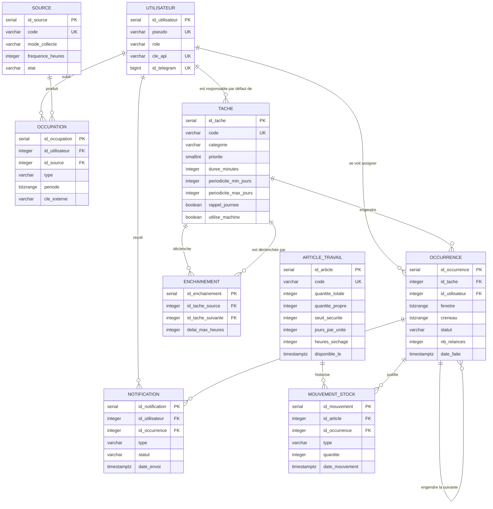

# Système de planification personnelle

Cahier des charges

Auteur : Thomas Mathis

Ce document remplace `cahier-des-charges-planification.md`, conservé pour mémoire.

---

## 1. Rappel du sujet et choix effectués

### 1.1 Rappel du sujet

Le projet consiste à concevoir et implanter le système d'information d'un assistant de planification personnelle. Le système croise des emplois du temps qui viennent de sources différentes — cours à l'IDMC, shifts chez McDonald's, disponibilités saisies à la main — et en déduit les moments réellement libres.

À partir de ces moments libres, le système place automatiquement des tâches récurrentes : ménage, litière du chat, lessives, vaisselle. Ces tâches n'ont pas de date fixe mais une périodicité — « passer l'aspirateur tous les 2 à 3 jours » — ce qui laisse au système une marge pour choisir le bon créneau.

Le résultat est consultable de deux façons : un flux iCalendar que n'importe quelle application de calendrier peut afficher, et un bot Telegram qui envoie les rappels et permet de valider une tâche d'un bouton. Une application web viendra plus tard et consommera la même API.

Le système gère deux utilisateurs : Thomas, administrateur, et Lorette, utilisatrice standard.

### 1.2 Choix effectués

Voici les choix effectués pour compléter le sujet.

- **Les règles métier vivent dans PostgreSQL.** Contraintes `CHECK`, contraintes d'exclusion, vues, fonctions PL/pgSQL et triggers. L'API ne fait qu'appeler et exposer. C'est un choix pédagogique autant que technique : la base garantit la cohérence même si un jour un script ou une saisie manuelle contourne l'API.
- **Les plages horaires sont modélisées avec le type `tstzrange`** plutôt qu'avec deux colonnes début et fin. Cela permet d'utiliser les opérateurs de chevauchement, l'indexation GiST et surtout les contraintes d'exclusion, qui rendent un chevauchement impossible au niveau de la base.
- **Une occurrence porte une fenêtre d'échéance, pas une date.** C'est ce qui distingue ce système d'une liste de tâches classique : le système a le droit de choisir quand, dans les limites qu'on lui donne.
- **La récurrence repart de la date réelle d'exécution**, jamais de la date théorique. Une tâche faite avec deux jours de retard ne doit pas décaler tout le reste du planning.
- **Deux natures de tâches.** La plupart des tâches ménagères n'ont pas d'heure : ce sont des rappels dans la journée. Elles sont exposées en événement journée entière dans le flux iCalendar. Seules les tâches réellement contraintes par une heure — les machines, qui doivent tourner en heures creuses — reçoivent un créneau horaire.
- **Une tâche du jour non validée le soir est reportée d'office au lendemain**, et re-notifiée, autant de fois qu'il le faut. Le nombre de relances est conservé : c'est ce qui permet de dire « en retard depuis trois jours » plutôt que de laisser la tâche disparaître.
- **Le cycle des vêtements de travail fait partie du socle**, et non des extensions. Il est indissociable des lessives : c'est le stock qui décide quand une machine doit tourner, et la machine à laver est une ressource unique qu'on ne peut pas mobiliser deux fois le même soir. Séparer les deux n'aurait pas de sens.
- **Une tâche non plaçable n'est jamais supprimée silencieusement.** Elle reste visible avec son motif d'échec. Un planning faux sans le dire est pire qu'un planning incomplet.
- **L'authentification est une clé d'API par utilisateur**, transmise dans un en-tête. Pour deux personnes sur un réseau local, les jetons à durée de vie et les mécanismes de rafraîchissement sont du décor.
- **Le sport et les déplacements en train sont hors périmètre de la première version.** Ils sont décrits en section 11 : ils réutilisent le même socle et s'ajoutent sans le remettre en cause.

---

## 2. Outils et architecture

### 2.1 Outils retenus

| Outil | Rôle | Pourquoi celui-là |
|---|---|---|
| PostgreSQL 16 | Données **et** règles métier | Types range, contraintes d'exclusion, PL/pgSQL : tout ce qu'il faut pour porter la logique |
| Python 3.12 | Langage unique du projet | Un seul langage pour l'API, la collecte et le bot |
| FastAPI | Couche HTTP | Documentation OpenAPI générée automatiquement, validation des entrées par Pydantic |
| psycopg 3 | Accès à la base | SQL écrit à la main, sans ORM : c'est le SQL qui porte les règles |
| httpx + icalendar | Collecte de l'ICS de l'ADE | Bibliothèques légères, pas de navigateur nécessaire |
| Playwright | Scraping du portail McDonald's | Nécessaire seulement pour ce site, qui exige une session authentifiée |
| icalendar | Export du planning | Génère le flux `.ics` consommé par les applications de calendrier |
| python-telegram-bot | Notifications et validation | Boutons intégrés dans le message : valider une tâche sans ouvrir d'application |
| APScheduler | Déclenchement périodique | Collectes et traitement quotidien, dans le même processus que l'API |
| Docker Compose | Exécution | Deux conteneurs : `db` et `api` |
| pytest | Tests | Surtout sur les fonctions SQL et le placement |

Sont volontairement écartés : les ORM, les files de messages, les frameworks de migration, les reverse proxies et les systèmes d'authentification à jetons. À l'échelle de deux utilisateurs et de quelques dizaines d'événements par jour, ils ajoutent de la configuration sans rien résoudre.

### 2.2 Schéma d'ensemble

```
   SOURCES EXTERNES                LE SYSTÈME                     SORTIES
   ────────────────                ──────────                     ───────

   ICS de l'ADE  ─────┐        ┌──────────────────┐
   Portail McDo  ─────┼───────►│   API FastAPI    │──────────►  Flux .ics
   Saisie manuelle ───┘        │  collecte        │             (calendrier
                               │  endpoints HTTP  │              du téléphone)
                               │  ordonnanceur    │
                               └────────┬─────────┘──────────►  Bot Telegram
                                        │                       (rappels et
                                        │ SQL                    validation)
                               ┌────────▼─────────┐
                               │   PostgreSQL     │──────────►  JSON
                               │  tables          │             (application
                               │  contraintes     │              web, plus tard)
                               │  vues            │
                               │  fonctions       │
                               │  triggers        │
                               └──────────────────┘
```

L'API est mince : elle reçoit une requête, appelle une fonction SQL ou lit une vue, et renvoie le résultat. Le calcul des disponibilités, le placement des tâches, la génération des occurrences et le contrôle des transitions se font dans la base.

---

## 3. Règles de gestion

Les règles sont classées en trois catégories : les règles sur les données, les règles sur les traitements et les règles sur les procédures manuelles.

| Règle | Type | Description |
|---|---|---|
| R1 | Données | Le système gère deux utilisateurs, l'un administrateur et l'autre standard. Chaque utilisateur possède une clé d'API et éventuellement un identifiant Telegram |
| R2 | Données | Une occupation est une plage horaire subie et non déplaçable : cours, shift, sommeil. Elle appartient à un utilisateur et provient d'une source |
| R3 | Données | Deux occupations de type cours ou travail ne peuvent pas se chevaucher pour un même utilisateur |
| R4 | Données | Une source déclare son mode de collecte et sa fréquence. Elle conserve la date de sa dernière collecte réussie |
| R5 | Données | Une occupation issue d'une collecte porte une clé externe, unique pour sa source, qui permet de la retrouver à la collecte suivante |
| R6 | Données | Une tâche récurrente est définie par une catégorie, une durée, une priorité de 1 à 5 et une périodicité minimale et maximale en jours. Elle ne porte aucune date |
| R7 | Données | Une tâche est soit un rappel dans la journée, sans heure imposée, soit une tâche à heure imposée. Une tâche à heure imposée déclare une fenêtre horaire, par exemple une machine à laver après 21h45 |
| R8 | Données | Une tâche déclare si elle mobilise la machine à laver, qui est une ressource unique |
| R9 | Données | Une occurrence est une exécution concrète d'une tâche. Elle porte une fenêtre d'échéance, et non une date unique |
| R10 | Données | Le créneau placé d'une occurrence est inclus dans sa fenêtre d'échéance et dure au moins le temps prévu par la tâche |
| R11 | Données | Deux occurrences à heure imposée ne peuvent pas se chevaucher pour un même utilisateur. Les rappels d'une même journée, eux, cohabitent |
| R12 | Données | Une tâche peut en déclencher une autre dans un délai maximal. La poussière déclenche l'aspirateur dans les 24 heures |
| R13 | Données | Un article de travail est défini par sa quantité totale, un seuil de sécurité, le nombre de jours de travail qu'une unité couvre et une durée de séchage |
| R14 | Données | La quantité propre d'un article ne dépasse jamais sa quantité totale et ne descend jamais sous zéro |
| R15 | Données | Chaque changement de stock est historisé avec son type, sa quantité et sa date |
| R16 | Traitement | Les disponibilités d'un utilisateur sont l'horizon moins ses occupations, moins les créneaux déjà placés |
| R17 | Traitement | Le système place les occurrences par priorité croissante, puis par échéance croissante, dans la première disponibilité assez longue et compatible avec la fenêtre horaire de la tâche |
| R18 | Traitement | Une tâche sans heure imposée est affectée à un jour, pas à une heure. Le système vérifie seulement que la journée laisse assez de temps libre au total |
| R19 | Traitement | Un créneau déjà notifié à l'utilisateur n'est plus déplacé par un placement ultérieur |
| R20 | Traitement | Une occurrence qui ne trouve aucun créneau reste à placer, avec un motif lisible, et n'est jamais supprimée |
| R21 | Traitement | La validation d'une occurrence enregistre la date réelle d'exécution et crée automatiquement l'occurrence suivante à partir de cette date, jamais à partir de l'échéance théorique |
| R22 | Traitement | La validation d'une occurrence déclenche les tâches enchaînées. Si une occurrence de la tâche suivante existe déjà dans le délai, elle est repositionnée au lieu d'être dupliquée |
| R23 | Traitement | Une tâche déclenchée par enchaînement ne peut jamais être placée avant la tâche qui l'a déclenchée |
| R24 | Traitement | Une occurrence est en retard si sa fenêtre d'échéance est dépassée, ou si elle a déjà subi au moins un report d'office. C'est le système qui le calcule, jamais celui qui affiche |
| R25 | Traitement | Le statut d'une occurrence ne peut pas régresser : une occurrence faite ne peut pas redevenir planifiée |
| R26 | Traitement | Une occurrence du jour qui n'est pas validée le soir est reportée d'office au lendemain et re-notifiée. Le nombre de relances est conservé et croît tant que la tâche n'est pas faite |
| R27 | Traitement | Chaque matin, le système notifie chaque utilisateur des tâches du jour et de ses tâches en retard |
| R28 | Traitement | Une notification est d'abord enregistrée en base, puis envoyée. Un échec d'envoi laisse la notification en attente et ne la perd pas |
| R29 | Traitement | Le flux iCalendar expose les occupations et les occurrences placées. Une occurrence sans heure imposée devient un événement journée entière, une occurrence à heure imposée devient un événement horaire |
| R30 | Traitement | Une source dont la dernière collecte réussie remonte à plus de deux fois sa fréquence est déclarée en panne et l'administrateur en est averti |
| R31 | Traitement | Chaque journée d'occupation de type travail consomme une unité de chaque article, selon le nombre de jours que cette unité couvre |
| R32 | Traitement | La quantité propre projetée d'un article est sa quantité propre actuelle moins la consommation prévue par les shifts à venir |
| R33 | Traitement | Dès que la quantité propre projetée d'un article passe sous son seuil de sécurité, le système crée une occurrence de lessive dont l'échéance est le début du shift menacé, moins la durée de séchage, moins la durée du cycle |
| R34 | Traitement | Si cette échéance est déjà dépassée au moment du calcul, la lessive est signalée en alerte immédiate plutôt que planifiée |
| R35 | Traitement | Deux occurrences mobilisant la machine à laver ne peuvent pas être placées le même jour |
| R36 | Traitement | La validation d'une lessive ne rend pas les vêtements immédiatement portables : ils redeviennent disponibles à la date de validation plus la durée de séchage |
| R37 | Procédure manuelle | L'utilisateur valide, reporte ou refuse une occurrence, depuis le bot ou depuis l'API |
| R38 | Procédure manuelle | La validation peut être rétroactive : l'utilisateur déclare avoir fait la tâche la veille |
| R39 | Procédure manuelle | L'administrateur peut forcer un créneau, qui devient épinglé et n'est plus déplacé |
| R40 | Procédure manuelle | Les occupations peuvent être saisies à la main, ce qui permet au système de fonctionner même quand une collecte échoue |
| R41 | Procédure manuelle | L'administrateur peut déclencher une collecte ou un replacement à tout moment |
| R42 | Procédure manuelle | L'utilisateur peut recaler à la main la quantité propre d'un article, quand le compte s'est désynchronisé de la réalité |
| R43 | Données | Une tâche peut exiger que les deux utilisateurs soient présents en même temps. Elle est alors nécessairement à heure imposée : un rappel « dans la journée » ne dit rien de la simultanéité |
| R44 | Traitement | Une tâche à deux est placée sur une intersection des disponibilités des deux utilisateurs. S'il n'en existe aucune sur sa fenêtre, le système notifie au lieu de placer la tâche au hasard |
| R45 | Traitement | Quand une source publie une occupation qui en chevauche une autre, l'occupation refusée est conservée en conflit plutôt que perdue |
| R46 | Traitement | Un conflit qui commence dans plus de deux semaines n'est pas soumis à arbitrage : l'emploi du temps sera vraisemblablement corrigé d'ici là |
| R47 | Procédure manuelle | Pour un conflit à moins de deux semaines, l'utilisateur choisit laquelle des deux occupations garder. Le choix est mémorisé et la question ne se repose plus |
| R48 | Données | Une source déclare son profil de collecte, le type d'occupation qu'elle produit, et son horizon. Ces réglages sont des données, pas du code |
| R49 | Procédure manuelle | L'URL d'un flux se renseigne depuis le bot. Elle n'est jamais versionnée : celle du planning de travail contient un jeton d'accès personnel |
| R50 | Données | En alternance, l'espagnol ne fait plus partie des langues suivies. C'est un drapeau de configuration, pas une modification du code |

Une règle garde son numéro une fois attribué, même quand une règle plus récente relève d'une catégorie antérieure : les numéros servent de référence dans les contraintes, les opérations et les commentaires du code SQL.

---

## 4. Acteurs du système

| Acteur | Type | Rôle |
|---|---|---|
| Thomas, administrateur | Principal | Configure les tâches récurrentes et les sources, saisit ses occupations, valide ses occurrences, force des créneaux, déclenche collectes et replacements |
| Lorette, utilisatrice standard | Principal | Saisit son emploi du temps, consulte son planning, valide, reporte ou refuse les occurrences qui lui sont assignées |
| Système | Secondaire | Calcule les disponibilités, place les occurrences, contrôle les transitions de statut, génère les occurrences suivantes et les notifications |
| Collecteur | Secondaire | Récupère les données des sources externes et les normalise en occupations |
| Ordonnanceur | Principal | Déclenche les collectes selon leur fréquence, le replacement et le traitement quotidien |
| ADE de l'Université de Lorraine | Secondaire | Fournit l'emploi du temps universitaire sous forme de fichier iCalendar |
| Portail McDonald's | Secondaire | Fournit les shifts prévisionnels |
| Telegram | Secondaire | Transporte les notifications et renvoie les actions de l'utilisateur |

---

## 5. Diagramme des données



---

## 6. Dictionnaire de données

### Table : Utilisateur

| Attribut | Type | NULL ? | Contrainte domaine | Unicité | Défaut | PK | FK |
|---|---|---|---|---|---|---|---|
| id_utilisateur | SERIAL | non | | oui | | oui | |
| pseudo | VARCHAR(50) | non | | oui | | | |
| nom | VARCHAR(50) | non | | | | | |
| role | VARCHAR(20) | non | 'admin', 'standard' | | 'standard' | | |
| fuseau | VARCHAR(50) | non | | | 'Europe/Paris' | | |
| cle_api | VARCHAR(64) | non | longueur >= 32 | oui | | | |
| id_telegram | BIGINT | oui | | oui | | | |
| actif | BOOLEAN | non | | | TRUE | | |
| date_creation | DATE | non | | | CURRENT_DATE | | |

### Table : Source

| Attribut | Type | NULL ? | Contrainte domaine | Unicité | Défaut | PK | FK |
|---|---|---|---|---|---|---|---|
| id_source | SERIAL | non | | oui | | oui | |
| code | VARCHAR(30) | non | | oui | | | |
| libelle | VARCHAR(100) | non | | | | | |
| mode_collecte | VARCHAR(20) | non | 'ics', 'scraping', 'manuelle' | | | | |
| url | TEXT | oui | | | | | |
| frequence_heures | INTEGER | non | > 0 | | 24 | | |
| derniere_collecte | TIMESTAMPTZ | oui | | | | | |
| etat | VARCHAR(20) | non | 'ok', 'en_panne' | | 'ok' | | |
| configuration | JSONB | non | | | '{}' | | |
| active | BOOLEAN | non | | | TRUE | | |

L'URL n'est jamais écrite dans le code ni dans le dépôt : celle du planning de travail contient un jeton d'accès personnel. Elle est fournie à l'exécution, depuis le bot, et l'API ne la renvoie jamais.

`configuration` porte les réglages du collecteur : profil de lecture, type d'occupation produit, horizon, et pour l'emploi du temps universitaire le groupe de TD et les langues suivies. Ce sont des données : changer de groupe au second semestre ne doit demander qu'une mise à jour, pas un redéploiement.

### Table : Occupation

| Attribut | Type | NULL ? | Contrainte domaine | Unicité | Défaut | PK | FK |
|---|---|---|---|---|---|---|---|
| id_occupation | SERIAL | non | | oui | | oui | |
| id_utilisateur | INTEGER | non | | | | | Utilisateur |
| id_source | INTEGER | non | | | | | Source |
| type | VARCHAR(20) | non | 'cours', 'travail', 'sommeil', 'autre' | | | | |
| libelle | VARCHAR(150) | non | | | | | |
| periode | TSTZRANGE | non | non vide, bornée | | | | |
| lieu | VARCHAR(100) | oui | | | | | |
| cle_externe | VARCHAR(200) | oui | | oui avec id_source | | | |
| date_collecte | TIMESTAMPTZ | non | | | now() | | |

### Table : Tache

| Attribut | Type | NULL ? | Contrainte domaine | Unicité | Défaut | PK | FK |
|---|---|---|---|---|---|---|---|
| id_tache | SERIAL | non | | oui | | oui | |
| code | VARCHAR(30) | non | | oui | | | |
| libelle | VARCHAR(100) | non | | | | | |
| categorie | VARCHAR(20) | non | 'menage', 'linge', 'vaisselle', 'animal', 'admin' | | | | |
| priorite | SMALLINT | non | entre 1 et 5 | | 3 | | |
| duree_minutes | INTEGER | non | > 0 | | | | |
| periodicite_min_jours | INTEGER | non | > 0 | | | | |
| periodicite_max_jours | INTEGER | non | >= periodicite_min_jours | | | | |
| rappel_journee | BOOLEAN | non | FALSE si une fenêtre horaire est définie | | TRUE | | |
| heure_min | TIME | oui | | | | | |
| heure_max | TIME | oui | > heure_min si définie | | | | |
| utilise_machine | BOOLEAN | non | | | FALSE | | |
| lave_uniforme | BOOLEAN | non | implique utilise_machine | | FALSE | | |
| requiert_les_deux | BOOLEAN | non | implique NOT rappel_journee | | FALSE | | |
| reportable | BOOLEAN | non | | | TRUE | | |
| id_utilisateur_defaut | INTEGER | oui | | | | | Utilisateur |
| active | BOOLEAN | non | | | TRUE | | |

La priorité 1 est la plus forte. Elle est réservée aux tâches qu'on ne peut pas repousser : la litière du chat, et la lessive de travail quand le stock est menacé.

`rappel_journee` distingue les deux natures de tâches de la règle R7. Une tâche cochée à vrai n'a pas d'heure : elle sortira en événement journée entière dans le calendrier. Une tâche cochée à faux doit déclarer sa fenêtre horaire.

### Table : Enchainement

| Attribut | Type | NULL ? | Contrainte domaine | Unicité | Défaut | PK | FK |
|---|---|---|---|---|---|---|---|
| id_enchainement | SERIAL | non | | oui | | oui | |
| id_tache_source | INTEGER | non | | oui avec id_tache_suivante | | | Tache |
| id_tache_suivante | INTEGER | non | ≠ id_tache_source | | | | Tache |
| delai_max_heures | INTEGER | non | > 0 | | 24 | | |

### Table : Occurrence

| Attribut | Type | NULL ? | Contrainte domaine | Unicité | Défaut | PK | FK |
|---|---|---|---|---|---|---|---|
| id_occurrence | SERIAL | non | | oui | | oui | |
| id_tache | INTEGER | non | | | | | Tache |
| id_utilisateur | INTEGER | oui | | | | | Utilisateur |
| fenetre | TSTZRANGE | non | non vide, bornée | | | | |
| creneau | TSTZRANGE | oui | inclus dans fenetre | | | | |
| statut | VARCHAR(20) | non | 'a_placer', 'planifiee', 'notifiee', 'faite', 'reportee', 'abandonnee' | | 'a_placer' | | |
| origine | VARCHAR(20) | non | 'recurrence', 'manuelle', 'enchainement', 'stock' | | 'recurrence' | | |
| epinglee | BOOLEAN | non | | | FALSE | | |
| rappel_journee | BOOLEAN | non | recopié de la tâche | | TRUE | | |
| utilise_machine | BOOLEAN | non | recopié de la tâche | | FALSE | | |
| nb_relances | INTEGER | non | >= 0 | | 0 | | |
| motif | TEXT | oui | | | | | |
| date_faite | TIMESTAMPTZ | oui | obligatoire si statut = 'faite', jamais dans le futur | | | | |
| id_occurrence_source | INTEGER | oui | | | | | Occurrence |
| date_creation | TIMESTAMPTZ | non | | | now() | | |

Le champ `motif` conserve la raison du placement ou de l'échec : « placée à 18h, dernier créneau de 40 min avant l'échéance » ou « aucun créneau libre avant le 12 ». C'est ce qui rend le système compréhensible plutôt qu'arbitraire.

Le champ `nb_relances` compte les reports d'office. Il ne sert pas à limiter les relances — une tâche revient jusqu'à ce qu'elle soit faite — mais à afficher « en retard depuis 3 jours » et à repérer les tâches que tu ne fais jamais, qui méritent d'être revues plutôt que répétées.

Les deux drapeaux `rappel_journee` et `utilise_machine` sont recopiés de la tâche à la création de l'occurrence, par trigger. C'est une dénormalisation assumée : une contrainte d'exclusion ne sait pas lire une table liée, et ce sont ces drapeaux qui conditionnent les contraintes de chevauchement et de machine unique.

### Table : Notification

| Attribut | Type | NULL ? | Contrainte domaine | Unicité | Défaut | PK | FK |
|---|---|---|---|---|---|---|---|
| id_notification | SERIAL | non | | oui | | oui | |
| id_utilisateur | INTEGER | non | | | | | Utilisateur |
| id_occurrence | INTEGER | oui | | | | | Occurrence |
| type | VARCHAR(30) | non | 'rappel', 'bilan', 'alerte' | | | | |
| contenu | TEXT | non | | | | | |
| statut | VARCHAR(20) | non | 'a_envoyer', 'envoyee', 'echec' | | 'a_envoyer' | | |
| date_creation | TIMESTAMPTZ | non | | | now() | | |
| date_envoi | TIMESTAMPTZ | oui | obligatoire si statut = 'envoyee' | | | | |

### Table : Conflit

| Attribut | Type | NULL ? | Contrainte domaine | Unicité | Défaut | PK | FK |
|---|---|---|---|---|---|---|---|
| id_conflit | SERIAL | non | | oui | | oui | |
| id_occupation | INTEGER | non | | | | | Occupation |
| id_source | INTEGER | non | | | | | Source |
| cle_externe | VARCHAR(200) | non | | oui avec id_source et id_occupation | | | |
| libelle | VARCHAR(150) | non | | | | | |
| periode | TSTZRANGE | non | non vide, bornée | | | | |
| lieu | VARCHAR(100) | oui | | | | | |
| details | TEXT | oui | | | | | |
| statut | VARCHAR(20) | non | 'en_attente', 'resolu' | | 'en_attente' | | |
| choix | VARCHAR(20) | oui | 'existante', 'nouvelle' ; obligatoire si résolu | | | | |
| date_detection | TIMESTAMPTZ | non | | | now() | | |
| date_resolution | TIMESTAMPTZ | oui | obligatoire si résolu | | | | |

`id_occupation` désigne ce qui est déjà au planning ; les colonnes `libelle`, `periode`, `lieu` et `details` décrivent la version que la source voudrait mettre à la place et que la contrainte d'exclusion a refusée.

Le champ `choix` est mémorisé pour que la collecte suivante ne repose pas la même question. Sans lui, garder l'existante ne servirait à rien : la version rejetée reviendrait toutes les douze heures.

### Table : ArticleTravail

| Attribut | Type | NULL ? | Contrainte domaine | Unicité | Défaut | PK | FK |
|---|---|---|---|---|---|---|---|
| id_article | SERIAL | non | | oui | | oui | |
| code | VARCHAR(30) | non | | oui | | | |
| libelle | VARCHAR(100) | non | | | | | |
| quantite_totale | INTEGER | non | > 0 | | | | |
| quantite_propre | INTEGER | non | entre 0 et quantite_totale | | | | |
| seuil_securite | INTEGER | non | entre 0 et quantite_totale | | 1 | | |
| jours_par_unite | INTEGER | non | > 0 | | 1 | | |
| heures_sechage | INTEGER | non | > 0 | | 24 | | |
| disponible_le | TIMESTAMPTZ | oui | | | | | |
| date_maj | TIMESTAMPTZ | non | | | now() | | |

Valeurs de départ : trois t-shirts, une unité couvre un jour de travail, séchage 24 heures ; deux pantalons, une unité couvre deux jours, séchage 36 heures. Seuil de sécurité à 1 dans les deux cas.

`disponible_le` porte la règle qui manquait à toute version naïve du problème : un vêtement lavé n'est pas un vêtement portable. Tant que cette date n'est pas atteinte, les unités en séchage ne comptent pas dans le stock utilisable.

`quantite_propre` est maintenue par trigger à chaque mouvement, jamais écrite directement par l'API.

### Table : MouvementStock

| Attribut | Type | NULL ? | Contrainte domaine | Unicité | Défaut | PK | FK |
|---|---|---|---|---|---|---|---|
| id_mouvement | SERIAL | non | | oui | | oui | |
| id_article | INTEGER | non | | | | | ArticleTravail |
| type | VARCHAR(20) | non | 'salissure', 'lavage', 'retour_propre', 'recalage' | | | | |
| quantite | INTEGER | non | ≠ 0 | | | | |
| date_mouvement | TIMESTAMPTZ | non | | | now() | | |
| id_occurrence | INTEGER | oui | | | | | Occurrence |

Chaque changement de stock laisse une ligne, comme un journal comptable. On peut donc toujours reconstituer pourquoi il ne restait qu'un t-shirt propre un mardi soir.

---

## 7. Contraintes d'intégrité

Ces contraintes sont traduites en `CHECK`, contraintes d'exclusion, fonctions et triggers.

| Règle visée | Description | Type |
|---|---|---|
| R1 | `role` appartient à {admin, standard}, `cle_api` unique et d'au moins 32 caractères | Statique forte |
| R2 | Une occupation référence un utilisateur et une source existants | Statique forte |
| R2 | `periode` est non vide et bornée des deux côtés | Statique forte |
| R3 | Deux occupations de type cours ou travail ne se chevauchent pas pour un même utilisateur : contrainte d'exclusion GiST partielle | Statique forte |
| R4 | `frequence_heures > 0`, `etat` appartient à {ok, en_panne} | Statique forte |
| R5 | Le couple (`id_source`, `cle_externe`) est unique quand la clé externe est renseignée | Statique forte |
| R6 | `priorite` entre 1 et 5, `duree_minutes > 0`, `periodicite_max_jours >= periodicite_min_jours` | Statique forte |
| R7 | Une tâche à heure imposée déclare ses deux bornes horaires avec `heure_max > heure_min` ; une tâche de type rappel n'en déclare aucune | Statique forte |
| R7 | `rappel_journee` et `utilise_machine` sont recopiés de la tâche vers l'occurrence : trigger | Dynamique forte |
| R9 | `fenetre` est non vide et bornée | Statique forte |
| R10 | `creneau` est inclus dans `fenetre` | Statique forte |
| R10 | La durée du créneau est au moins égale à `duree_minutes` de la tâche | Statique forte |
| R11 | Deux occurrences à heure imposée ne se chevauchent pas pour un même utilisateur : contrainte d'exclusion GiST partielle sur `NOT rappel_journee` et les statuts planifiée et notifiée | Statique forte |
| R12 | Un enchaînement n'est pas réflexif, et le couple (source, suivante) est unique | Statique forte |
| R13 | `quantite_totale > 0`, `jours_par_unite > 0`, `heures_sechage > 0`, `seuil_securite` entre 0 et `quantite_totale` | Statique forte |
| R14 | `quantite_propre` reste entre 0 et `quantite_totale` | Statique forte |
| R15 | `quantite` d'un mouvement est non nulle ; `quantite_propre` est recalculée à chaque mouvement : trigger | Dynamique forte |
| R17 | Le placement respecte la fenêtre horaire de la tâche | Dynamique forte |
| R19 | Une occurrence notifiée ou épinglée n'est pas déplacée par le placement | Dynamique forte |
| R20 | Une occurrence non plaçable garde le statut à placer et reçoit un motif | Dynamique faible |
| R21 | `date_faite` est renseignée dès que le statut passe à faite, et n'est jamais dans le futur | Statique forte |
| R21 | Le passage au statut faite crée l'occurrence suivante : trigger | Dynamique forte |
| R22 | Le passage au statut faite crée ou repositionne les occurrences enchaînées : trigger | Dynamique forte |
| R23 | Une occurrence issue d'un enchaînement a une fenêtre qui commence à la date d'exécution de sa source | Dynamique forte |
| R25 | Le statut ne régresse pas : les statuts faite, reportée et abandonnée sont terminaux : trigger | Dynamique forte |
| R26 | `nb_relances >= 0`, et il n'augmente que d'une unité par report d'office : trigger | Dynamique forte |
| R28 | `date_envoi` est renseignée dès que le statut passe à envoyée | Statique forte |
| R30 | Une source est en panne quand `now() - derniere_collecte > 2 × frequence_heures` : vue | Dynamique faible |
| R33 | La lessive créée par le stock a la priorité 1 et n'est pas reportable | Dynamique forte |
| R35 | Deux occurrences avec `utilise_machine` ne sont pas placées le même jour pour un même utilisateur : trigger | Dynamique forte |
| R36 | La validation d'une lessive fixe `disponible_le` à la date de validation plus `heures_sechage` : trigger | Dynamique forte |
| R36 | Les unités en séchage ne comptent pas dans le stock utilisable tant que `disponible_le` n'est pas atteint : vue | Dynamique forte |
| R43 | `requiert_les_deux` exclut `rappel_journee` | Statique forte |
| R44 | Le créneau d'une tâche à deux est libre pour tous les utilisateurs actifs simultanément : intersection de multirange | Dynamique forte |
| R44 | L'absence d'intersection produit une notification d'alerte, jamais un placement arbitraire | Dynamique faible |
| R45 | Une occupation refusée par la contrainte d'exclusion est enregistrée en conflit, avec la version déjà en place | Dynamique forte |
| R46 | Un conflit à plus de deux semaines n'est pas enregistré : vue `v_conflit`, colonne `a_arbitrer` | Dynamique faible |
| R47 | Un conflit résolu porte son choix et sa date de résolution | Statique forte |
| R47 | Un conflit tranché en faveur de l'existant écarte durablement la version rejetée | Dynamique forte |
| R48 | `configuration` est un JSONB, validé à l'usage par le collecteur | Statique faible |

---

## 8. Description des opérations

### Opération 1 : Collecte d'une source

| | |
|---|---|
| **Objectif** | Récupérer les contraintes dures d'une source externe et les enregistrer comme occupations |
| **Acteurs** | Ordonnanceur ou administrateur (principal), collecteur et source externe (secondaires) |
| **Événement déclencheur** | La fréquence de la source est écoulée, ou l'administrateur force la collecte |
| **Pré-conditions** | La source existe et est active |
| **Actions** | 1. Récupérer les données brutes auprès de la source, sur une fenêtre glissante<br>2. Les transformer en occupations selon le profil de la source, chacune portant une clé externe<br>3. Fusionner les doublons de clé externe en gardant la version la plus informative<br>4. Écarter ce qui ne concerne pas l'utilisateur : langue non suivie, autre groupe, hors horizon<br>5. Pour chaque occupation, si la clé externe existe déjà pour cette source, mettre à jour la ligne ; sinon l'insérer<br>6. Supprimer les occupations de cette source qui n'apparaissent plus dans la collecte et qui sont dans le futur<br>7. Mettre à jour `derniere_collecte` et repasser l'état à ok<br>8. Si des occupations ont changé, déclencher l'opération 4 |
| **Actions alternatives** | Si la source est injoignable ou renvoie des données illisibles, ne rien modifier, laisser `derniere_collecte` inchangée. La vue de santé signalera la panne si le retard dépasse deux fois la fréquence.<br>Si une occupation en chevauche une autre, la contrainte d'exclusion la refuse : elle part en conflit (opération 11) plutôt que de faire échouer toute la collecte |
| **Post-conditions** | Les occupations de la source reflètent l'état réel de l'emploi du temps, sans doublon. Le bilan de collecte dit ce qui a été écarté et pourquoi |

### Opération 2 : Génération des occurrences manquantes

| | |
|---|---|
| **Objectif** | Créer les occurrences des tâches qui n'en ont aucune en cours |
| **Acteurs** | Système (principal) |
| **Événement déclencheur** | Exécution du placement, ou traitement quotidien |
| **Pré-conditions** | Aucune |
| **Actions** | 1. Pour chaque tâche active, chercher une occurrence non terminée<br>2. S'il n'en existe pas, déterminer la date de référence : la dernière date d'exécution réelle de cette tâche, ou la date du jour si la tâche n'a jamais été faite<br>3. Créer une occurrence dont la fenêtre va de la date de référence plus la périodicité minimale, à la date de référence plus la périodicité maximale<br>4. Assigner l'occurrence à l'utilisateur par défaut de la tâche |
| **Actions alternatives** | Une tâche désactivée est ignorée. Une tâche qui a déjà une occurrence en cours est ignorée : c'est ce qui empêche l'accumulation |
| **Post-conditions** | Chaque tâche active a exactement une occurrence en cours |

### Opération 3 : Projection du stock de vêtements de travail

| | |
|---|---|
| **Objectif** | Déclencher une lessive assez tôt pour ne jamais se retrouver sans uniforme propre |
| **Acteurs** | Système (principal) |
| **Événement déclencheur** | Une collecte a modifié les shifts, une lessive a été validée, ou le traitement du matin s'exécute |
| **Pré-conditions** | Les articles de travail sont renseignés avec leur quantité et leur seuil |
| **Actions** | 1. Lister les journées d'occupation de type travail à venir, dans l'ordre chronologique<br>2. Partir de la quantité propre actuelle de chaque article, en excluant les unités dont la date de disponibilité n'est pas atteinte<br>3. Parcourir les journées de travail une par une et décrémenter le stock projeté selon le nombre de jours qu'une unité couvre<br>4. Repérer la première journée où le stock projeté d'un article passe sous son seuil de sécurité<br>5. Calculer l'échéance de lessive : début de ce shift, moins la durée de séchage de l'article, moins la durée du cycle<br>6. S'il n'existe pas déjà une occurrence de lessive en cours, en créer une en priorité 1, avec une fenêtre qui se termine à cette échéance |
| **Actions alternatives** | Si l'échéance calculée est déjà passée, ne pas planifier : créer une notification d'alerte immédiate. Il est trop tard pour que le linge sèche, la personne doit le savoir tout de suite plutôt que découvrir le problème au moment de partir.<br>Si aucun shift n'est connu, ne rien faire : c'est le cas quand la collecte du portail est en panne et qu'aucune saisie manuelle n'a été faite |
| **Post-conditions** | Une lessive est programmée avant la rupture, ou l'utilisateur est averti qu'elle ne peut plus l'être |

### Opération 4 : Placement des tâches

| | |
|---|---|
| **Objectif** | Attribuer un créneau à chaque occurrence en attente |
| **Acteurs** | Système (principal), ordonnanceur ou administrateur (déclencheur) |
| **Événement déclencheur** | Collecte ayant modifié une occupation, validation d'une tâche, traitement quotidien, ou demande explicite |
| **Pré-conditions** | Aucune |
| **Actions** | 1. Exécuter les opérations 2 et 3 pour compléter les occurrences manquantes<br>2. Libérer le créneau des occurrences ni notifiées ni épinglées : elles retournent au statut à placer<br>3. Calculer les disponibilités de chaque utilisateur sur l'horizon : l'horizon moins les occupations, moins les créneaux conservés<br>4. Trier les occurrences à placer par priorité croissante, puis par fin de fenêtre croissante, puis par durée décroissante<br>5. **Tâche à heure imposée** : chercher la première disponibilité assez longue, incluse dans la fenêtre d'échéance et dans la fenêtre horaire de la tâche, et à venir. Si la tâche mobilise la machine, écarter les jours où une autre tâche à machine est déjà placée<br>6. **Tâche à deux** : chercher de la même façon, mais dans l'intersection des disponibilités de tous les utilisateurs actifs<br>7. **Tâche de type rappel** : chercher le premier jour de la fenêtre d'échéance dont le temps libre total dépasse la durée de la tâche, et affecter la journée entière<br>8. Enregistrer le créneau, passer au statut planifiée et écrire le motif du placement<br>9. Retirer le temps consommé des disponibilités et passer à l'occurrence suivante |
| **Actions alternatives** | Si aucune disponibilité ne convient, l'occurrence reste au statut à placer et reçoit un motif explicite. Elle sera retentée au placement suivant et signalée dans le bilan du matin.<br>Pour une tâche à deux, l'absence d'intersection déclenche en plus une notification : c'est un cas qu'aucun replacement ne résoudra tout seul |
| **Post-conditions** | Chaque occurrence plaçable est affectée à un créneau ou à une journée. Aucune tâche à heure imposée n'en chevauche une autre, aucun jour ne porte deux machines. Les occurrences non plaçables restent visibles avec leur motif |

### Opération 5 : Validation d'une occurrence

| | |
|---|---|
| **Objectif** | Enregistrer qu'une tâche a été faite et enchaîner sur la suite |
| **Acteurs** | Utilisateur (principal), système (secondaire) |
| **Événement déclencheur** | L'utilisateur appuie sur le bouton de validation du bot, ou appelle l'API |
| **Pré-conditions** | L'occurrence existe, n'est pas dans un statut terminal, et l'utilisateur en est l'assigné ou est administrateur |
| **Actions** | 1. Vérifier que la date d'exécution fournie n'est pas dans le futur ; en l'absence de date, prendre l'heure courante<br>2. Passer le statut à faite et enregistrer la date réelle<br>3. Créer l'occurrence suivante de la même tâche, dont la fenêtre est calculée **à partir de la date réelle** et non de l'échéance théorique<br>4. Pour chaque enchaînement partant de cette tâche, chercher une occurrence en cours de la tâche suivante dont la fenêtre croise l'intervalle allant de la date réelle à la date réelle plus le délai maximal<br>5. Si une telle occurrence existe, la repositionner pour qu'elle commence à la date réelle ; sinon en créer une avec cette fenêtre et l'origine enchaînement<br>6. Si la tâche validée est une lessive de travail, enregistrer un mouvement de stock de type lavage et fixer la date de disponibilité des articles concernés à la date réelle plus leur durée de séchage<br>7. Déclencher l'opération 4 |
| **Actions alternatives** | Si l'occurrence est déjà dans un statut terminal, rejeter l'opération : une deuxième validation écraserait la date réelle et fausserait toute la récurrence. Si l'utilisateur n'est ni l'assigné ni administrateur, rejeter |
| **Post-conditions** | La tâche est soldée, la suivante est en attente de placement, les tâches enchaînées sont programmées sans doublon, et le stock reflète la réalité |

### Opération 6 : Report ou refus d'une occurrence

| | |
|---|---|
| **Objectif** | Permettre de repousser une tâche ou de la rendre |
| **Acteurs** | Utilisateur (principal) |
| **Événement déclencheur** | L'utilisateur appuie sur le bouton reporter ou refuser |
| **Pré-conditions** | L'occurrence existe, n'est pas dans un statut terminal, et l'utilisateur en est l'assigné ou est administrateur |
| **Actions** | **Report** : 1. Passer l'occurrence au statut reportée<br>2. Créer une occurrence de remplacement dont la fenêtre va de maintenant à la nouvelle échéance demandée<br>**Refus** : 1. Passer l'occurrence au statut abandonnée<br>2. Créer une occurrence de remplacement avec la même fenêtre, mais sans assigné, pour qu'elle soit reprise par l'autre utilisateur ou réassignée à la main<br>3. Dans les deux cas, déclencher l'opération 4 |
| **Actions alternatives** | Si la nouvelle échéance demandée est dans le passé, rejeter l'opération. Si la tâche est une lessive créée par la projection de stock, refuser le report : la repousser reviendrait à se retrouver sans uniforme propre, et le système ne doit pas permettre de le faire sans le dire |
| **Post-conditions** | La tâche reste due sous une nouvelle forme. Rien ne disparaît sans trace |

### Opération 7 : Bilan du matin

| | |
|---|---|
| **Objectif** | Prévenir chaque utilisateur de sa journée et de ses retards |
| **Acteurs** | Ordonnanceur (principal), système (secondaire) |
| **Événement déclencheur** | Il est 7h00 |
| **Pré-conditions** | Aucune |
| **Actions** | 1. Exécuter l'opération 4 pour disposer d'un planning à jour<br>2. Pour chaque utilisateur, lister ses occurrences affectées à la journée<br>3. Créer une notification de type bilan contenant cette liste, en indiquant pour chaque tâche relancée depuis combien de jours elle est due<br>4. Passer ces occurrences au statut notifiée, ce qui fige leur affectation<br>5. Lister les occurrences en retard et les ajouter au bilan<br>6. Lister les occurrences restées à placer et les signaler<br>7. Vérifier l'état des sources et créer une notification d'alerte à l'administrateur pour chaque source en panne<br>8. Envoyer les notifications en attente par le bot et enregistrer la date d'envoi |
| **Actions alternatives** | S'il n'y a ni tâche du jour, ni retard, ni panne, aucune notification n'est créée : un bilan vide tous les matins ferait couper les notifications en une semaine |
| **Post-conditions** | Chaque utilisateur sait ce qu'il a à faire, les affectations communiquées sont figées, les notifications non envoyées restent en attente |

### Opération 8 : Relance du soir et report d'office

| | |
|---|---|
| **Objectif** | Faire revenir le lendemain une tâche qui n'a pas été faite, sans jamais la perdre |
| **Acteurs** | Ordonnanceur (principal) |
| **Événement déclencheur** | Il est 21h00 |
| **Pré-conditions** | Aucune |
| **Actions** | 1. Lister les occurrences notifiées affectées à la journée qui s'achève et qui ne sont pas validées<br>2. Créer une notification de rappel pour chacune, avec ses boutons d'action<br>3. À minuit, pour celles qui restent non validées : reporter l'affectation au lendemain, étendre la fenêtre d'échéance jusqu'à cette nouvelle date, incrémenter le nombre de relances et repasser l'occurrence au statut planifiée<br>4. L'occurrence sera reprise dans le bilan du matin suivant, marquée comme en retard |
| **Actions alternatives** | Une tâche à heure imposée dont l'heure est passée n'est pas relancée le soir même : elle est directement reportée, puisqu'on ne peut plus lancer une machine à 23h50 pour qu'elle finisse en heures creuses.<br>Une lessive de travail dont l'échéance de stock est dépassée ne se contente pas d'un report : elle déclenche une alerte, parce que le report ne résout rien |
| **Post-conditions** | Aucune tâche non faite ne disparaît. Chaque tâche revient le lendemain, avec son compteur de relances qui rend le retard visible |

### Opération 9 : Consultation du planning

| | |
|---|---|
| **Objectif** | Rendre le planning visible sans interface graphique |
| **Acteurs** | Utilisateur (principal), application de calendrier (secondaire) |
| **Événement déclencheur** | L'utilisateur ouvre son calendrier, ou appelle l'API |
| **Pré-conditions** | L'appelant fournit une clé d'API valide |
| **Actions** | 1. Lire la vue de planning pour l'utilisateur et la période demandée<br>2. En sortie JSON, renvoyer les occupations et les occurrences avec leur statut, leur retard éventuel, leur nombre de relances et les actions possibles<br>3. En sortie iCalendar, produire un `VEVENT` par occupation et par occurrence affectée : événement horaire pour les occupations et les tâches à heure imposée, événement journée entière pour les tâches de type rappel |
| **Actions alternatives** | Sans clé d'API valide, rejeter la demande |
| **Post-conditions** | Le planning est affiché dans l'application de calendrier du téléphone, sans qu'aucune interface n'ait été développée |

### Opération 10 : Saisie manuelle d'une occupation

| | |
|---|---|
| **Objectif** | Renseigner une contrainte que la collecte ne fournit pas, ou plus |
| **Acteurs** | Utilisateur (principal) |
| **Événement déclencheur** | Un shift n'est pas remonté, la collecte est en panne, ou l'utilisateur ajoute un rendez-vous personnel |
| **Pré-conditions** | L'utilisateur est authentifié |
| **Actions** | 1. Vérifier que la période est valide et bornée<br>2. Enregistrer l'occupation rattachée à la source manuelle<br>3. Déclencher l'opération 4, qui inclut la projection de stock si l'occupation est de type travail |
| **Actions alternatives** | Si la période chevauche une occupation de cours ou de travail existante, la contrainte d'exclusion rejette l'insertion et l'erreur est renvoyée en clair à l'utilisateur |
| **Post-conditions** | La contrainte est prise en compte et le planning est recalculé. Le système reste utilisable même quand toutes les collectes sont en panne |

### Opération 11 : Arbitrage d'un conflit horaire

| | |
|---|---|
| **Objectif** | Décider laquelle de deux occupations simultanées est la bonne |
| **Acteurs** | Utilisateur (principal), système (secondaire) |
| **Événement déclencheur** | Une collecte a rencontré un chevauchement à moins de deux semaines |
| **Pré-conditions** | Le conflit existe et n'est pas déjà tranché |
| **Actions** | 1. À la détection, enregistrer l'occupation refusée à côté de celle déjà en place, et notifier<br>2. Présenter les deux versions côte à côte : libellé, horaire, salle<br>3. **Garder l'existante** : marquer le conflit résolu ; la version rejetée est écartée durablement, les collectes suivantes ne reposent plus la question<br>4. **Garder la nouvelle** : supprimer l'occupation en place, insérer celle du conflit, marquer résolu<br>5. Déclencher l'opération 4 |
| **Actions alternatives** | Un conflit qui commence dans plus de deux semaines n'est pas enregistré du tout : il n'a pas à être arbitré maintenant, et l'emploi du temps sera vraisemblablement corrigé avant qu'il ne compte |
| **Post-conditions** | Une seule occupation occupe le créneau, et le choix est mémorisé |

---

## 9. Interfaces exposées

### 9.1 Endpoints

```
Planning
  GET    /planning?debut=&fin=            planning consolidé
  GET    /planning.ics?cle=               flux iCalendar
  POST   /planning/placer                 relance le placement

Tâches
  GET    /taches                          liste des tâches récurrentes
  POST   /taches                          créer une tâche
  PATCH  /taches/{id}                     modifier une tâche

Occurrences
  GET    /occurrences?statut=             filtrer par statut
  GET    /occurrences/en-retard
  POST   /occurrences                     créer ou forcer une occurrence
  POST   /occurrences/{id}/valider        avec date réelle optionnelle
  POST   /occurrences/{id}/reporter
  POST   /occurrences/{id}/refuser

Occupations
  GET    /occupations?debut=&fin=
  POST   /occupations                     saisie manuelle
  DELETE /occupations/{id}

Stock
  GET    /stock                           état et date de disponibilité
  GET    /stock/projection                consommation prévue et prochaine lessive
  POST   /stock/{code}/recaler            corriger la quantité propre à la main

Sources
  GET    /sources                         avec leur état de santé
  POST   /sources/{code}/collecter        forcer une collecte

Système
  GET    /sante
```

L'authentification se fait par un en-tête `X-Cle-Api`. Le flux iCalendar fait exception : la clé passe dans l'URL, parce que les applications de calendrier ne savent pas envoyer d'en-tête personnalisé.

### 9.2 Ce que le flux iCalendar peut et ne peut pas faire

Le format iCalendar prévoit un composant `VTODO` pour les tâches à cocher, avec une date d'échéance et un pourcentage d'avancement. Il n'est pourtant pas utilisable ici, pour deux raisons :

- Un calendrier abonné qui ne contient que des `VTODO` s'affiche vide dans l'application Calendrier d'iOS. Le composant est ignoré. Depuis iOS 13, l'application Rappels utilise un format propriétaire qui ne se branche pas sur un flux distant.
- Un calendrier abonné est en lecture seule. Même si les `VTODO` s'affichaient, on ne pourrait rien y cocher.

La solution retenue est donc l'**événement journée entière** : un `VEVENT` avec `DTSTART;VALUE=DATE`. C'est exactement la sémantique voulue — à faire ce jour-là, sans heure précise — et il s'affiche en bandeau en haut de la journée sur iPhone comme sur Google Agenda.

| Élément | Composant | Rendu |
|---|---|---|
| Cours, shift, sommeil | `VEVENT` avec heure | Événement classique dans la grille |
| Tâche à heure imposée (machines) | `VEVENT` avec heure | Événement classique, à l'heure du créneau |
| Tâche de type rappel (ménage, litière) | `VEVENT` journée entière | Bandeau en haut du jour |
| Tâche en retard | `VEVENT` journée entière | Titre préfixé du nombre de jours de retard |

La validation ne passe donc jamais par le calendrier. Elle se fait dans Telegram, par bouton, ou par l'API. Le calendrier sert à voir, le bot sert à agir. C'est aussi ce qui rend l'application web utile plus tard : elle réunira les deux.

### 9.3 Bot Telegram

Le bot n'est pas une interface graphique, c'est un client de l'API. Il doit suffire à l'usage quotidien.

- Notifications avec trois boutons : fait, reporter, refuser.
- Rappel du soir pour les tâches du jour non validées, puis report d'office à minuit.
- Commandes de consultation : planning du jour, tâches en retard, état du stock d'uniforme.
- Commandes de saisie rapide : ajouter un shift, forcer une collecte, recaler le stock.

Si cet ensemble suffit à vivre une semaine sans écran, l'API est complète.

---

## 10. Extensions prévues

Ces deux modules sont hors de la première version. Ils sont décrits ici parce qu'ils orientent le modèle : chacun s'ajoute sans rien casser de ce qui précède.

**Sport.** Un quota de trois séances par semaine, une durée de créneau qui dépend du lieu de départ, une rotation entre trois types de séances. Ajoute une catégorie de tâche et une contrainte de quota hebdomadaire.

**Déplacements.** Détection d'une fenêtre libre de 48 heures, proposition d'un train, et statut d'absence qui gèle les tâches locales pendant la période. Ajoute une table de trajets et une table de statuts.

---

## 11. Ce qui est volontairement exclu

- Toute interface graphique. Elle viendra dans un projet séparé et consommera cette API.
- L'ouverture à d'autres utilisateurs que Thomas et Lorette.
- La gestion budgétaire et les courses.
- Tout apprentissage automatique ou prédiction de préférences.
- Le suivi des heures travaillées et l'estimation de salaire.
