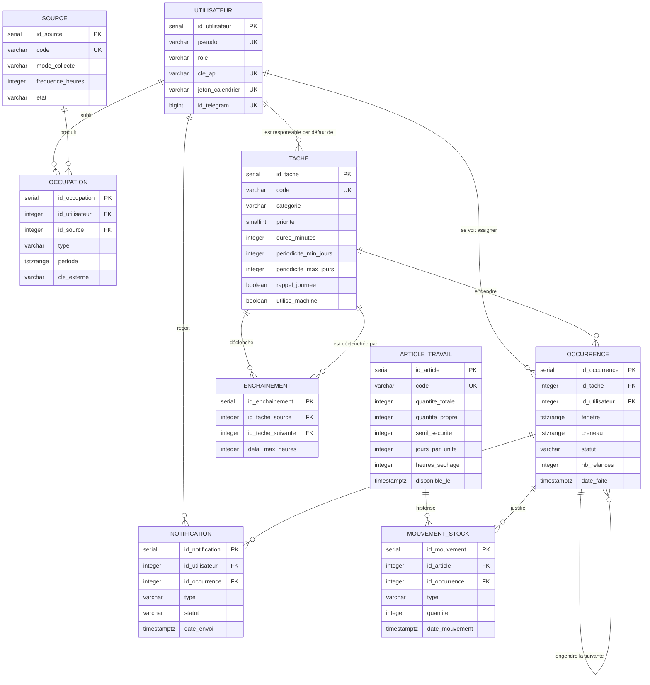

# Système de planification personnelle

Cahier des charges

Auteur : Thomas Mathis

Ce document remplace `cahier-des-charges-planification.md`, conservé pour mémoire.

---

## 1. Rappel du sujet et choix effectués

### 1.1 Rappel du sujet

Le projet consiste à concevoir et implanter le système d'information d'un assistant de planification personnelle. Le système croise des emplois du temps qui viennent de sources différentes — cours à l'IDMC, shifts chez McDonald's, disponibilités saisies à la main — et en déduit les moments réellement libres.

À partir de ces moments libres, le système place automatiquement des tâches récurrentes : ménage, litière du chat, lessives, vaisselle. Ces tâches n'ont pas de date fixe mais une périodicité — « passer l'aspirateur tous les 2 à 3 jours » — ce qui laisse au système une marge pour choisir le bon créneau.

Le résultat est consultable de deux façons : un flux iCalendar que n'importe quelle application de calendrier peut afficher, et un bot Telegram qui envoie les rappels et permet de valider une tâche d'un bouton. Une application web viendra plus tard et consommera la même API.

Le système gère deux utilisateurs : Thomas, administrateur, et Lorette, utilisatrice standard.

### 1.2 Choix effectués

Voici les choix effectués pour compléter le sujet.

- **Les règles métier vivent dans PostgreSQL.** Contraintes `CHECK`, contraintes d'exclusion, vues, fonctions PL/pgSQL et triggers. L'API ne fait qu'appeler et exposer. C'est un choix pédagogique autant que technique : la base garantit la cohérence même si un jour un script ou une saisie manuelle contourne l'API.
- **Les plages horaires sont modélisées avec le type `tstzrange`** plutôt qu'avec deux colonnes début et fin. Cela permet d'utiliser les opérateurs de chevauchement, l'indexation GiST et surtout les contraintes d'exclusion, qui rendent un chevauchement impossible au niveau de la base.
- **Une occurrence porte une fenêtre d'échéance, pas une date.** C'est ce qui distingue ce système d'une liste de tâches classique : le système a le droit de choisir quand, dans les limites qu'on lui donne.
- **La récurrence repart de la date réelle d'exécution**, jamais de la date théorique. Une tâche faite avec deux jours de retard ne doit pas décaler tout le reste du planning.
- **Deux natures de tâches.** La plupart des tâches ménagères n'ont pas d'heure : ce sont des rappels dans la journée. Elles sont exposées en événement journée entière dans le flux iCalendar. Seules les tâches réellement contraintes par une heure — les machines, qui doivent tourner en heures creuses — reçoivent un créneau horaire.
- **Une tâche du jour non validée le soir est reportée d'office au lendemain**, et re-notifiée, autant de fois qu'il le faut. Le nombre de relances est conservé : c'est ce qui permet de dire « en retard depuis trois jours » plutôt que de laisser la tâche disparaître.
- **Le cycle des vêtements de travail fait partie du socle**, et non des extensions. Il est indissociable des lessives : c'est le stock qui décide quand une machine doit tourner, et la machine à laver est une ressource unique qu'on ne peut pas mobiliser deux fois le même soir. Séparer les deux n'aurait pas de sens.
- **Une tâche non plaçable n'est jamais supprimée silencieusement.** Elle reste visible avec son motif d'échec. Un planning faux sans le dire est pire qu'un planning incomplet.
- **L'authentification est une clé d'API par utilisateur**, transmise dans un en-tête. Pour deux personnes sur un réseau privé, les jetons à durée de vie et les mécanismes de rafraîchissement sont du décor.
- **Le sport et les déplacements en train étaient hors périmètre de la première version.** Ils ont été ajoutés ensuite, sur le même socle et sans le remettre en cause. La section 10 dit ce que chacun a apporté.
- **Le système tourne sur un serveur allumé en permanence.** Un ordonnanceur qui déclenche à 7 h et à minuit n'a aucun intérêt sur une machine qui dort. Le déploiement fait donc partie du sujet, et non de la mise en production.

---

## 2. Outils et architecture

### 2.1 Outils retenus

| Outil | Rôle | Pourquoi celui-là |
|---|---|---|
| PostgreSQL 16 | Données **et** règles métier | Types range, contraintes d'exclusion, PL/pgSQL : tout ce qu'il faut pour porter la logique |
| Python 3.12 | Langage unique du projet | Un seul langage pour l'API, la collecte et le bot |
| FastAPI | Couche HTTP | Documentation OpenAPI générée automatiquement, validation des entrées par Pydantic |
| psycopg 3 | Accès à la base | SQL écrit à la main, sans ORM : c'est le SQL qui porte les règles |
| httpx + icalendar | Collecte des flux ICS | Bibliothèques légères, pas de navigateur nécessaire |
| icalendar | Export du planning | Génère le flux `.ics` consommé par les applications de calendrier |
| imaplib (standard) | Lecture des confirmations SNCF | Fait partie de Python, et la boîte est ouverte en lecture seule |
| API SNCF (Navitia) | Horaires de train | Source officielle, interrogeable par heure de départ ou d'arrivée |
| python-telegram-bot | Notifications et validation | Boutons intégrés dans le message : valider une tâche sans ouvrir d'application |
| APScheduler | Déclenchement périodique | Collectes et traitement quotidien, dans le même processus que l'API |
| Docker Compose | Exécution | Deux conteneurs : `db` et `api` |
| Tailscale | Accès distant et HTTPS | Aucun port ouvert sur Internet, certificat fourni par `tailscale serve` |
| systemd | Déploiement automatique | Un minuteur interroge GitHub et déploie ce qui a été poussé |
| pytest | Tests | Surtout sur les fonctions SQL et le placement |

**Un scraper était initialement prévu** pour le planning McDonald's, avec Playwright. Il s'est avéré inutile : Easy at Work publie un flux iCalendar personnel, qui se collecte comme celui de l'université. La valeur `'scraping'` reste acceptée par la colonne `mode_collecte` mais n'est utilisée par aucune source.

Sont volontairement écartés : les ORM, les files de messages, les frameworks de migration, les reverse proxies et les systèmes d'authentification à jetons. À l'échelle de deux utilisateurs et de quelques dizaines d'événements par jour, ils ajoutent de la configuration sans rien résoudre.

### 2.2 Schéma d'ensemble

```
   SOURCES EXTERNES                LE SYSTÈME                     SORTIES
   ────────────────                ──────────                     ───────

   ICS de l'ADE   ────┐        ┌──────────────────┐
   ICS Easy at Work ──┤        │   API FastAPI    │──────────►  Flux .ics
   Calendriers perso ─┼───────►│  collecte        │             (calendrier
   API SNCF       ────┤        │  endpoints HTTP  │              du téléphone)
   Boîte IMAP     ────┤        │  ordonnanceur    │
   Saisie manuelle ───┘        └────────┬─────────┘──────────►  Bot Telegram
                                        │                       (rappels et
                                        │ SQL                    validation)
                               ┌────────▼─────────┐
                               │   PostgreSQL     │──────────►  JSON
                               │  tables          │             (application
                               │  contraintes     │              web, plus tard)
                               │  vues            │
                               │  fonctions       │
                               │  triggers        │
                               └──────────────────┘
```

L'API est mince : elle reçoit une requête, appelle une fonction SQL ou lit une vue, et renvoie le résultat. Le calcul des disponibilités, le placement des tâches, la génération des occurrences et le contrôle des transitions se font dans la base.

### 2.3 Exécution et déploiement

Le système tourne sur un serveur dédié — un portable de récupération sous Debian 13, allumé en permanence. Le point est important pour le fonctionnement : l'ordonnanceur déclenche le bilan à 7 h, la relance à 21 h et le report à minuit, ce qu'une machine qui dort ne permet pas. Les fonctions de rattrapage existent mais ne sont plus qu'un filet de sécurité.

Deux conteneurs Docker, `planif-db` et `planif-api`, avec `restart: unless-stopped` : ils repartent seuls après une coupure, sans service systemd à écrire.

**Accès distant.** Tout passe par Tailscale, y compris depuis le téléphone. Aucun port n'est ouvert sur la box, et `tailscale serve` fournit le HTTPS et son certificat. L'abonnement au calendrier utilise le nom du tailnet, qui reste le même d'un réseau Wi-Fi à l'autre — une adresse IP locale, elle, cesse de fonctionner dès qu'on change de réseau.

**Fuseau horaire.** Les conteneurs vivent en UTC et tous les horodatages sont stockés en UTC. La conversion vers `Europe/Paris` se fait à l'affichage et au déclenchement des tâches planifiées, ce qui évite d'avoir à traiter le changement d'heure dans les comparaisons de dates.

**Déploiement.** Un minuteur systemd exécute `outils/deployer.sh` toutes les deux minutes : il compare `HEAD` à `origin/main`, et s'il y a du nouveau, applique les migrations puis reconstruit l'API. Un `git push` suffit donc à mettre le serveur à jour. Le serveur interroge GitHub au lieu de recevoir un webhook, ce qui évite d'ouvrir un port et rattrape les push faits pendant qu'il était éteint.

---

## 3. Règles de gestion

Les règles sont regroupées par domaine. Chaque code est stable : ajouter une règle
n'oblige jamais à renuméroter les autres, ni à reprendre les commentaires du code
qui les citent.

Trois types, selon la manière dont la règle est tenue : **D** pour une règle sur
les données, garantie par le schéma ; **T** pour un traitement, réalisé par une
fonction ou un trigger ; **M** pour une procédure manuelle, à la charge de
l'utilisateur.

### 3.1 Utilisateurs et accès — `UTI`

| Code | Type | Règle |
|---|---|---|
| UTI-1 | D | Le système gère deux utilisateurs, un administrateur et un standard. Chacun possède une clé d'API et, éventuellement, un identifiant Telegram |
| UTI-2 | D | L'abonnement au calendrier s'authentifie par un jeton distinct de la clé d'API. Cette adresse vit en clair dans le téléphone : elle ne doit ouvrir que la lecture du planning |
| UTI-3 | T | Renouveler le jeton de calendrier invalide les abonnements en place, sans toucher à la clé d'API ni à l'appairage du bot |

### 3.2 Sources et collecte — `COL`

| Code | Type | Règle |
|---|---|---|
| COL-1 | D | Une occupation est une plage horaire subie : cours, service, sommeil. Elle appartient à un utilisateur et provient d'une source |
| COL-2 | D | Deux occupations de type cours ou travail ne peuvent pas se chevaucher pour un même utilisateur |
| COL-3 | D | Une source déclare son mode de collecte et sa fréquence, et conserve la date de sa dernière collecte réussie |
| COL-4 | D | Une occupation collectée porte une clé externe, unique pour sa source, qui permet de la retrouver à la collecte suivante plutôt que de la dupliquer |
| COL-5 | D | Une source déclare son profil de lecture, le type d'occupation qu'elle produit et son horizon. Ces réglages sont des données, pas du code |
| COL-6 | D | En alternance, l'espagnol sort des langues suivies. C'est un drapeau de configuration |
| COL-7 | M | L'URL d'un flux se renseigne depuis le bot et n'est jamais versionnée : celle du planning de travail contient un jeton d'accès personnel |
| COL-8 | T | Une collecte rend compte de chaque séance lue. Si les compteurs ne s'équilibrent pas, l'écart est signalé |
| COL-9 | T | Une source dont la dernière collecte réussie remonte à plus de deux fois sa fréquence est déclarée en panne, et l'administrateur en est averti |
| COL-10 | T | Une occupation refusée pour cause de chevauchement est conservée en conflit plutôt que perdue |
| COL-11 | T | Un conflit qui commence dans plus de deux semaines n'est pas soumis à arbitrage : l'emploi du temps sera vraisemblablement corrigé d'ici là |
| COL-12 | M | Pour un conflit plus proche, l'utilisateur choisit laquelle des deux occupations garder. Le choix est mémorisé |
| COL-13 | M | Les occupations peuvent être saisies à la main, ce qui permet au système de fonctionner quand une collecte échoue. Une saisie manuelle est de type « autre » : elle occupe l'agenda pour le placement, sans se heurter à la contrainte de non-chevauchement réservée aux cours et aux shifts |
| COL-14 | D | Chacun publie son calendrier personnel depuis son application et en donne le lien. Une source sans URL naît inactive, sans quoi elle passerait pour en panne |
| COL-15 | D | Les occupations d'un calendrier personnel échappent à la contrainte d'exclusion : un rendez-vous posé sur une plage plus large est ordinaire |
| COL-16 | T | Un calendrier personnel appartient à la personne que son code désigne. Ce rattachement précède l'assignation générale, qui donnerait sinon toute source orpheline à l'administrateur |
| COL-17 | D | Les UE au choix arrivent toutes dans le même flux. La configuration de la source porte la liste des cours que l'on ne suit pas ; un libellé qui en contient un est écarté, sans égard à la casse ni aux accents |

### 3.3 Tâches et occurrences — `TAC`

| Code | Type | Règle |
|---|---|---|
| TAC-1 | D | Une tâche récurrente déclare une catégorie, une durée, une priorité de 1 à 5 et une périodicité minimale et maximale en jours. Elle ne porte aucune date |
| TAC-2 | D | Une tâche est soit un rappel dans la journée, sans heure, soit une tâche à heure imposée déclarant sa fenêtre horaire |
| TAC-3 | D | Une tâche déclare si elle mobilise la machine à laver, ressource unique du logement |
| TAC-4 | D | Une occurrence est une exécution concrète d'une tâche. Elle porte une fenêtre d'échéance, et non une date unique |
| TAC-5 | D | Le créneau placé d'une occurrence est inclus dans sa fenêtre et dure au moins le temps prévu |
| TAC-6 | D | Deux occurrences à heure imposée ne peuvent pas se chevaucher pour un même utilisateur. Les rappels d'une même journée, eux, cohabitent |
| TAC-7 | D | Une tâche peut en déclencher une autre dans un délai maximal : la poussière déclenche l'aspirateur sous 24 h |
| TAC-8 | D | Une tâche peut n'exister que par enchaînement. Étendre le linge ne revient pas tous les jours, seulement après une lessive |
| TAC-9 | D | Une tâche peut exiger la présence des deux utilisateurs. Elle est alors nécessairement à heure imposée : un rappel « dans la journée » ne dit rien de la simultanéité |
| TAC-10 | T | Une tâche peut en couvrir une autre : la valider solde aussi la tâche couverte, à la même date. Vider la litière vaut ramassage |

### 3.4 Placement — `PLA`

| Code | Type | Règle |
|---|---|---|
| PLA-1 | T | Les disponibilités d'un utilisateur sont l'horizon moins ses occupations, moins les créneaux déjà placés |
| PLA-2 | T | Les occurrences sont placées par priorité croissante, puis par échéance croissante, dans la première disponibilité assez longue et compatible avec la fenêtre horaire de la tâche |
| PLA-3 | T | Une tâche sans heure imposée est affectée à un jour, pas à une heure : seul le temps libre total de la journée est vérifié |
| PLA-4 | T | Un rappel va sur le jour le moins chargé de sa fenêtre, et à charge égale sur le plus libre. Prendre le premier jour venu entasserait tout le même soir |
| PLA-5 | T | Un créneau déjà notifié n'est plus déplacé par un placement ultérieur |
| PLA-6 | T | Un créneau prévu dans les sept jours ne bouge plus : on ne s'organise pas autour d'un planning qui se dérobe |
| PLA-7 | T | Le planning est établi un mois à l'avance. Au-delà de la prochaine, les occurrences sont des prévisions : une validation réelle les efface et la chaîne se refait |
| PLA-8 | T | Une occurrence sans créneau reste à placer, avec un motif lisible, et n'est jamais supprimée |
| PLA-9 | T | Une tâche à deux se place sur une intersection des disponibilités. Faute d'intersection, le système notifie au lieu de placer au hasard |
| PLA-10 | T | Seules les tâches domestiques entrent dans la répartition équitable. Compter le sport reviendrait à payer ses séances de piscine en heures de ménage |

### 3.5 Exécution et suivi — `EXE`

| Code | Type | Règle |
|---|---|---|
| EXE-1 | T | Valider une occurrence enregistre la date réelle d'exécution et crée la suivante à partir de cette date, jamais de l'échéance théorique |
| EXE-2 | T | Valider déclenche les tâches enchaînées. Si une occurrence de la tâche suivante existe déjà dans le délai, elle est repositionnée plutôt que dupliquée |
| EXE-3 | T | Une tâche déclenchée par enchaînement n'est jamais placée avant celle qui l'a déclenchée |
| EXE-4 | T | Une occurrence est en retard si sa fenêtre est dépassée ou si elle a subi au moins un report. C'est le système qui le calcule, jamais l'affichage |
| EXE-5 | D | Le statut d'une occurrence ne régresse pas : une occurrence faite ne redevient pas planifiée |
| EXE-6 | T | Une occurrence du jour non validée le soir est reportée d'office au lendemain et re-notifiée. Le compteur de relances croît tant qu'elle n'est pas faite |
| EXE-7 | M | L'utilisateur valide, reporte ou refuse une occurrence, depuis le bot ou l'API |
| EXE-8 | M | La validation peut être rétroactive : déclarer avoir fait la tâche la veille |
| EXE-9 | M | L'administrateur peut épingler un créneau, qui n'est alors plus déplacé |
| EXE-10 | M | L'administrateur peut déclencher une collecte ou un replacement à tout moment |
| EXE-11 | M | Une tâche faite spontanément peut être déclarée sans qu'elle ait été prévue ce jour-là. Elle reprend l'occurrence ouverte s'il en existe une, sinon elle en crée une déjà validée. Dans les deux cas la récurrence repart de la date déclarée |

### 3.6 Absences et présence — `ABS`

| Code | Type | Règle |
|---|---|---|
| ABS-1 | D | Une absence est une période hors du logement. Deux absences d'une même personne ne se chevauchent pas |
| ABS-2 | T | Aucune tâche domestique n'est placée un jour entièrement couvert par une absence : on ne salit pas un logement où l'on n'est pas |
| ABS-3 | T | Les tâches sans assigné fixe reviennent à la personne présente. Si les deux le sont, à celle qui porte le moins de minutes |
| ABS-4 | T | Quand personne n'est présent sur toute la fenêtre, la tâche attend le retour au lieu d'être assignée à un absent |
| ABS-5 | T | Une absence déclarée l'emporte sur le gel des créneaux à sept jours. Le gel protège un plan tenable, pas un plan devenu impossible |
| ABS-6 | M | Le retour se déclare à la main et ferme l'absence à l'instant présent : on rentre en voiture, ou plus tôt que prévu |
| ABS-7 | M | Un départ peut se déclarer sans date de retour. L'absence court alors jusqu'à la prochaine obligation connue |

### 3.7 Trajets en train — `TRJ`

| Code | Type | Règle |
|---|---|---|
| TRJ-1 | D | Une fenêtre de départ est un creux d'au moins 48 h sans cours ni travail. En deçà, le trajet coûte plus que le séjour ne rapporte |
| TRJ-2 | T | Un aller ne se propose que s'il part au moins 30 min après la dernière obligation ; un retour doit ramener 30 min avant la suivante |
| TRJ-3 | T | Les retours se cherchent à partir de l'heure limite d'arrivée, du dernier train possible vers les plus tôt. Avec un cours à 16h30, le train attendu est celui de 14h42 |
| TRJ-4 | D | Un horaire proposé n'est pas une donnée du système : il vient de la SNCF et n'est conservé que le temps d'être choisi ou écarté |
| TRJ-5 | T | Retenir un aller et un retour crée l'absence correspondante, du départ à l'arrivée du retour |
| TRJ-6 | T | Les autres horaires proposés sont écartés, non supprimés : relire ce qui avait été proposé aide à comprendre un choix |
| TRJ-7 | T | Un aller retenu sans retour gèle jusqu'à la prochaine obligation connue |
| TRJ-8 | M | L'achat du billet reste manuel. Une proposition retenue est une intention, pas une réservation |

### 3.8 Billets lus par courriel — `BIL`

| Code | Type | Règle |
|---|---|---|
| BIL-1 | D | Un courriel n'est lu qu'une fois. Son en-tête `Message-ID` lui tient lieu d'identité |
| BIL-2 | D | Seuls les courriels des domaines officiels de SNCF Connect sont analysés. Les faux courriels au nom de la SNCF sont répandus |
| BIL-3 | D | Quand le corps ne porte aucun trajet, le sujet est lu : il nomme les deux gares, le sens et la date, jamais l'heure |
| BIL-4 | T | Le sens d'un trajet se juge sur sa destination, non sur la gare de domicile : on part tantôt de Nancy, tantôt de Lunéville |
| BIL-5 | T | Un billet lu crée l'aller, le retour s'il figure, puis l'absence — par le même chemin qu'une réservation faite au bot |
| BIL-6 | T | Un billet sans horaire vers la gare famille ouvre l'absence au lendemain, et un billet qui en revient la ferme au matin. Seules les journées certaines sont gelées |
| BIL-7 | T | Un retour acheté seul ferme l'absence en cours, à son heure d'arrivée |
| BIL-8 | T | Un courriel d'expéditeur légitime qu'on n'a pas su lire est conservé avec son motif : le format ne nous appartient pas et changera |
| BIL-9 | T | Une absence déclarée sans qu'on l'ait demandée est annoncée, avec de quoi l'annuler |

### 3.9 Propositions de week-end — `WKD`

| Code | Type | Règle |
|---|---|---|
| WKD-1 | D | Une proposition est une suggestion, non une absence. Elle s'affiche au calendrier et n'a aucun effet sur le placement |
| WKD-2 | T | Deux propositions vivantes ne se chevauchent pas. Sans cette règle, un cours ajouté ferait reproposer le même week-end à chaque collecte |
| WKD-3 | T | Une proposition couverte par une absence est soldée, quelle qu'en soit l'origine. Passée, elle est périmée |
| WKD-4 | T | Un week-end décliné ne revient jamais : revenir à la charge est le meilleur moyen de faire couper les notifications |
| WKD-5 | T | Une proposition s'annonce quinze jours avant et se relance une seule fois trois jours avant, jamais deux fois le même jour |

### 3.10 Séances de sport — `SPT`

| Code | Type | Règle |
|---|---|---|
| SPT-1 | D | Une séance se fait dans un lieu, et un lieu a des heures d'ouverture. Proposer un créneau hors ouverture reviendrait à proposer une porte close |
| SPT-2 | D | Un lieu sans aucun horaire déclaré est ouvert en permanence, dans ses bornes de bon sens. Mais « aucune plage ce jour-là » n'est pas « ouvert en permanence » |
| SPT-3 | D | Un lieu peut être fermé sur une période entière : un SUAPS ferme l'été, aux vacances et entre deux semestres |
| SPT-4 | T | Le créneau réservé comprend le trajet aller et retour, dont la durée dépend du jour : cinq minutes depuis la fac, vingt depuis le logement |
| SPT-5 | D | Le quota est hebdomadaire, non périodique : « trois fois par semaine » ne se traduit pas en « tous les 2,33 jours » |
| SPT-6 | T | Une seule séance par jour. Trois séances entassées le même après-midi n'en font pas trois |
| SPT-7 | T | Une séance qui finit après l'heure tardive d'un lieu exige un repos avant la prochaine obligation. La règle ne vise que la nuit |
| SPT-8 | D | Chaque lieu déclare s'il faut chercher au plus tôt ou au plus tard dans le creux : la piscine n'ouvre que deux heures à midi, la salle est ouverte tout le jour |

### 3.11 Uniforme et stock — `UNI`

| Code | Type | Règle |
|---|---|---|
| UNI-1 | D | Un article de travail déclare sa quantité totale, un seuil de sécurité, le nombre de journées qu'une unité couvre et une durée de séchage |
| UNI-2 | D | La quantité propre ne dépasse jamais la quantité totale et ne descend jamais sous zéro |
| UNI-3 | D | Chaque changement de stock est historisé avec son type, sa quantité et sa date |
| UNI-4 | T | Chaque journée travaillée use l'uniforme : un t-shirt par service, un pantalon toutes les deux journées |
| UNI-5 | T | Le décompte porte sur des **journées travaillées**, non sur des jours de calendrier. Travailler lundi puis jeudi salit le pantalon au second service |
| UNI-6 | T | Une journée déjà comptée ne se recompte pas : la machine s'éteint, l'ordonnanceur rattrape, et rattraper ne doit rien salir en double |
| UNI-7 | T | La consommation remonte jusqu'à hier inclus, jamais aujourd'hui : un service du soir n'est pas fini le matin |
| UNI-8 | T | Un retour de linge propre remet à zéro le compteur de journées portées |
| UNI-9 | T | La quantité propre projetée est la quantité actuelle moins la consommation prévue par les services à venir |
| UNI-10 | T | Dès que la projection passe sous le seuil, une lessive est créée dont l'échéance est le service menacé, moins le séchage, moins le cycle |
| UNI-11 | T | Si cette échéance est déjà dépassée, la lessive est signalée en alerte plutôt que planifiée |
| UNI-12 | T | Deux occurrences mobilisant la machine ne sont pas placées le même jour |
| UNI-13 | T | Valider une lessive ne rend pas le linge portable : il redevient disponible à la date de validation plus la durée de séchage |
| UNI-14 | M | La quantité propre peut être recalée à la main quand le compte s'écarte de la réalité |
| UNI-15 | M | Le recalage se déclare en quantité réelle — « j'ai deux t-shirts propres » — et non en écart. L'écart est calculé et écrit au journal des mouvements, le compteur de journées portées repart de zéro |

### 3.12 Notifications et calendrier — `NOT`

| Code | Type | Règle |
|---|---|---|
| NOT-1 | T | Chaque matin, le système notifie les tâches du jour et celles en retard |
| NOT-2 | T | Une notification est enregistrée en base avant d'être envoyée. Un échec d'envoi la laisse en attente et ne la perd pas |
| NOT-3 | T | Le flux iCalendar expose les occupations et les occurrences placées. Une tâche sans heure devient un événement journée entière, une tâche à heure imposée un événement horaire |

---

## 4. Acteurs du système

| Acteur | Type | Rôle |
|---|---|---|
| Thomas, administrateur | Principal | Configure les tâches récurrentes et les sources, saisit ses occupations, valide ses occurrences, force des créneaux, déclenche collectes et replacements |
| Lorette, utilisatrice standard | Principal | Saisit son emploi du temps, consulte son planning, valide, reporte ou refuse les occurrences qui lui sont assignées |
| Système | Secondaire | Calcule les disponibilités, place les occurrences, contrôle les transitions de statut, génère les occurrences suivantes et les notifications |
| Collecteur | Secondaire | Récupère les données des sources externes et les normalise en occupations |
| Ordonnanceur | Principal | Déclenche les collectes selon leur fréquence, le replacement et le traitement quotidien |
| ADE de l'Université de Lorraine | Secondaire | Fournit l'emploi du temps universitaire sous forme de fichier iCalendar |
| Portail McDonald's | Secondaire | Fournit les shifts prévisionnels |
| Telegram | Secondaire | Transporte les notifications et renvoie les actions de l'utilisateur |

---

## 5. Diagramme des données



---

## 6. Dictionnaire de données

### Table : Utilisateur

| Attribut | Type | NULL ? | Contrainte domaine | Unicité | Défaut | PK | FK |
|---|---|---|---|---|---|---|---|
| id_utilisateur | SERIAL | non | | oui | | oui | |
| pseudo | VARCHAR(50) | non | | oui | | | |
| nom | VARCHAR(50) | non | | | | | |
| role | VARCHAR(20) | non | 'admin', 'standard' | | 'standard' | | |
| fuseau | VARCHAR(50) | non | | | 'Europe/Paris' | | |
| cle_api | VARCHAR(64) | non | longueur >= 32 | oui | | | |
| jeton_calendrier | VARCHAR(64) | non | | oui | UUID sans tirets | | |
| id_telegram | BIGINT | oui | | oui | | | |
| actif | BOOLEAN | non | | | TRUE | | |
| date_creation | DATE | non | | | CURRENT_DATE | | |

### Table : Source

| Attribut | Type | NULL ? | Contrainte domaine | Unicité | Défaut | PK | FK |
|---|---|---|---|---|---|---|---|
| id_source | SERIAL | non | | oui | | oui | |
| code | VARCHAR(30) | non | | oui | | | |
| libelle | VARCHAR(100) | non | | | | | |
| mode_collecte | VARCHAR(20) | non | 'ics', 'scraping', 'manuelle' | | | | |
| url | TEXT | oui | | | | | |
| frequence_heures | INTEGER | non | > 0 | | 24 | | |
| derniere_collecte | TIMESTAMPTZ | oui | | | | | |
| etat | VARCHAR(20) | non | 'ok', 'en_panne' | | 'ok' | | |
| configuration | JSONB | non | | | '{}' | | |
| active | BOOLEAN | non | | | TRUE | | |

L'URL n'est jamais écrite dans le code ni dans le dépôt : celle du planning de travail contient un jeton d'accès personnel. Elle est fournie à l'exécution, depuis le bot, et l'API ne la renvoie jamais.

`configuration` porte les réglages du collecteur : profil de lecture, type d'occupation produit, horizon, et pour l'emploi du temps universitaire le groupe de TD et les langues suivies. Ce sont des données : changer de groupe au second semestre ne doit demander qu'une mise à jour, pas un redéploiement.

### Table : Occupation

| Attribut | Type | NULL ? | Contrainte domaine | Unicité | Défaut | PK | FK |
|---|---|---|---|---|---|---|---|
| id_occupation | SERIAL | non | | oui | | oui | |
| id_utilisateur | INTEGER | non | | | | | Utilisateur |
| id_source | INTEGER | non | | | | | Source |
| type | VARCHAR(20) | non | 'cours', 'travail', 'sommeil', 'autre' | | | | |
| libelle | VARCHAR(150) | non | | | | | |
| periode | TSTZRANGE | non | non vide, bornée | | | | |
| lieu | VARCHAR(100) | oui | | | | | |
| cle_externe | VARCHAR(200) | oui | | oui avec id_source | | | |
| date_collecte | TIMESTAMPTZ | non | | | now() | | |

### Table : Tache

| Attribut | Type | NULL ? | Contrainte domaine | Unicité | Défaut | PK | FK |
|---|---|---|---|---|---|---|---|
| id_tache | SERIAL | non | | oui | | oui | |
| code | VARCHAR(30) | non | | oui | | | |
| libelle | VARCHAR(100) | non | | | | | |
| categorie | VARCHAR(20) | non | 'menage', 'linge', 'vaisselle', 'animal', 'admin' | | | | |
| priorite | SMALLINT | non | entre 1 et 5 | | 3 | | |
| duree_minutes | INTEGER | non | > 0 | | | | |
| periodicite_min_jours | INTEGER | non | > 0 | | | | |
| periodicite_max_jours | INTEGER | non | >= periodicite_min_jours | | | | |
| rappel_journee | BOOLEAN | non | FALSE si une fenêtre horaire est définie | | TRUE | | |
| heure_min | TIME | oui | | | | | |
| heure_max | TIME | oui | > heure_min si définie | | | | |
| utilise_machine | BOOLEAN | non | | | FALSE | | |
| lave_uniforme | BOOLEAN | non | implique utilise_machine | | FALSE | | |
| requiert_les_deux | BOOLEAN | non | implique NOT rappel_journee | | FALSE | | |
| reportable | BOOLEAN | non | | | TRUE | | |
| id_utilisateur_defaut | INTEGER | oui | | | | | Utilisateur |
| active | BOOLEAN | non | | | TRUE | | |

La priorité 1 est la plus forte. Elle est réservée aux tâches qu'on ne peut pas repousser : la litière du chat, et la lessive de travail quand le stock est menacé.

`rappel_journee` distingue les deux natures de tâches de la règle R7. Une tâche cochée à vrai n'a pas d'heure : elle sortira en événement journée entière dans le calendrier. Une tâche cochée à faux doit déclarer sa fenêtre horaire.

### Table : Enchainement

| Attribut | Type | NULL ? | Contrainte domaine | Unicité | Défaut | PK | FK |
|---|---|---|---|---|---|---|---|
| id_enchainement | SERIAL | non | | oui | | oui | |
| id_tache_source | INTEGER | non | | oui avec id_tache_suivante | | | Tache |
| id_tache_suivante | INTEGER | non | ≠ id_tache_source | | | | Tache |
| delai_max_heures | INTEGER | non | > 0 | | 24 | | |

### Table : Remplacement

| Attribut | Type | NULL ? | Contrainte domaine | Unicité | Défaut | PK | FK |
|---|---|---|---|---|---|---|---|
| id_remplacement | SERIAL | non | | oui | | oui | |
| id_tache_faite | INTEGER | non | | oui avec id_tache_couverte | | | Tache |
| id_tache_couverte | INTEGER | non | ≠ id_tache_faite | | | | Tache |

« Faire ceci vaut avoir fait cela ». La relation n'est pas symétrique : vider la litière dispense du ramassage, l'inverse est faux.

### Table : Occurrence

| Attribut | Type | NULL ? | Contrainte domaine | Unicité | Défaut | PK | FK |
|---|---|---|---|---|---|---|---|
| id_occurrence | SERIAL | non | | oui | | oui | |
| id_tache | INTEGER | non | | | | | Tache |
| id_utilisateur | INTEGER | oui | | | | | Utilisateur |
| fenetre | TSTZRANGE | non | non vide, bornée | | | | |
| creneau | TSTZRANGE | oui | inclus dans fenetre | | | | |
| statut | VARCHAR(20) | non | 'a_placer', 'planifiee', 'notifiee', 'faite', 'reportee', 'abandonnee' | | 'a_placer' | | |
| origine | VARCHAR(20) | non | 'recurrence', 'manuelle', 'enchainement', 'stock' | | 'recurrence' | | |
| epinglee | BOOLEAN | non | | | FALSE | | |
| rappel_journee | BOOLEAN | non | recopié de la tâche | | TRUE | | |
| utilise_machine | BOOLEAN | non | recopié de la tâche | | FALSE | | |
| nb_relances | INTEGER | non | >= 0 | | 0 | | |
| motif | TEXT | oui | | | | | |
| date_faite | TIMESTAMPTZ | oui | obligatoire si statut = 'faite', jamais dans le futur | | | | |
| id_occurrence_source | INTEGER | oui | | | | | Occurrence |
| date_creation | TIMESTAMPTZ | non | | | now() | | |

Le champ `motif` conserve la raison du placement ou de l'échec : « placée à 18h, dernier créneau de 40 min avant l'échéance » ou « aucun créneau libre avant le 12 ». C'est ce qui rend le système compréhensible plutôt qu'arbitraire.

Le champ `nb_relances` compte les reports d'office. Il ne sert pas à limiter les relances — une tâche revient jusqu'à ce qu'elle soit faite — mais à afficher « en retard depuis 3 jours » et à repérer les tâches que tu ne fais jamais, qui méritent d'être revues plutôt que répétées.

Les deux drapeaux `rappel_journee` et `utilise_machine` sont recopiés de la tâche à la création de l'occurrence, par trigger. C'est une dénormalisation assumée : une contrainte d'exclusion ne sait pas lire une table liée, et ce sont ces drapeaux qui conditionnent les contraintes de chevauchement et de machine unique.

### Table : Notification

| Attribut | Type | NULL ? | Contrainte domaine | Unicité | Défaut | PK | FK |
|---|---|---|---|---|---|---|---|
| id_notification | SERIAL | non | | oui | | oui | |
| id_utilisateur | INTEGER | non | | | | | Utilisateur |
| id_occurrence | INTEGER | oui | | | | | Occurrence |
| type | VARCHAR(30) | non | 'rappel', 'bilan', 'alerte' | | | | |
| contenu | TEXT | non | | | | | |
| statut | VARCHAR(20) | non | 'a_envoyer', 'envoyee', 'echec' | | 'a_envoyer' | | |
| date_creation | TIMESTAMPTZ | non | | | now() | | |
| date_envoi | TIMESTAMPTZ | oui | obligatoire si statut = 'envoyee' | | | | |

### Table : Absence

| Attribut | Type | NULL ? | Contrainte domaine | Unicité | Défaut | PK | FK |
|---|---|---|---|---|---|---|---|
| id_absence | SERIAL | non | | oui | | oui | |
| id_utilisateur | INTEGER | non | | | | | Utilisateur |
| periode | TSTZRANGE | non | non vide, bornée ; sans chevauchement pour un même utilisateur | | | | |
| lieu | VARCHAR(100) | oui | | | | | |
| origine | VARCHAR(20) | non | 'manuelle', 'trajet' | | 'manuelle' | | |
| commentaire | TEXT | oui | | | | | |
| date_creation | TIMESTAMPTZ | non | | | now() | | |

Une absence n'est pas une occupation. Être en cours empêche de faire le ménage à ce moment-là ; être à Saint-Dié dispense de le faire, puisqu'on ne salit pas un logement où l'on n'est pas.

Un jour n'est compté absent que s'il est entièrement couvert : partir vendredi soir laisse la journée de vendredi utilisable, et la geler créerait un retard fictif.

### Table : Trajet

| Attribut | Type | NULL ? | Contrainte domaine | Unicité | Défaut | PK | FK |
|---|---|---|---|---|---|---|---|
| id_trajet | BIGINT | non | | oui | identité | oui | |
| id_utilisateur | INTEGER | non | | | | | Utilisateur |
| sens | VARCHAR(10) | non | 'aller', 'retour' | | | | |
| periode | TSTZRANGE | non | non vide, bornée | | | | |
| origine | VARCHAR(100) | non | | | | | |
| destination | VARCHAR(100) | non | | | | | |
| correspondances | SMALLINT | non | >= 0 | | 0 | | |
| resume | VARCHAR(200) | oui | | | | | |
| statut | VARCHAR(20) | non | 'proposee', 'retenue', 'ecartee' | | 'proposee' | | |
| id_trajet_aller | BIGINT | oui | renseigné seulement si sens = 'retour' | | | | Trajet |
| id_absence | INTEGER | oui | | | | | Absence |
| date_creation | TIMESTAMPTZ | non | | | now() | | |

Une fenêtre de départ, elle, n'a pas de table. C'est le résultat d'un calcul sur les occupations, et lui donner une clé obligerait à la tenir à jour à chaque collecte — pour un objet dont la durée de vie utile se compte en secondes.

Un trajet retenu n'est pas un billet. Le système propose des horaires et gèle le ménage en conséquence ; l'achat reste manuel (R70).

### Table : Courriel

| Attribut | Type | NULL ? | Contrainte domaine | Unicité | Défaut | PK | FK |
|---|---|---|---|---|---|---|---|
| id_courriel | BIGINT | non | | oui | identité | oui | |
| identifiant | VARCHAR(255) | non | | oui | | | |
| expediteur | VARCHAR(255) | non | | | | | |
| sujet | VARCHAR(500) | oui | | | | | |
| recu_le | TIMESTAMPTZ | oui | | | | | |
| statut | VARCHAR(20) | non | 'traite', 'ignore', 'illisible', 'refuse' | | | | |
| motif | TEXT | oui | | | | | |
| reference | VARCHAR(20) | oui | | | | | |
| id_utilisateur | INTEGER | oui | | | | | Utilisateur |
| id_absence | INTEGER | oui | | | | | Absence |
| traite_le | TIMESTAMPTZ | non | | | now() | | |

Cette table ne stocke pas les courriels, seulement ce qu'on en a fait. Les quatre statuts se lisent ainsi : **traite**, une absence en est née ; **ignore**, expéditeur non reconnu ou courriel sans billet ; **illisible**, expéditeur légitime mais analyse échouée ; **refuse**, billet compris mais absence rejetée par la base, le plus souvent parce qu'elle en chevauche une autre.

La distinction entre *ignore* et *illisible* porte tout l'intérêt de la table. Un prospectus ignoré ne demande rien à personne. Un courriel légitime devenu illisible signale que le format a changé — et sans lui, le jour où plus aucune absence ne se déclare, rien n'indiquerait pourquoi (R75).

### Table : Conflit

| Attribut | Type | NULL ? | Contrainte domaine | Unicité | Défaut | PK | FK |
|---|---|---|---|---|---|---|---|
| id_conflit | SERIAL | non | | oui | | oui | |
| id_occupation | INTEGER | non | | | | | Occupation |
| id_source | INTEGER | non | | | | | Source |
| cle_externe | VARCHAR(200) | non | | oui avec id_source et id_occupation | | | |
| libelle | VARCHAR(150) | non | | | | | |
| periode | TSTZRANGE | non | non vide, bornée | | | | |
| lieu | VARCHAR(100) | oui | | | | | |
| details | TEXT | oui | | | | | |
| statut | VARCHAR(20) | non | 'en_attente', 'resolu' | | 'en_attente' | | |
| choix | VARCHAR(20) | oui | 'existante', 'nouvelle' ; obligatoire si résolu | | | | |
| date_detection | TIMESTAMPTZ | non | | | now() | | |
| date_resolution | TIMESTAMPTZ | oui | obligatoire si résolu | | | | |

`id_occupation` désigne ce qui est déjà au planning ; les colonnes `libelle`, `periode`, `lieu` et `details` décrivent la version que la source voudrait mettre à la place et que la contrainte d'exclusion a refusée.

Le champ `choix` est mémorisé pour que la collecte suivante ne repose pas la même question. Sans lui, garder l'existante ne servirait à rien : la version rejetée reviendrait toutes les douze heures.

### Table : ArticleTravail

| Attribut | Type | NULL ? | Contrainte domaine | Unicité | Défaut | PK | FK |
|---|---|---|---|---|---|---|---|
| id_article | SERIAL | non | | oui | | oui | |
| code | VARCHAR(30) | non | | oui | | | |
| libelle | VARCHAR(100) | non | | | | | |
| quantite_totale | INTEGER | non | > 0 | | | | |
| quantite_propre | INTEGER | non | entre 0 et quantite_totale | | | | |
| seuil_securite | INTEGER | non | entre 0 et quantite_totale | | 1 | | |
| jours_par_unite | INTEGER | non | > 0 | | 1 | | |
| heures_sechage | INTEGER | non | > 0 | | 24 | | |
| disponible_le | TIMESTAMPTZ | oui | | | | | |
| date_maj | TIMESTAMPTZ | non | | | now() | | |

Valeurs de départ : trois t-shirts, une unité couvre un jour de travail, séchage 24 heures ; deux pantalons, une unité couvre deux jours, séchage 36 heures. Seuil de sécurité à 1 dans les deux cas.

`disponible_le` porte la règle qui manquait à toute version naïve du problème : un vêtement lavé n'est pas un vêtement portable. Tant que cette date n'est pas atteinte, les unités en séchage ne comptent pas dans le stock utilisable.

`quantite_propre` est maintenue par trigger à chaque mouvement, jamais écrite directement par l'API.

### Table : MouvementStock

| Attribut | Type | NULL ? | Contrainte domaine | Unicité | Défaut | PK | FK |
|---|---|---|---|---|---|---|---|
| id_mouvement | SERIAL | non | | oui | | oui | |
| id_article | INTEGER | non | | | | | ArticleTravail |
| type | VARCHAR(20) | non | 'salissure', 'lavage', 'retour_propre', 'recalage' | | | | |
| quantite | INTEGER | non | ≠ 0 | | | | |
| date_mouvement | TIMESTAMPTZ | non | | | now() | | |
| id_occurrence | INTEGER | oui | | | | | Occurrence |

Chaque changement de stock laisse une ligne, comme un journal comptable. On peut donc toujours reconstituer pourquoi il ne restait qu'un t-shirt propre un mardi soir.

---

## 7. Contraintes d'intégrité

Ces contraintes sont traduites en `CHECK`, contraintes d'exclusion, fonctions et triggers.

| Règle visée | Description | Type |
|---|---|---|
| UTI-1 | `role` appartient à {admin, standard}, `cle_api` unique et d'au moins 32 caractères | Statique forte |
| COL-1 | Une occupation référence un utilisateur et une source existants | Statique forte |
| COL-1 | `periode` est non vide et bornée des deux côtés | Statique forte |
| COL-2 | Deux occupations de type cours ou travail ne se chevauchent pas pour un même utilisateur : contrainte d'exclusion GiST partielle | Statique forte |
| COL-3 | `frequence_heures > 0`, `etat` appartient à {ok, en_panne} | Statique forte |
| COL-4 | Le couple (`id_source`, `cle_externe`) est unique quand la clé externe est renseignée | Statique forte |
| TAC-1 | `priorite` entre 1 et 5, `duree_minutes > 0`, `periodicite_max_jours >= periodicite_min_jours` | Statique forte |
| TAC-2 | Une tâche à heure imposée déclare ses deux bornes horaires avec `heure_max > heure_min` ; une tâche de type rappel n'en déclare aucune | Statique forte |
| TAC-2 | `rappel_journee` et `utilise_machine` sont recopiés de la tâche vers l'occurrence : trigger | Dynamique forte |
| TAC-4 | `fenetre` est non vide et bornée | Statique forte |
| TAC-5 | `creneau` est inclus dans `fenetre` | Statique forte |
| TAC-5 | La durée du créneau est au moins égale à `duree_minutes` de la tâche | Statique forte |
| TAC-6 | Deux occurrences à heure imposée ne se chevauchent pas pour un même utilisateur : contrainte d'exclusion GiST partielle sur `NOT rappel_journee` et les statuts planifiée et notifiée | Statique forte |
| TAC-7 | Un enchaînement n'est pas réflexif, et le couple (source, suivante) est unique | Statique forte |
| UNI-1 | `quantite_totale > 0`, `jours_par_unite > 0`, `heures_sechage > 0`, `seuil_securite` entre 0 et `quantite_totale` | Statique forte |
| UNI-2 | `quantite_propre` reste entre 0 et `quantite_totale` | Statique forte |
| UNI-3 | `quantite` d'un mouvement est non nulle ; `quantite_propre` est recalculée à chaque mouvement : trigger | Dynamique forte |
| PLA-2 | Le placement respecte la fenêtre horaire de la tâche | Dynamique forte |
| PLA-5 | Une occurrence notifiée ou épinglée n'est pas déplacée par le placement | Dynamique forte |
| PLA-8 | Une occurrence non plaçable garde le statut à placer et reçoit un motif | Dynamique faible |
| EXE-1 | `date_faite` est renseignée dès que le statut passe à faite, et n'est jamais dans le futur | Statique forte |
| EXE-1 | Le passage au statut faite crée l'occurrence suivante : trigger | Dynamique forte |
| EXE-2 | Le passage au statut faite crée ou repositionne les occurrences enchaînées : trigger | Dynamique forte |
| EXE-3 | Une occurrence issue d'un enchaînement a une fenêtre qui commence à la date d'exécution de sa source | Dynamique forte |
| EXE-5 | Le statut ne régresse pas : les statuts faite, reportée et abandonnée sont terminaux : trigger | Dynamique forte |
| EXE-6 | `nb_relances >= 0`, et il n'augmente que d'une unité par report d'office : trigger | Dynamique forte |
| NOT-2 | `date_envoi` est renseignée dès que le statut passe à envoyée | Statique forte |
| COL-9 | Une source est en panne quand `now() - derniere_collecte > 2 × frequence_heures` : vue | Dynamique faible |
| UNI-10 | La lessive créée par le stock a la priorité 1 et n'est pas reportable | Dynamique forte |
| UNI-12 | Deux occurrences avec `utilise_machine` ne sont pas placées le même jour pour un même utilisateur : trigger | Dynamique forte |
| UNI-13 | La validation d'une lessive fixe `disponible_le` à la date de validation plus `heures_sechage` : trigger | Dynamique forte |
| UNI-13 | Les unités en séchage ne comptent pas dans le stock utilisable tant que `disponible_le` n'est pas atteint : vue | Dynamique forte |
| TAC-9 | `requiert_les_deux` exclut `rappel_journee` | Statique forte |
| PLA-9 | Le créneau d'une tâche à deux est libre pour tous les utilisateurs actifs simultanément : intersection de multirange | Dynamique forte |
| PLA-9 | L'absence d'intersection produit une notification d'alerte, jamais un placement arbitraire | Dynamique faible |
| COL-10 | Une occupation refusée par la contrainte d'exclusion est enregistrée en conflit, avec la version déjà en place | Dynamique forte |
| COL-11 | Un conflit à plus de deux semaines n'est pas enregistré : vue `v_conflit`, colonne `a_arbitrer` | Dynamique faible |
| COL-12 | Un conflit résolu porte son choix et sa date de résolution | Statique forte |
| COL-12 | Un conflit tranché en faveur de l'existant écarte durablement la version rejetée | Dynamique forte |
| COL-5 | `configuration` est un JSONB, validé à l'usage par le collecteur | Statique faible |
| TAC-10 | Un remplacement n'est pas réflexif, et le couple (faite, couverte) est unique | Statique forte |
| TAC-10 | Valider une tâche solde les occurrences ouvertes des tâches qu'elle couvre : trigger | Dynamique forte |
| COL-8 | Le total des compteurs de collecte égale le nombre de séances lues | Dynamique faible |
| PLA-6 | Le replacement ne libère que les créneaux au-delà du délai de stabilité | Dynamique forte |
| TAC-8 | Une tâche non récurrente n'est jamais engendrée par la génération périodique | Dynamique forte |
| PLA-7 | La validation efface les occurrences prévisionnelles de la même tâche | Dynamique forte |
| ABS-1 | Deux absences d'une même personne ne se chevauchent pas : contrainte d'exclusion | Statique forte |
| ABS-1 | `periode` est non vide et bornée | Statique forte |
| ABS-2 | La recherche de jour et de créneau saute les jours d'absence | Dynamique forte |
| ABS-3 | L'assigné est choisi au placement parmi les présents, par charge croissante | Dynamique forte |
| ABS-4 | Une occurrence sans personne disponible reste sans assigné, avec un motif | Dynamique faible |
| UTI-2 | `jeton_calendrier` est unique et non nul, engendré par défaut à la création du compte | Statique forte |
| UTI-3 | Le flux iCalendar n'accepte que `jeton_calendrier` ; la clé d'API y est refusée, et réciproquement | Dynamique forte |
| TRJ-1 | Une fenêtre n'est pas stockée : c'est le résultat de `fenetres_de_depart`, filtré sur sa durée | Dynamique forte |
| TRJ-2 | Les bornes `depart_au_plus_tot` et `retour_au_plus_tard` sont calculées, jamais saisies | Dynamique forte |
| TRJ-4 | `sens` appartient à {aller, retour}, `statut` à {proposee, retenue, ecartee}, `periode` est bornée et non vide | Statique forte |
| TRJ-4 | Un `id_trajet_aller` n'est renseigné que sur un trajet de sens 'retour' | Statique forte |
| ABS-5 | Le replacement libère les créneaux gelés dont l'assigné est absent ce jour-là | Dynamique forte |
| TRJ-5 | Le retour ne peut pas partir avant l'arrivée de l'aller | Dynamique forte |
| TRJ-5 | Deux trajets retenus qui se chevauchent sont refusés par la contrainte d'exclusion sur `absence` | Statique forte |
| TRJ-7 | Sans retour, la fin de l'absence est déduite de la prochaine obligation | Dynamique faible |
| TRJ-3 | La recherche de retour interroge la SNCF par heure d'arrivée, non par heure de départ | Dynamique forte |
| BIL-1 | `identifiant` est unique sur la table Courriel | Statique forte |
| BIL-2 | Le domaine de l'expéditeur est comparé en entier à la liste blanche : un suffixe ne suffit pas | Dynamique forte |
| BIL-5 | Un billet passe par `retenir_trajet`, donc se heurte aux mêmes refus qu'une réservation manuelle | Dynamique forte |
| BIL-8 | `statut` appartient à {traite, ignore, illisible, refuse} | Statique forte |
| ABS-6 | Fermer une absence qui commence à l'instant donné l'efface, faute de quoi la période serait vide | Dynamique forte |
| ABS-7 | Un départ est refusé si une absence est déjà en cours à cet instant | Dynamique forte |
| BIL-3 | Un sujet est retenu s'il contient « voyage », deux gares distinctes et une date | Dynamique forte |
| BIL-6 | Les courriels d'une relève sont traités dans l'ordre du voyage, non dans celui de la boîte | Dynamique forte |
| COL-14 | Une URL `webcal://` est ramenée à `https://` avant d'être stockée | Dynamique forte |
| COL-15 | `type` d'une occupation personnelle vaut 'autre', hors du champ de la contrainte d'exclusion | Statique forte |
| COL-16 | Le code d'un calendrier personnel s'écrit `PERSO_<PSEUDO>` et détermine son propriétaire | Statique faible |
| WKD-1 | `statut` appartient à {proposee, ecartee, realisee, perimee} | Statique forte |
| WKD-2 | Deux propositions de statut 'proposee' d'une même personne ne se chevauchent pas : contrainte d'exclusion | Statique forte |
| WKD-5 | Une relance suppose une annonce antérieure, faite un autre jour, et jamais deux | Dynamique forte |
| SPT-1 | `categorie` d'une tâche accepte 'sport' ; `heure_fin` d'une ouverture suit `heure_debut` | Statique forte |
| SPT-5 | `quota_hebdomadaire` est nul ou strictement positif | Statique forte |
| SPT-7 | Un lieu qui exige un repos déclare une heure tardive | Statique forte |
| SPT-8 | `preference` appartient à {tot, tard} | Statique forte |
| SPT-3 | Deux fermetures d'un même lieu ne se chevauchent pas : contrainte d'exclusion | Statique forte |
| SPT-3 | Une fermeture s'exprime en jours pleins : une fermeture ne commence pas à 14h37 | Statique faible |
| UNI-5 | `journees_portees` est positif ou nul, et remis à zéro à chaque mise au sale | Dynamique forte |
| UNI-6 | `dernier_jour_compte` ne recule jamais : une journée antérieure est ignorée | Dynamique forte |

---

## 8. Description des opérations

### Opération 1 : Collecte d'une source

| | |
|---|---|
| **Objectif** | Récupérer les contraintes dures d'une source externe et les enregistrer comme occupations |
| **Acteurs** | Ordonnanceur ou administrateur (principal), collecteur et source externe (secondaires) |
| **Événement déclencheur** | La fréquence de la source est écoulée, ou l'administrateur force la collecte |
| **Pré-conditions** | La source existe et est active |
| **Actions** | 1. Récupérer les données brutes auprès de la source, sur une fenêtre glissante<br>2. Les transformer en occupations selon le profil de la source, chacune portant une clé externe<br>3. Fusionner les doublons de clé externe en gardant la version la plus informative<br>4. Écarter ce qui ne concerne pas l'utilisateur : langue non suivie, autre groupe, hors horizon<br>5. Pour chaque occupation, si la clé externe existe déjà pour cette source, mettre à jour la ligne ; sinon l'insérer<br>6. Supprimer les occupations de cette source qui n'apparaissent plus dans la collecte et qui sont dans le futur<br>7. Mettre à jour `derniere_collecte` et repasser l'état à ok<br>8. Si des occupations ont changé, déclencher l'opération 4 |
| **Actions alternatives** | Si la source est injoignable ou renvoie des données illisibles, ne rien modifier, laisser `derniere_collecte` inchangée. La vue de santé signalera la panne si le retard dépasse deux fois la fréquence.<br>Si une occupation en chevauche une autre, la contrainte d'exclusion la refuse : elle part en conflit (opération 11) plutôt que de faire échouer toute la collecte |
| **Post-conditions** | Les occupations de la source reflètent l'état réel de l'emploi du temps, sans doublon. Le bilan de collecte dit ce qui a été écarté et pourquoi |

### Opération 2 : Génération des occurrences manquantes

| | |
|---|---|
| **Objectif** | Créer les occurrences des tâches qui n'en ont aucune en cours |
| **Acteurs** | Système (principal) |
| **Événement déclencheur** | Exécution du placement, ou traitement quotidien |
| **Pré-conditions** | Aucune |
| **Actions** | 1. Pour chaque tâche active, chercher une occurrence non terminée<br>2. S'il n'en existe pas, déterminer la date de référence : la dernière date d'exécution réelle de cette tâche, ou la date du jour si la tâche n'a jamais été faite<br>3. Créer une occurrence dont la fenêtre va de la date de référence plus la périodicité minimale, à la date de référence plus la périodicité maximale<br>4. Assigner l'occurrence à l'utilisateur par défaut de la tâche |
| **Actions alternatives** | Une tâche désactivée est ignorée. Une tâche qui a déjà une occurrence en cours est ignorée : c'est ce qui empêche l'accumulation |
| **Post-conditions** | Chaque tâche active a exactement une occurrence en cours |

### Opération 3 : Projection du stock de vêtements de travail

| | |
|---|---|
| **Objectif** | Déclencher une lessive assez tôt pour ne jamais se retrouver sans uniforme propre |
| **Acteurs** | Système (principal) |
| **Événement déclencheur** | Une collecte a modifié les shifts, une lessive a été validée, ou le traitement du matin s'exécute |
| **Pré-conditions** | Les articles de travail sont renseignés avec leur quantité et leur seuil |
| **Actions** | 1. Lister les journées d'occupation de type travail à venir, dans l'ordre chronologique<br>2. Partir de la quantité propre actuelle de chaque article, en excluant les unités dont la date de disponibilité n'est pas atteinte<br>3. Parcourir les journées de travail une par une et décrémenter le stock projeté selon le nombre de jours qu'une unité couvre<br>4. Repérer la première journée où le stock projeté d'un article passe sous son seuil de sécurité<br>5. Calculer l'échéance de lessive : début de ce shift, moins la durée de séchage de l'article, moins la durée du cycle<br>6. S'il n'existe pas déjà une occurrence de lessive en cours, en créer une en priorité 1, avec une fenêtre qui se termine à cette échéance |
| **Actions alternatives** | Si l'échéance calculée est déjà passée, ne pas planifier : créer une notification d'alerte immédiate. Il est trop tard pour que le linge sèche, la personne doit le savoir tout de suite plutôt que découvrir le problème au moment de partir.<br>Si aucun shift n'est connu, ne rien faire : c'est le cas quand la collecte du portail est en panne et qu'aucune saisie manuelle n'a été faite |
| **Post-conditions** | Une lessive est programmée avant la rupture, ou l'utilisateur est averti qu'elle ne peut plus l'être |

### Opération 4 : Placement des tâches

| | |
|---|---|
| **Objectif** | Attribuer un créneau à chaque occurrence en attente |
| **Acteurs** | Système (principal), ordonnanceur ou administrateur (déclencheur) |
| **Événement déclencheur** | Collecte ayant modifié une occupation, validation d'une tâche, traitement quotidien, ou demande explicite |
| **Pré-conditions** | Aucune |
| **Actions** | 1. Exécuter les opérations 2 et 3 pour compléter les occurrences manquantes<br>2. Libérer le créneau des occurrences ni notifiées ni épinglées : elles retournent au statut à placer<br>3. Calculer les disponibilités de chaque utilisateur sur l'horizon : l'horizon moins les occupations, moins les créneaux conservés<br>4. Trier les occurrences à placer par priorité croissante, puis par fin de fenêtre croissante, puis par durée décroissante<br>5. **Tâche à heure imposée** : chercher la première disponibilité assez longue, incluse dans la fenêtre d'échéance et dans la fenêtre horaire de la tâche, et à venir. Si la tâche mobilise la machine, écarter les jours où une autre tâche à machine est déjà placée<br>6. **Tâche à deux** : chercher de la même façon, mais dans l'intersection des disponibilités de tous les utilisateurs actifs<br>7. **Tâche de type rappel** : chercher le premier jour de la fenêtre d'échéance dont le temps libre total dépasse la durée de la tâche, et affecter la journée entière<br>8. Enregistrer le créneau, passer au statut planifiée et écrire le motif du placement<br>9. Retirer le temps consommé des disponibilités et passer à l'occurrence suivante |
| **Actions alternatives** | Si aucune disponibilité ne convient, l'occurrence reste au statut à placer et reçoit un motif explicite. Elle sera retentée au placement suivant et signalée dans le bilan du matin.<br>Pour une tâche à deux, l'absence d'intersection déclenche en plus une notification : c'est un cas qu'aucun replacement ne résoudra tout seul |
| **Post-conditions** | Chaque occurrence plaçable est affectée à un créneau ou à une journée. Aucune tâche à heure imposée n'en chevauche une autre, aucun jour ne porte deux machines. Les occurrences non plaçables restent visibles avec leur motif |

### Opération 5 : Validation d'une occurrence

| | |
|---|---|
| **Objectif** | Enregistrer qu'une tâche a été faite et enchaîner sur la suite |
| **Acteurs** | Utilisateur (principal), système (secondaire) |
| **Événement déclencheur** | L'utilisateur appuie sur le bouton de validation du bot, ou appelle l'API |
| **Pré-conditions** | L'occurrence existe, n'est pas dans un statut terminal, et l'utilisateur en est l'assigné ou est administrateur |
| **Actions** | 1. Vérifier que la date d'exécution fournie n'est pas dans le futur ; en l'absence de date, prendre l'heure courante<br>2. Passer le statut à faite et enregistrer la date réelle<br>3. Créer l'occurrence suivante de la même tâche, dont la fenêtre est calculée **à partir de la date réelle** et non de l'échéance théorique<br>4. Pour chaque enchaînement partant de cette tâche, chercher une occurrence en cours de la tâche suivante dont la fenêtre croise l'intervalle allant de la date réelle à la date réelle plus le délai maximal<br>5. Si une telle occurrence existe, la repositionner pour qu'elle commence à la date réelle ; sinon en créer une avec cette fenêtre et l'origine enchaînement<br>6. Si la tâche validée est une lessive de travail, enregistrer un mouvement de stock de type lavage et fixer la date de disponibilité des articles concernés à la date réelle plus leur durée de séchage<br>7. Déclencher l'opération 4 |
| **Actions alternatives** | Si l'occurrence est déjà dans un statut terminal, rejeter l'opération : une deuxième validation écraserait la date réelle et fausserait toute la récurrence. Si l'utilisateur n'est ni l'assigné ni administrateur, rejeter |
| **Post-conditions** | La tâche est soldée, la suivante est en attente de placement, les tâches enchaînées sont programmées sans doublon, et le stock reflète la réalité |

### Opération 6 : Report ou refus d'une occurrence

| | |
|---|---|
| **Objectif** | Permettre de repousser une tâche ou de la rendre |
| **Acteurs** | Utilisateur (principal) |
| **Événement déclencheur** | L'utilisateur appuie sur le bouton reporter ou refuser |
| **Pré-conditions** | L'occurrence existe, n'est pas dans un statut terminal, et l'utilisateur en est l'assigné ou est administrateur |
| **Actions** | **Report** : 1. Passer l'occurrence au statut reportée<br>2. Créer une occurrence de remplacement dont la fenêtre va de maintenant à la nouvelle échéance demandée<br>**Refus** : 1. Passer l'occurrence au statut abandonnée<br>2. Créer une occurrence de remplacement avec la même fenêtre, mais sans assigné, pour qu'elle soit reprise par l'autre utilisateur ou réassignée à la main<br>3. Dans les deux cas, déclencher l'opération 4 |
| **Actions alternatives** | Si la nouvelle échéance demandée est dans le passé, rejeter l'opération. Si la tâche est une lessive créée par la projection de stock, refuser le report : la repousser reviendrait à se retrouver sans uniforme propre, et le système ne doit pas permettre de le faire sans le dire |
| **Post-conditions** | La tâche reste due sous une nouvelle forme. Rien ne disparaît sans trace |

### Opération 7 : Bilan du matin

| | |
|---|---|
| **Objectif** | Prévenir chaque utilisateur de sa journée et de ses retards |
| **Acteurs** | Ordonnanceur (principal), système (secondaire) |
| **Événement déclencheur** | Il est 7h00 |
| **Pré-conditions** | Aucune |
| **Actions** | 1. Exécuter l'opération 4 pour disposer d'un planning à jour<br>2. Pour chaque utilisateur, lister ses occurrences affectées à la journée<br>3. Créer une notification de type bilan contenant cette liste, en indiquant pour chaque tâche relancée depuis combien de jours elle est due<br>4. Passer ces occurrences au statut notifiée, ce qui fige leur affectation<br>5. Lister les occurrences en retard et les ajouter au bilan<br>6. Lister les occurrences restées à placer et les signaler<br>7. Vérifier l'état des sources et créer une notification d'alerte à l'administrateur pour chaque source en panne<br>8. Envoyer les notifications en attente par le bot et enregistrer la date d'envoi |
| **Actions alternatives** | S'il n'y a ni tâche du jour, ni retard, ni panne, aucune notification n'est créée : un bilan vide tous les matins ferait couper les notifications en une semaine |
| **Post-conditions** | Chaque utilisateur sait ce qu'il a à faire, les affectations communiquées sont figées, les notifications non envoyées restent en attente |

### Opération 8 : Relance du soir et report d'office

| | |
|---|---|
| **Objectif** | Faire revenir le lendemain une tâche qui n'a pas été faite, sans jamais la perdre |
| **Acteurs** | Ordonnanceur (principal) |
| **Événement déclencheur** | Il est 21h00 |
| **Pré-conditions** | Aucune |
| **Actions** | 1. Lister les occurrences notifiées affectées à la journée qui s'achève et qui ne sont pas validées<br>2. Créer une notification de rappel pour chacune, avec ses boutons d'action<br>3. À minuit, pour celles qui restent non validées : reporter l'affectation au lendemain, étendre la fenêtre d'échéance jusqu'à cette nouvelle date, incrémenter le nombre de relances et repasser l'occurrence au statut planifiée<br>4. L'occurrence sera reprise dans le bilan du matin suivant, marquée comme en retard |
| **Actions alternatives** | Une tâche à heure imposée dont l'heure est passée n'est pas relancée le soir même : elle est directement reportée, puisqu'on ne peut plus lancer une machine à 23h50 pour qu'elle finisse en heures creuses.<br>Une lessive de travail dont l'échéance de stock est dépassée ne se contente pas d'un report : elle déclenche une alerte, parce que le report ne résout rien |
| **Post-conditions** | Aucune tâche non faite ne disparaît. Chaque tâche revient le lendemain, avec son compteur de relances qui rend le retard visible |

### Opération 9 : Consultation du planning

| | |
|---|---|
| **Objectif** | Rendre le planning visible sans interface graphique |
| **Acteurs** | Utilisateur (principal), application de calendrier (secondaire) |
| **Événement déclencheur** | L'utilisateur ouvre son calendrier, ou appelle l'API |
| **Pré-conditions** | L'appelant fournit une clé d'API valide |
| **Actions** | 1. Lire la vue de planning pour l'utilisateur et la période demandée<br>2. En sortie JSON, renvoyer les occupations et les occurrences avec leur statut, leur retard éventuel, leur nombre de relances et les actions possibles<br>3. En sortie iCalendar, produire un `VEVENT` par occupation et par occurrence affectée : événement horaire pour les occupations et les tâches à heure imposée, événement journée entière pour les tâches de type rappel |
| **Actions alternatives** | Sans clé d'API valide, rejeter la demande |
| **Post-conditions** | Le planning est affiché dans l'application de calendrier du téléphone, sans qu'aucune interface n'ait été développée |

### Opération 10 : Saisie manuelle d'une occupation

| | |
|---|---|
| **Objectif** | Renseigner une contrainte que la collecte ne fournit pas, ou plus |
| **Acteurs** | Utilisateur (principal) |
| **Événement déclencheur** | Un shift n'est pas remonté, la collecte est en panne, ou l'utilisateur ajoute un rendez-vous personnel |
| **Pré-conditions** | L'utilisateur est authentifié |
| **Actions** | 1. Vérifier que la période est valide et bornée<br>2. Enregistrer l'occupation rattachée à la source manuelle<br>3. Déclencher l'opération 4, qui inclut la projection de stock si l'occupation est de type travail |
| **Actions alternatives** | Si la période chevauche une occupation de cours ou de travail existante, la contrainte d'exclusion rejette l'insertion et l'erreur est renvoyée en clair à l'utilisateur |
| **Post-conditions** | La contrainte est prise en compte et le planning est recalculé. Le système reste utilisable même quand toutes les collectes sont en panne |

### Opération 11 : Arbitrage d'un conflit horaire

| | |
|---|---|
| **Objectif** | Décider laquelle de deux occupations simultanées est la bonne |
| **Acteurs** | Utilisateur (principal), système (secondaire) |
| **Événement déclencheur** | Une collecte a rencontré un chevauchement à moins de deux semaines |
| **Pré-conditions** | Le conflit existe et n'est pas déjà tranché |
| **Actions** | 1. À la détection, enregistrer l'occupation refusée à côté de celle déjà en place, et notifier<br>2. Présenter les deux versions côte à côte : libellé, horaire, salle<br>3. **Garder l'existante** : marquer le conflit résolu ; la version rejetée est écartée durablement, les collectes suivantes ne reposent plus la question<br>4. **Garder la nouvelle** : supprimer l'occupation en place, insérer celle du conflit, marquer résolu<br>5. Déclencher l'opération 4 |
| **Actions alternatives** | Un conflit qui commence dans plus de deux semaines n'est pas enregistré du tout : il n'a pas à être arbitré maintenant, et l'emploi du temps sera vraisemblablement corrigé avant qu'il ne compte |
| **Post-conditions** | Une seule occupation occupe le créneau, et le choix est mémorisé |

---

## 9. Interfaces exposées

### 9.1 Endpoints

```
Planning
  GET    /planning?debut=&fin=            planning consolidé
  GET    /planning.ics?cle=               flux iCalendar (jeton de calendrier)
  GET    /moi/calendrier                  URL d'abonnement à donner au téléphone
  POST   /moi/calendrier/renouveler       révoque les abonnements en place
  POST   /planning/placer                 relance le placement

Trajets
  GET    /trajets/propositions            week-ends repérés, en attente
  POST   /trajets/propositions/tour       repère, annonce, relance
  DELETE /trajets/propositions/{id}       décline un week-end
  GET    /trajets/fenetres                creux assez longs pour partir
  POST   /trajets/aller?rang=             horaires de départ possibles
  POST   /trajets/retour?aller=           horaires de retour possibles
  POST   /trajets/retenir                 retient l'aller-retour, crée l'absence
  GET    /trajets                         trajets retenus à venir
  DELETE /trajets/absence/{id}            annule un trajet retenu
  POST   /trajets/courriels               relève les confirmations d'achat
  GET    /trajets/courriels/a-revoir      courriels SNCF non exploités
  DELETE /trajets/courriels/a-revoir      les oublie, pour qu'ils soient relus

Tâches
  GET    /taches                          liste des tâches récurrentes
  POST   /taches                          créer une tâche
  PATCH  /taches/{id}                     modifier une tâche

Occurrences
  GET    /occurrences?statut=             filtrer par statut
  GET    /occurrences/en-retard
  POST   /occurrences                     créer ou forcer une occurrence
  POST   /occurrences/{id}/valider        avec date réelle optionnelle
  POST   /occurrences/{id}/reporter
  POST   /occurrences/{id}/refuser

Occupations
  GET    /occupations?debut=&fin=
  POST   /occupations                     saisie manuelle
  DELETE /occupations/{id}

Stock
  GET    /stock                           état et date de disponibilité
  GET    /stock/projection                consommation prévue et prochaine lessive
  POST   /stock/{code}/recaler            corriger la quantité propre à la main

Sources
  GET    /sources                         avec leur état de santé
  POST   /sources/{code}/collecter        forcer une collecte

Système
  GET    /sante
```

L'authentification se fait par un en-tête `X-Cle-Api`. Le flux iCalendar fait exception : la clé passe dans l'URL, parce que les applications de calendrier ne savent pas envoyer d'en-tête personnalisé.

### 9.2 Ce que le flux iCalendar peut et ne peut pas faire

Le format iCalendar prévoit un composant `VTODO` pour les tâches à cocher, avec une date d'échéance et un pourcentage d'avancement. Il n'est pourtant pas utilisable ici, pour deux raisons :

- Un calendrier abonné qui ne contient que des `VTODO` s'affiche vide dans l'application Calendrier d'iOS. Le composant est ignoré. Depuis iOS 13, l'application Rappels utilise un format propriétaire qui ne se branche pas sur un flux distant.
- Un calendrier abonné est en lecture seule. Même si les `VTODO` s'affichaient, on ne pourrait rien y cocher.

La solution retenue est donc l'**événement journée entière** : un `VEVENT` avec `DTSTART;VALUE=DATE`. C'est exactement la sémantique voulue — à faire ce jour-là, sans heure précise — et il s'affiche en bandeau en haut de la journée sur iPhone comme sur Google Agenda.

| Élément | Composant | Rendu |
|---|---|---|
| Cours, shift, sommeil | `VEVENT` avec heure | Événement classique dans la grille |
| Tâche à heure imposée (machines) | `VEVENT` avec heure | Événement classique, à l'heure du créneau |
| Tâche de type rappel (ménage, litière) | `VEVENT` journée entière | Bandeau en haut du jour |
| Tâche en retard | `VEVENT` journée entière | Titre préfixé du nombre de jours de retard |

La validation ne passe donc jamais par le calendrier. Elle se fait dans Telegram, par bouton, ou par l'API. Le calendrier sert à voir, le bot sert à agir. C'est aussi ce qui rend l'application web utile plus tard : elle réunira les deux.

### 9.3 Bot Telegram

Le bot n'est pas une interface graphique, c'est un client de l'API. Il doit suffire à l'usage quotidien.

- Notifications avec trois boutons : fait, reporter, refuser.
- Rappel du soir pour les tâches du jour non validées, puis report d'office à minuit.
- Commandes de consultation : planning du jour, tâches en retard, état du stock d'uniforme.
- Commandes de saisie rapide : ajouter un shift, forcer une collecte, recaler le stock.

Si cet ensemble suffit à vivre une semaine sans écran, l'API est complète.

---

## 10. Modules ajoutés après la première version

Ces deux modules étaient annoncés comme extensions. Ils sont désormais en place, et chacun s'est ajouté sans modifier ce qui précédait — ce qui était l'objet de les avoir décrits d'avance.

**Sport** (règles `SPT`, migration `013`). Quota de trois séances par semaine, heures d'ouverture par lieu, périodes de fermeture, temps de trajet variable selon qu'on part de la fac ou de chez soi. A ajouté trois tables (`lieu_sport`, `ouverture`, `fermeture`) et une catégorie de tâche. Le sport est exclu de la balance de répartition domestique, une séance de piscine n'étant pas une corvée à partager.

**Déplacements** (règles `TRJ`, `BIL`, `WKD`, migrations `008` à `012`). Détection des fenêtres libres, interrogation de l'API SNCF, proposition d'horaires, lecture des confirmations d'achat par courriel, et propositions spontanées de week-end. L'absence qui en découle libère les tâches locales et les redistribue.

---

## 11. Ce qui est volontairement exclu

- Toute interface graphique. Elle viendra dans un projet séparé et consommera cette API.
- L'achat des billets de train. Le système propose des horaires et en tire les conséquences sur le planning ; la transaction reste manuelle.
- L'ouverture à d'autres utilisateurs que Thomas et Lorette.
- L'exposition sur le web public : l'accès passe par Tailscale, ce qui suppose le client installé sur chaque appareil.
- La gestion budgétaire et les courses.
- Tout apprentissage automatique ou prédiction de préférences.
- Le suivi des heures travaillées et l'estimation de salaire.
